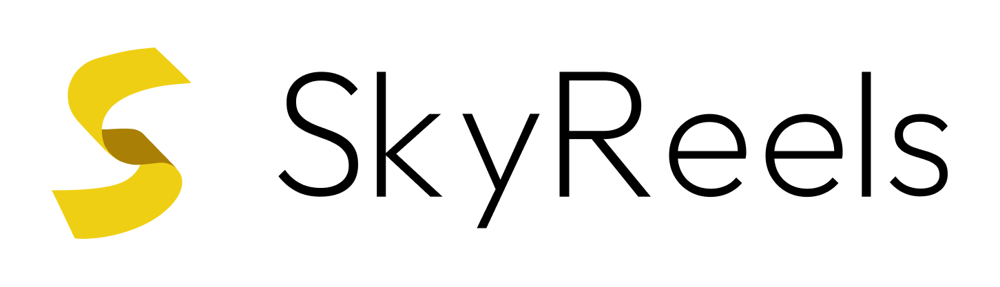

# HelloDev 开发者日报 - 2025年08月01日

大家好，我是HelloDev！今天又是收获满满的一天，发现了不少令人兴奋的技术内容。让我来和大家分享一下今天的精彩发现~

📊 **今日统计**：
- 🚀 技术分享：7条
- 🛠️ 工具推荐：6条  
- 📰 行业动态：0条
- 💡 经验讨论：0条
- 📸 每日一图：0条

---

## 🚀 技术分享

### [SkyworkAI / SkyReels-V2](https://github.com/SkyworkAI/SkyReels-V2) 

**我的推荐理由**：作为一个对AI视频生成非常感兴趣的开发者，SkyReels-V2真的让我眼前一亮。这是首个开源的无限长度电影生成模型，突破了传统视频生成在时长上的限制。它不仅在技术架构上有所创新，采用了自回归扩散forcing架构，而且在实际效果上也非常出色，特别是在指令遵循和视觉一致性方面。对于想要探索长视频内容生成的朋友，这个项目绝对值得深入研究。

**核心特性**：
- **无限长度视频生成**：通过自回归扩散forcing架构，SkyReels-V2实现了真正意义上的无限长度视频生成，这在视频生成领域是一个重大突破。
- **多模型支持**：项目包含多个模型系列，支持文本到视频（T2V）和图像到视频（I2V）生成，满足不同场景的需求。
- **易于部署**：提供了详细的推理代码和模型权重，支持单GPU和多GPU推理，让开发者可以快速上手实践。

**技术洞察**：SkyReels-V2的技术实现非常值得关注。它通过多模态大语言模型、多阶段预训练、强化学习和扩散forcing技术的全面优化，实现了在视频生成质量和时长方面的双重突破。这种技术组合为未来的视频生成模型提供了新的思路。

**适用场景**：特别适合需要生成长视频内容的应用，如故事生成、产品演示视频、教育培训内容等。

---

### [stenzek / duckstation](https://github.com/stenzek/duckstation)

**我的推荐理由**：作为一个怀旧游戏爱好者，DuckStation给我留下了深刻印象。这款PS1模拟器不仅在性能上表现出色，而且在兼容性和功能丰富度上都做得非常好。它支持多种硬件渲染API，并提供了丰富的增强功能，让老游戏在现代设备上焕发新生。如果你也想重温经典PS1游戏，这个模拟器绝对值得一试。

**核心特性**：
- **高性能模拟**：针对x86-64、AArch32、AArch64和RV64架构进行了优化，确保在各种设备上都能流畅运行。
- **丰富的图形增强**：支持多种硬件渲染API，包括D3D11、D3D12、OpenGL、Vulkan和Metal，并提供上采样、纹理过滤等增强功能。
- **全面的控制器支持**：支持数字和模拟控制器、光枪、NeGcon等多种输入设备，带来原汁原味的游戏体验。

**技术洞察**：DuckStation在追求高性能的同时，也非常注重准确性和长期可维护性。它采用了CPU重编译器/JIT技术，并实现了精确的混合和深度缓冲区仿真，确保游戏的原始体验得到最大程度的保留。

**适用场景**：适合所有想要在现代设备上玩PS1游戏的玩家，特别是对画质和性能有较高要求的用户。

---

### [OpenPipe/ART: Agent Reinforcement Trainer](https://github.com/OpenPipe/ART)

**我的推荐理由**：强化学习在AI领域一直是个热门话题，而ART框架让我看到了将强化学习应用于LLM代理训练的新可能。它通过GRPO算法和RULER奖励机制，大大简化了奖励函数的设计过程，让开发者可以更专注于代理的行为训练。对于想要探索LLM代理能力的朋友，这个框架提供了很好的起点。

**核心特性**：
- **GRPO算法支持**：采用Generalized Reward Policy Optimization算法，专门针对多步骤代理任务进行了优化。
- **零样本奖励机制**：RULER功能通过LLM-as-judge的方式，无需手工设计奖励函数就能获得有效的代理奖励。
- **灵活的集成方式**：提供了便捷的包装器，可以轻松将RL训练集成到现有的Python应用中。

**技术洞察**：ART框架的最大亮点在于它对奖励函数工程的简化。传统的强化学习需要大量时间来设计和调整奖励函数，而ART通过RULER机制将这一过程自动化，大大提高了开发效率。这对于快速原型开发和实验非常有价值。

**适用场景**：适合需要训练智能代理执行复杂任务的应用场景，如自动化客服、智能助手等。

---

### [puppeteer / puppeteer](https://github.com/puppeteer/puppeteer)

**我的推荐理由**：作为前端开发者的我，对Puppeteer简直爱不释手。这个库让浏览器自动化变得如此简单，无论是进行端到端测试、网页截图还是PDF生成，它都能轻松胜任。它对Chrome和Firefox的全面支持，以及活跃的社区维护，让我在项目中使用起来非常放心。

**核心特性**：
- **高阶API**：提供了简洁易用的API，让常见的浏览器自动化任务变得轻而易举。
- **多浏览器支持**：同时支持Chrome和Firefox，满足不同项目的需求。
- **灵活的运行模式**：默认以无头模式运行，也可配置为有头模式，适应不同的使用场景。

**技术洞察**：Puppeteer的成功不仅在于其功能强大，更在于其优秀的工程设计。它通过DevTools Protocol和WebDriver BiDi协议与浏览器通信，确保了与浏览器的紧密集成。同时，它的模块化设计让开发者可以根据需要选择安装完整包或核心库，提供了很好的灵活性。

**适用场景**：非常适合用于Web应用的自动化测试、数据抓取、网页监控等任务。

---

### [Canner / WrenAI](https://github.com/Canner/WrenAI)

**我的推荐理由**：WrenAI让我看到了自然语言查询数据库的巨大潜力。作为一个数据工程师，我经常需要编写复杂的SQL查询，而WrenAI可以将自然语言直接转换为准确的SQL语句和可视化图表，大大提高了工作效率。它对多种数据源和LLM模型的支持，使其在企业环境中具有很高的实用价值。

**核心特性**：
- **自然语言到SQL**：用户可以用自然语言查询数据库，并获得准确的SQL查询结果。
- **多数据源支持**：支持BigQuery、PostgreSQL、MySQL等多种主流数据库。
- **丰富的可视化**：不仅能生成SQL查询，还能自动生成相应的图表和AI洞察。

**技术洞察**：WrenAI的核心在于其语义层设计，通过MDL模型确保LLM输出的准确性和可控性。这种设计思路很好地解决了LLM在处理结构化数据时容易出现的幻觉问题，为GenBI应用提供了可靠的技术基础。

**适用场景**：非常适合需要频繁查询数据库并生成报告的业务分析师、数据工程师等角色。

---

### [kijai / ComfyUI-WanVideoWrapper](https://github.com/kijai/ComfyUI-WanVideoWrapper)

**我的推荐理由**：对于热衷于AI视频生成的我来说，ComfyUI-WanVideoWrapper是一个非常实用的工具。它为WanVideo及相关模型提供了便捷的ComfyUI集成方案，让复杂的视频生成流程变得可视化和模块化。特别是它对fp8缩放模型和GGUF模型的支持，让在资源有限的设备上运行这些模型成为可能。

**核心特性**：
- **便捷的节点封装**：为WanVideo及相关模型提供了专门的ComfyUI自定义节点，简化了集成过程。
- **广泛的模型支持**：支持SkyReels、WanVideoFun、ReCamMaster等多种视频生成模型。
- **示例工作流**：提供了丰富的示例工作流，帮助用户快速上手。

**技术洞察**：这个项目体现了开源社区的协作精神。作为一个个人沙盒项目，它为新模型和功能的快速测试提供了平台。这种灵活的开发模式在快速发展的AI领域尤为重要，能够让开发者及时体验到最新的技术成果。

**适用场景**：适合想要在ComfyUI中使用WanVideo系列模型进行视频生成的创作者和研究人员。

---

### [EmenstaNougat / ESP32-BlueJammer](https://github.com/EmenstaNougat/ESP32-BlueJammer)

**我的推荐理由**：ESP32-BlueJammer虽然是一个相对小众的项目，但它在无线安全教育方面的价值不容忽视。通过这个项目，我们可以深入了解2.4GHz频段无线通信的工作原理和潜在安全风险。详细的硬件构建指南和多种固件选项，让它成为一个很好的学习和实验平台。

**核心特性**：
- **多协议支持**：支持蓝牙、BLE、WiFi和RC等多种2.4GHz协议的干扰。
- **完整的硬件方案**：提供了详细的电路图、PCB布局和3D打印外壳设计。
- **便捷的固件部署**：支持通过网页界面或Windows应用程序进行固件烧录。

**技术洞察**：这个项目在技术实现上采用了ESP32和nRF24模块的组合，通过生成噪声和无用数据包来实现干扰效果。虽然功能相对简单，但它完整地展示了无线干扰器的工作原理，对于学习无线通信安全具有很好的教育意义。

**适用场景**：主要用于无线通信安全的教学和实验，帮助理解无线网络的脆弱性和防护措施。

---

## 🛠️ 工具推荐

### [shadcn/ui](https://www.producthunt.com/products/shadcn-ui)

**我的推荐理由**：作为一名React开发者，shadcn/ui简直是我的开发利器。它将美观、可访问和可定制的组件完美结合，让我能够快速构建出专业级的用户界面。最棒的是，我可以直接复制粘贴组件代码到项目中，极大地提升了开发效率。如果你也在寻找高质量的React UI组件库，我强烈推荐试试shadcn/ui。

**核心特性**：
- **精美设计**：所有组件都经过精心设计，视觉效果出色。
- **即插即用**：支持直接复制粘贴到项目中，无需复杂的安装配置。
- **高度可定制**：基于Tailwind CSS和Radix UI构建，提供了极强的定制能力。

**技术洞察**：shadcn/ui的成功在于它对开发者体验的极致关注。通过将组件代码直接暴露给开发者，它避免了传统组件库中常见的"黑盒"问题，让开发者能够完全掌控组件的行为和样式。这种设计理念在现代前端开发中越来越受到重视。

**适用场景**：非常适合需要快速构建现代化Web应用的React开发者，特别是对UI设计有一定要求的项目。

---

### [React](https://www.producthunt.com/products/react)

**我的推荐理由**：虽然React已经不是什么新鲜事物，但它依然是我构建用户界面的首选。它的组件化架构让代码组织变得清晰，虚拟DOM技术确保了出色的性能表现。庞大的生态系统和活跃的社区支持，让我在遇到问题时总能找到解决方案。对于任何想要进入前端开发的朋友，掌握React绝对是一个明智的选择。

**核心特性**：
- **组件化架构**：将UI拆分为独立可复用的组件，提高代码的可维护性。
- **虚拟DOM**：通过高效的diff算法，最小化真实DOM操作，提升应用性能。
- **丰富的生态系统**：拥有大量的第三方库和工具，满足各种开发需求。

**技术洞察**：React的核心优势在于其简洁而强大的设计理念。通过JSX语法，它将HTML和JavaScript无缝结合，让开发者能够以更直观的方式描述UI。同时，它的单向数据流和状态管理机制，让应用的状态变化变得可预测和易于调试。

**适用场景**：适用于各种规模的Web应用开发，从小型项目到大型企业级应用都能胜任。

---

### [Figma](https://www.producthunt.com/products/figma)

**我的推荐理由**：在设计协作方面，Figma绝对是我用过的最出色的工具。它的实时协作功能让团队成员可以同时编辑同一个设计文件，大大提高了工作效率。云端存储的特性也让我再也不用担心文件丢失的问题。虽然在处理大型文件时偶尔会有些卡顿，但总体体验非常棒。

**核心特性**：
- **实时协作**：多人可以同时编辑同一个设计文件，实时看到彼此的修改。
- **云端平台**：所有文件都存储在云端，随时随地可以访问和编辑。
- **丰富的插件生态**：拥有大量的第三方插件，可以扩展软件功能。

**技术洞察**：Figma的技术架构非常先进，它将整个设计工具构建在Web平台上，这使得跨平台兼容性和实时协作成为可能。这种云端优先的设计理念，让它在远程协作日益普及的今天具有明显优势。

**适用场景**：非常适合需要团队协作进行UI/UX设计的项目，特别是远程工作环境。

---

### [Tailwind CSS](https://www.producthunt.com/products/tailwind-css)

**我的推荐理由**：Tailwind CSS彻底改变了我写CSS的方式。通过一系列预定义的工具类，我可以在HTML中直接描述样式，而无需编写大量的自定义CSS代码。这种"实用优先"的方法不仅提高了开发效率，还让样式代码变得更加一致和可维护。虽然初学者可能需要一些时间适应，但一旦掌握就会爱不释手。

**核心特性**：
- **实用优先**：提供大量细粒度的工具类，直接在HTML中应用样式。
- **高度可定制**：通过配置文件可以完全定制生成的CSS，满足项目的具体需求。
- **优秀的文档**：提供了详尽的文档和示例，学习成本相对较低。

**技术洞察**：Tailwind CSS的设计哲学是"约束促进创造力"。通过提供一套有限但完整的样式原语，它鼓励开发者在既定的设计系统内进行创新，从而避免了传统CSS开发中常见的样式不一致问题。这种约束反而激发了更好的设计。

**适用场景**：非常适合需要快速构建响应式Web界面的项目，特别是对设计一致性有较高要求的应用。

---

### [V0.dev](https://www.producthunt.com/products/v0-dev)

**我的推荐理由**：V0.dev是Vercel推出的AI驱动UI生成工具，它可以根据简单的文本描述或图像快速生成React组件代码。在我最近的项目中，它帮助我快速构建了多个页面原型，节省了大量时间。虽然生成的代码有时需要手动调整，但整体效果令人满意，特别是在快速验证想法时非常有用。

**核心特性**：
- **AI驱动生成**：通过AI技术将文本描述或图像转换为可用的UI代码。
- **与现有项目集成**：生成的代码可以轻松集成到现有的React项目中。
- **快速原型开发**：大幅缩短从想法到原型的时间。

**技术洞察**：V0.dev代表了前端开发工具智能化的发展方向。通过将AI技术与代码生成相结合，它让开发者能够更专注于业务逻辑而非界面实现。这种"代码即对话"的理念，预示着未来开发工具将更加智能和高效。

**适用场景**：非常适合需要快速构建UI原型的场景，特别是前端开发者希望快速验证设计想法时。

---

### [Sketch](https://www.producthunt.com/products/sketch)

**我的推荐理由**：作为Mac用户，Sketch的手感一直让我非常满意。它专为Mac平台优化，在性能和用户体验方面都表现出色。丰富的插件生态系统和强大的设计工具，让我能够高效地完成各种设计任务。虽然近年来面临Figma等云端工具的竞争，但Sketch在某些方面仍有其独特优势。

**核心特性**：
- **Mac原生体验**：专为macOS设计，提供了流畅的操作体验。
- **共享库功能**：支持创建和使用共享组件库，提高团队协作效率。
- **强大的设计工具**：提供了丰富的矢量编辑和原型设计功能。

**技术洞察**：Sketch的成功在于它对设计师工作流程的深刻理解。通过提供一套完整的设计到交付工具链，它让设计师能够在一个应用中完成从概念到实现的全过程。虽然云端协作是趋势，但本地应用在性能和稳定性方面仍有其价值。

**适用场景**：非常适合习惯Mac环境的UI/UX设计师，特别是对性能和本地体验有较高要求的用户。

---

## 📝 今日总结

今天的内容就分享到这里。从SkyReels-V2的无限长度视频生成，到DuckStation带来的怀旧游戏体验，再到WrenAI实现的自然语言数据库查询，我们可以看到AI技术正在各个领域发挥越来越重要的作用。同时，像shadcn/ui、Tailwind CSS这样的开发工具也在不断提升我们的工作效率。

**个人感悟**：今天的发现让我深刻感受到技术发展的速度之快。AI不仅在改变我们与计算机交互的方式，也在重塑整个软件开发流程。作为一名开发者，我们需要保持持续学习的心态，积极拥抱这些新技术和工具。同时，我也意识到开源社区的力量，正是无数开发者的贡献，才让这些优秀的项目得以诞生和发展。

**明日预告**：明天我会继续为大家挖掘更多优质内容，包括更多前沿的AI项目和实用的开发工具。

---

💌 **互动时间**：
- 你对哪个项目最感兴趣？
- 有什么想了解的技术话题？
- 欢迎在评论区分享你的想法！

🔗 **关注HelloDev**：每日精选开发者最有价值的技术内容
📱 **多平台发布**：微信公众号 | 掘金 | 知乎 | GitHub

*本日报由HelloDev Generator自动生成，内容经过人工审核和优化*