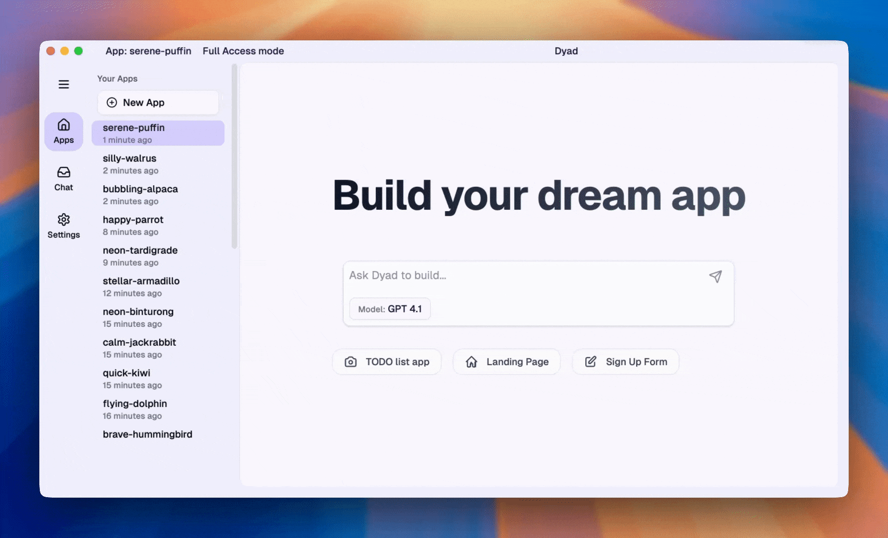

# HelloDev 开发者日报 - 2025年08月03日

大家好，我是HelloDev！今天又是收获满满的一天，发现了不少令人兴奋的技术内容。让我来和大家分享一下今天的精彩发现~

📊 **今日统计**：
- 🚀 技术分享：8条
- 🛠️ 工具推荐：0条  
- 📰 行业动态：0条
- 💡 经验讨论：0条
- 📸 每日一图：0条

---

## 🚀 技术分享

### [pointfreeco / swift-composable-architecture](https://github.com/pointfreeco/swift-composable-architecture) 
**我的推荐理由**：如果你正在开发Swift应用，特别是使用SwiftUI或UIKit的项目，这个架构模式绝对值得一看。它由Point-Free的两位大神Brandon Williams和Stephen Celis设计，强调可组合性、可测试性和易用性。我特别喜欢它将复杂应用拆分成小模块的思路，这样不仅让代码更易维护，测试也变得简单多了。

**核心特性**：
- **状态管理**：使用简单的值类型进行状态管理，让应用行为可预测
- **模块化组合**：通过Reducer的组合，轻松构建复杂功能模块
- **副作用测试**：提供TestStore等工具，让异步操作的测试变得简单直观

**技术洞察**：TCA的核心思想是将应用逻辑分解为可组合的小单元，每个单元都有明确的输入输出。这种设计不仅提高了代码的可维护性，也让开发者能够更容易地进行单元测试和集成测试。特别是其依赖注入系统，为构建松耦合架构提供了强大支持。

**适用场景**：适用于iOS、macOS等Apple平台的复杂应用开发，特别适合需要高度可测试性和可维护性的项目。

---

### [MotiaDev / motia](https://github.com/MotiaDev/motia) 

**我的推荐理由**：这个项目真的让我眼前一亮！它试图解决后端开发中的一个痛点：不同组件（API、事件处理、定时任务等）之间的协调问题。通过统一的"Step"概念，Motia将整个后端逻辑组织得井井有条。我特别欣赏它支持多种编程语言的特性，这在微服务架构中非常实用。

**核心特性**：
- **统一框架**：将API、事件、AI代理等统一在一个框架下管理
- **多语言支持**：支持JavaScript、TypeScript和Python编写业务逻辑
- **实时调试**：提供Workbench UI用于实时调试和监控

**技术洞察**：Motia的Step-based架构让我想起了函数式编程的思想，每个Step都是一个纯函数，通过事件驱动的方式连接起来。这种方式不仅简化了开发流程，还提高了系统的可观测性。特别是其零配置的监控功能，对于快速迭代的项目来说简直是福音。

**适用场景**：适合需要快速构建和部署后端服务的团队，特别是那些使用多种编程语言的项目。

---

### [tonsky / FiraCode](https://github.com/tonsky/FiraCode) 

*▲ 连字功能让代码更易读*

**我的推荐理由**：作为一名程序员，代码的可读性对我来说至关重要。FiraCode通过连字功能将常见的操作符组合成更易识别的符号，比如将`!=`显示为一个整体符号。这个小改动大大提升了我的编码体验，特别是在长时间编程时减少了视觉疲劳。

**核心特性**：
- **编程连字**：将多字符符号组合显示，提升代码可读性
- **多种字重**：提供多种字重选择，满足不同偏好
- **广泛兼容**：支持各种编辑器和终端环境

**技术洞察**：字体设计看似简单，但对开发者效率的影响却不容小觑。FiraCode在保持等宽字体特性的同时，通过精心设计的连字系统，有效减少了代码阅读时的认知负担。这种细节上的优化体现了对开发者体验的深度关注。

**适用场景**：所有编程场景，特别是需要长时间编码的开发者。

---

### [trekhleb/javascript-algorithms](https://github.com/trekhleb/javascript-algorithms) 

*▲ 算法可视化的直观展示*

**我的推荐理由**：无论你是准备技术面试还是想提升算法能力，这个项目都是绝佳的学习资源。每个算法都有详细的解释和图示，还有YouTube视频辅助理解。我特别喜欢它的交互式Playground，可以在线调试和测试算法实现。

**核心特性**：
- **全面覆盖**：涵盖从基础数据结构到高级算法的广泛主题
- **详细解释**：每个算法都配有完整的文档和复杂度分析
- **在线实验**：提供Playground环境用于算法测试和实验

**技术洞察**：这个项目的价值不仅在于算法实现，更在于它对算法思维的培养。通过实际的代码实现和复杂度分析，帮助开发者深入理解算法的本质。特别是在Big O notation的讲解上，为性能优化提供了理论基础。

**适用场景**：算法学习、技术面试准备、计算机科学教育。

---

### [kubesphere / kubesphere](https://github.com/kubesphere/kubesphere) 

**我的推荐理由**：作为Kubernetes的管理平台，KubeSphere提供了非常完整的解决方案。它不仅简化了K8s集群的部署和管理，还集成了DevOps、服务网格、可观测性等多项功能。对于企业级用户来说，这是一个能够显著提升运维效率的工具。

**核心特性**：
- **多集群管理**：支持统一管理多个Kubernetes集群
- **DevOps集成**：内置GitOps支持和CI/CD流水线
- **服务网格**：基于Istio的微服务治理能力

**技术洞察**：KubeSphere的设计理念是将Kubernetes打造成一个"分布式操作系统"，通过即插即用的架构，让各种云原生组件能够无缝集成。这种抽象层次的提升，使得复杂的企业级应用管理变得更加直观和高效。

**适用场景**：企业级Kubernetes集群管理、多云环境部署、云原生应用开发。

---

### [dyad-sh / dyad](https://github.com/dyad-sh/dyad) 

**我的推荐理由**：随着AI应用的普及，本地化AI开发工具变得越来越重要。Dyad提供了一个完全本地运行的AI应用构建平台，不仅保护了数据隐私，还避免了对云服务的依赖。对于注重隐私的开发者来说，这是个非常有吸引力的选择。

**核心特性**：
- **本地执行**：所有AI应用都在本地运行，确保数据隐私
- **API密钥支持**：支持使用自己的AI API密钥，避免厂商锁定
- **跨平台支持**：同时支持macOS和Windows系统

**技术洞察**：Dyad体现了当前AI开发的一个重要趋势：从云端集中式向本地分布式转变。这种模式不仅提高了数据安全性，还为开发者提供了更大的灵活性和控制权。特别是在企业环境中，这种本地化方案更容易获得采纳。

**适用场景**：注重数据隐私的AI应用开发、企业内部AI工具构建、个人AI项目实验。

---

### [OpenBAS-Platform / openbas](https://github.com/OpenBAS-Platform/openbas) 

**我的推荐理由**：网络安全演练是企业安全建设的重要环节，但往往缺乏合适的工具支持。OpenBAS提供了一个完整的平台来规划和执行各种安全模拟演练，从技术层面到战略层面都有覆盖。对于安全团队来说，这是一个非常实用的工具。

**核心特性**：
- **模拟演练**：支持各种类型的安全模拟和渗透测试
- **威胁情报集成**：与OpenCTI平台集成，获取最新的威胁情报
- **多渠道注入**：支持邮件、短信、社交媒体等多种注入方式

**技术洞察**：OpenBAS的价值在于它将安全演练从理论变成了实践。通过模拟真实的攻击场景，帮助企业发现安全漏洞并验证防护措施的有效性。这种主动式安全策略比传统的被动防护更加有效。

**适用场景**：企业安全团队演练、安全培训机构教学、红蓝对抗演练。

---

### [jlevy / the-art-of-command-line](https://github.com/jlevy/the-art-of-command-line) 

*▲ 命令行技巧的精华总结*

**我的推荐理由**：无论你是Linux新手还是资深用户，这份命令行指南都值得一读。它用简洁的语言总结了大量实用的命令行技巧，从基础操作到高级数据处理都有涉及。我经常在遇到问题时翻阅这份指南，总能找到高效的解决方案。

**核心特性**：
- **全面覆盖**：从基础到高级的完整命令行知识体系
- **实用技巧**：大量实际工作中用得上的小技巧
- **多语言支持**：提供多种语言版本

**技术洞察**：掌握命令行不仅是为了提高效率，更是理解操作系统本质的重要途径。这份指南通过精选的技巧和实例，帮助开发者建立起对Unix/Linux系统的深入理解。特别是在自动化脚本和系统管理方面，命令行技能是不可或缺的。

**适用场景**：Linux系统管理、自动化脚本开发、系统故障排查。

---

## 📝 今日总结

今天的内容就分享到这里。从Swift的可组合架构到后端统一框架，从字体设计到算法学习，我们看到了开发者社区在各个领域的创新和进步。

**个人感悟**：今天的开源项目让我深刻感受到技术发展的多元化趋势。一方面，我们看到像TCA这样的架构模式在推动应用开发的规范化和模块化；另一方面，像Motia这样的框架在简化后端开发的复杂性。同时，像FiraCode这样的细节优化项目也提醒我们，优秀的开发者体验往往来自于对细节的关注。这些项目共同构成了一个更加完善和人性化的开发生态。

**明日预告**：明天我会继续为大家挖掘更多优质内容，包括新兴的AI工具、前沿的Web技术以及实用的开发技巧。

---

💌 **互动时间**：
- 你对哪个项目最感兴趣？
- 有什么想了解的技术话题？
- 欢迎在评论区分享你的想法！

🔗 **关注HelloDev**：每日精选开发者最有价值的技术内容
📱 **多平台发布**：微信公众号 | 掘金 | 知乎 | GitHub

*本日报由HelloDev Generator自动生成，内容经过人工审核和优化*