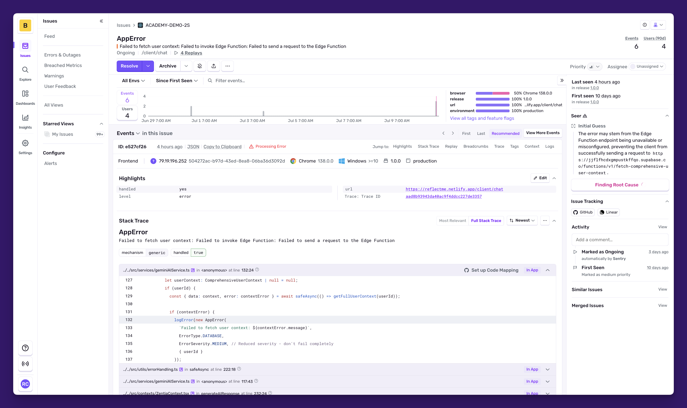
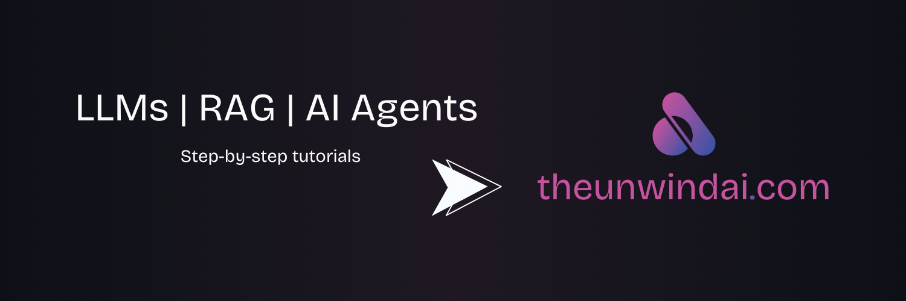
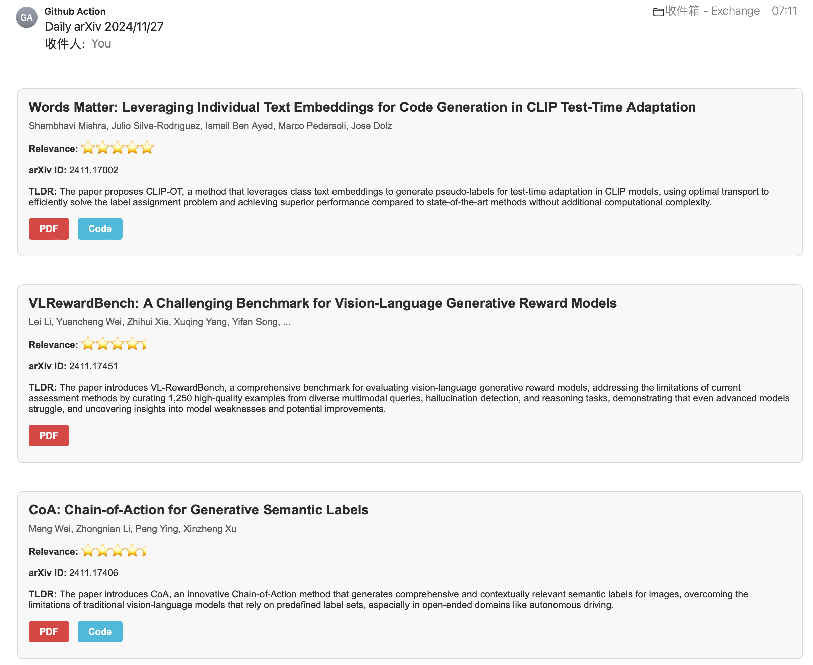

# HelloDev 开发者日报 - 2025年08月03日

大家好，我是HelloDev！今天又是收获满满的一天，发现了不少令人兴奋的技术内容。让我来和大家分享一下今天的精彩发现~

📊 **今日统计**：
- 🚀 技术分享：8条
- 🛠️ 工具推荐：0条  
- 📰 行业动态：0条
- 💡 经验讨论：0条
- 📸 每日一图：0条

---

## 🚀 技术分享

### [getsentry / sentry](https://github.com/getsentry/sentry) 

**我的推荐理由**：Sentry是我一直在用的错误追踪和性能监控平台，它真的能帮助开发者快速定位和解决问题。从我的使用体验来看，它不仅提供了详细的错误信息和性能瓶颈分析，还支持20多种编程语言，让集成变得非常简单。特别是它的Seer AI助手功能，让调试变得更加智能。

**核心特性**：
- **实时错误追踪和告警**：当应用出现问题时，Sentry能立即通知你，并提供详细的错误信息和堆栈跟踪，让你快速定位问题。
- **性能监控和追踪**：除了错误追踪，Sentry还能监控应用的性能，帮助你发现性能瓶颈，优化用户体验。
- **多语言支持**：支持20多种编程语言，无论你使用哪种技术栈，都能轻松集成。

**技术洞察**：Sentry通过其强大的SDK支持和实时监控能力，极大地缩短了问题发现和解决的时间。它不仅仅是一个错误追踪工具，更是一个全面的应用性能管理平台。对于追求高可靠性的应用来说，Sentry是不可或缺的工具。

**适用场景**：适用于任何需要实时监控和错误追踪的应用，特别是那些对用户体验和系统稳定性要求较高的产品。

---

### [comet-ml / opik](https://github.com/comet-ml/opik)

**我的推荐理由**：作为一个专注于LLM应用开发的平台，Opik让我印象深刻。它提供了从开发到生产全生命周期的支持，包括追踪、评估和监控。我觉得这个平台特别适合那些正在构建复杂LLM应用的团队，它能帮助你更好地理解和优化你的模型。

**核心特性**：
- **全面的追踪功能**：Opik能追踪LLM调用、对话和代理活动，让你清楚地了解模型的行为。
- **高级评估能力**：支持LLM-as-a-judge指标、数据集和实验管理，帮助你评估模型性能。
- **生产监控仪表盘**：提供实时监控和在线评估规则，确保你的应用在生产环境中稳定运行。

**技术洞察**：Opik通过其全面的追踪和评估功能，为LLM应用的开发和优化提供了强有力的支持。它的开放源代码特性和灵活的部署选项使其适用于各种规模的项目。

**适用场景**：适用于构建和优化LLM应用的团队，特别是那些需要详细监控和评估的复杂项目。

---

### [Shubhamsaboo / awesome-llm-apps](https://github.com/Shubhamsaboo/awesome-llm-apps)

**我的推荐理由**：这个项目汇集了各种LLM应用的实例，从简单的AI代理到复杂的多代理团队，内容非常丰富。如果你对LLM应用开发感兴趣，这个项目绝对值得一看。它不仅提供了实际的代码示例，还有详细的教程，非常适合学习和实践。

**核心特性**：
- **丰富的LLM应用示例**：包括AI代理、多代理团队、语音AI代理等，涵盖各种应用场景。
- **支持多种AI模型**：支持OpenAI、Anthropic、Google以及开源模型，满足不同需求。
- **全面的教程和示例**：提供RAG教程、LLM应用与记忆教程等，帮助你快速上手。

**技术洞察**：awesome-llm-apps通过其丰富的实例和教程，为LLM应用开发提供了宝贵的资源。它不仅展示了LLM技术的实际应用，还为开发者提供了学习和实践的平台。

**适用场景**：适合对LLM应用开发感兴趣的开发者，无论是初学者还是有经验的开发者都能从中受益。

---

### [gradio-app / gradio](https://github.com/gradio-app/gradio)

**我的推荐理由**：Gradio让机器学习模型的展示和分享变得异常简单。作为一个Python库，它能快速将任何Python函数转换为Web应用，无需任何前端经验。我特别喜欢它的Blocks类，可以创建高度定制化的应用界面。如果你有机器学习模型需要展示，Gradio绝对是一个不错的选择。

**核心特性**：
- **快速构建机器学习模型的演示或Web应用**：只需几行代码，就能将模型转换为交互式Web应用。
- **无需前端经验**：无需JavaScript、CSS或Web托管经验，即可分享应用。
- **支持多种机器学习组件**：提供丰富的组件，支持各种机器学习应用。

**技术洞察**：Gradio通过其简单易用的接口和强大的功能，极大地降低了机器学习模型展示的门槛。它不仅适用于研究和教育领域，也被广泛应用于工业界。

**适用场景**：适用于需要快速展示和分享机器学习模型的开发者，特别是那些没有前端经验的开发者。

---

### [Huanshere / VideoLingo](https://github.com/Huanshere/VideoLingo)

**我的推荐理由**：VideoLingo是一个集视频翻译、本地化和配音于一体的工具，能够生成Netflix质量的字幕。它通过AI技术解决了传统机器翻译僵硬和多行字幕的问题，让视频内容更容易被全球观众接受。如果你有视频内容需要本地化，这个项目绝对值得尝试。

**核心特性**：
- **高质量的字幕生成**：基于WhisperX的单词级字幕识别，确保翻译的准确性。
- **AI驱动的字幕分割**：通过AI技术自动分割字幕，提升观看体验。
- **多语言支持**：支持多种语言和TTS接口，便于内容本地化。

**技术洞察**：VideoLingo通过其完整的视频处理流程，从下载、识别、分割、翻译到配音，为视频内容的本地化提供了全面的解决方案。它不仅提升了字幕质量，还简化了本地化流程。

**适用场景**：适用于需要将视频内容进行本地化的创作者和企业，特别是那些希望扩大全球受众的视频内容。

---

### [TideDra / zotero-arxiv-daily](https://github.com/TideDra/zotero-arxiv-daily)

**我的推荐理由**：作为一个科研人员，我每天都会关注最新的arXiv论文。zotero-arxiv-daily通过分析我的Zotero库，智能推荐相关的论文，并通过邮件发送给我。这个项目不仅节省了我的时间，还帮助我发现了许多有价值的研究。如果你也是科研人员，这个工具绝对值得一试。

**核心特性**：
- **智能论文推荐**：根据Zotero库中的论文上下文，推荐相关的arXiv论文。
- **AI生成的论文摘要**：通过LLM生成论文摘要，帮助快速筛选目标论文。
- **自动化推送**：通过GitHub Actions实现自动化推送，无需安装额外软件。

**技术洞察**：zotero-arxiv-daily通过其智能推荐和自动化推送功能，极大地提升了科研信息获取的效率。它不仅简化了论文筛选过程，还通过AI技术提供了更深入的论文分析。

**适用场景**：适用于需要跟踪最新科研动态的科研人员和学生，特别是那些使用Zotero管理文献的用户。

---

### [odoo / odoo](https://github.com/odoo/odoo)

**我的推荐理由**：Odoo是一套功能齐全的开源商业应用套件，涵盖了CRM、ERP、电商等多个领域。作为一个模块化的系统，它可以根据企业需求灵活配置，非常适合中小企业构建完整的业务管理系统。我在一些项目中使用过Odoo，它的灵活性和可扩展性让我印象深刻。

**核心特性**：
- **开源商业应用套件**：提供CRM、ERP、电商等多种功能，满足企业多样化需求。
- **模块化设计**：支持模块化安装和集成，可根据需求灵活配置。
- **活跃的社区支持**：拥有超过2200名贡献者，社区活跃，持续更新。

**技术洞察**：Odoo通过其模块化设计和丰富的功能，为中小企业提供了一站式的商业解决方案。它不仅降低了企业信息化的门槛，还通过其活跃的社区支持，便于定制和扩展。

**适用场景**：适用于需要构建完整业务管理系统的中小企业，特别是那些希望降低信息化成本的企业。

---

### [PrefectHQ / prefect](https://github.com/PrefectHQ/prefect)

**我的推荐理由**：Prefect是一个强大的工作流编排框架，专为构建弹性的Python数据管道而设计。它简化了将脚本转换为生产工作流的过程，提供了调度、缓存、重试等功能。我在一些数据项目中使用过Prefect，它让数据自动化变得更加简单和可靠。

**核心特性**：
- **Python数据管道的工作流编排**：支持复杂的逻辑处理和现有工具集成。
- **调度、缓存和重试**：提供调度、缓存和重试功能，确保数据管道的稳定性。
- **自我托管或云监控**：支持自我托管或云监控，便于团队协作。

**技术洞察**：Prefect通过其强大的工作流编排能力，简化了数据自动化的过程。它不仅降低了数据管道的复杂性，还通过其灵活的部署选项，适用于各种规模的项目。

**适用场景**：适用于需要构建和管理数据管道的数据团队，特别是那些追求高可靠性和自动化程度的项目。

---

## 📝 今日总结

今天的内容就分享到这里。从Sentry的错误追踪到Opik的LLM应用开发，再到VideoLingo的视频本地化，我们可以看到AI和自动化技术正在深刻地改变着我们的开发和工作方式。

**个人感悟**：今天的项目让我再次感受到开源社区的力量。无论是Sentry这样成熟的企业级工具，还是像VideoLingo这样创新的个人项目，都展现了开发者们的创造力和解决问题的能力。我觉得，作为一个开发者，保持对新技术的敏感度和学习热情是非常重要的。只有这样，我们才能在这个快速变化的技术世界中保持竞争力。

**明日预告**：明天我会继续为大家挖掘更多优质内容，包括更多关于AI应用和开发工具的精彩项目。

---

💌 **互动时间**：
- 你对哪个项目最感兴趣？
- 有什么想了解的技术话题？
- 欢迎在评论区分享你的想法！

🔗 **关注HelloDev**：每日精选开发者最有价值的技术内容
📱 **多平台发布**：微信公众号 | 掘金 | 知乎 | GitHub

*本日报由HelloDev Generator自动生成，内容经过人工审核和优化*