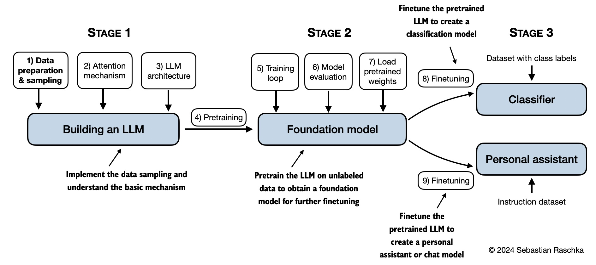
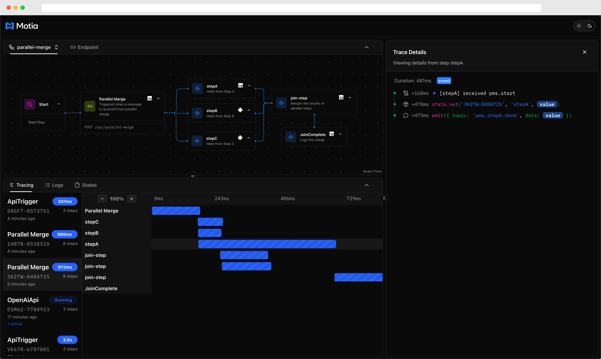
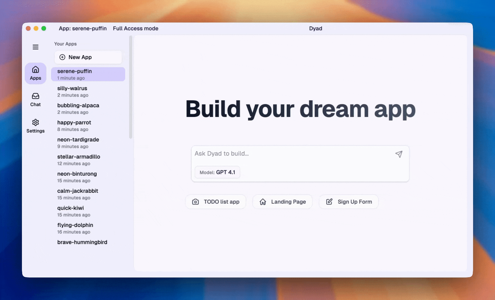

# HelloDev 开发者日报 - 2025年08月04日

大家好，我是HelloDev！今天又是收获满满的一天，发现了不少令人兴奋的技术内容。让我来和大家分享一下今天的精彩发现~

📊 **今日统计**：
- 🚀 技术分享：8条
- 🛠️ 工具推荐：4条  
- 📰 行业动态：5条
- 💡 经验讨论：3条
- 📸 每日一图：0条

---

## 🚀 技术分享

### [rasbt / LLMs-from-scratch](https://github.com/rasbt/LLMs-from-scratch) 

**我的推荐理由**：如果你对大型语言模型（LLM）的内部工作原理感兴趣，这个项目绝对是必看的。它不仅是Sebastian Raschka新书《Build a Large Language Model (From Scratch)》的官方代码仓库，更重要的是它提供了一套完整的从零开始构建ChatGPT-like模型的实践指南。我特别喜欢它不仅涵盖了理论知识，还提供了实际可运行的代码示例，让你能够亲手实现每一个细节，从文本数据处理到注意力机制，再到预训练和微调。

**核心特性**：
- **从零实现LLM**：使用PyTorch从头开始构建GPT-like模型，包括注意力机制和指令微调等高级技术
- **配套学习资源丰富**：包含书籍章节对应的代码、练习题和解决方案，以及配套视频课程
- **实用性强**：代码设计考虑了在普通笔记本电脑上运行的可行性，降低了学习门槛

**技术洞察**：通过从零构建LLM，开发者不仅能深入理解模型的内部机制，还能掌握如何将理论知识转化为实际代码。这种实践方式对于想要深入AI领域的开发者来说是无价的。

**适用场景**：适合想要深入理解LLM原理的开发者、AI学习者以及希望构建自定义语言模型的研究人员。

---

### [wg-easy / wg-easy](https://github.com/wg-easy/wg-easy)

**我的推荐理由**：作为一个经常需要远程访问公司内网的开发者，我对VPN工具有着天然的关注。wg-easy提供了一个极其简单的方式来部署和管理WireGuard VPN，它的Web UI让我印象深刻。特别是它支持生成客户端二维码和配置文件下载，这大大简化了客户端的配置过程。我已经在我的个人服务器上部署了它，使用体验非常流畅。

**核心特性**：
- **一体化解决方案**：将WireGuard与Web UI完美结合，简化了VPN的部署和管理
- **客户端管理功能完善**：支持客户端的增删改查、二维码生成和配置文件下载
- **现代化界面**：支持自动亮/暗模式切换、多语言和Gravatar头像

**技术洞察**：该项目展示了如何通过现代化的前端技术（TypeScript/Vue.js）和简洁的后端设计，将复杂的网络工具变得易于使用。其架构设计值得学习。

**适用场景**：适合需要快速部署个人或团队VPN的开发者，以及希望简化VPN管理流程的系统管理员。

---

### [sst / opencode](https://github.com/sst/opencode)

**我的推荐理由**：作为一个终端重度用户，我对任何能在终端中运行的工具都充满兴趣。OpenCode提供了一个在终端中直接与AI交互的编码助手，这正是我一直在寻找的工具。它支持多种AI提供商，这意味着我可以根据需要切换不同的模型。而且它的开源性质让我可以自由定制和扩展功能。

**核心特性**：
- **终端优先设计**：专注于Terminal User Interface (TUI)，让开发者无需离开命令行环境
- **提供商无关**：支持Anthropic、OpenAI、Google以及本地模型，灵活性极高
- **客户端/服务器架构**：允许远程控制，甚至可以通过移动设备控制终端

**技术洞察**：OpenCode代表了AI工具发展的一个重要方向：将AI能力无缝集成到开发者现有的工作流中，而不是强制用户切换到新的环境。这种设计理念非常值得借鉴。

**适用场景**：适合喜欢在终端中工作的开发者，以及需要在移动设备上远程控制编码环境的用户。

---

### [MotiaDev / motia](https://github.com/MotiaDev/motia)

**我的推荐理由**：现代后端开发变得越来越复杂，需要处理API、后台任务、工作流和AI代理等多种组件。Motia通过引入"Steps"概念，将这些不同的组件统一在一个系统中，这让我非常兴奋。它支持多种编程语言，这意味着团队中的不同开发者可以使用自己熟悉的语言协作。

**核心特性**：
- **统一后端系统**：将API、后台任务、工作流和AI代理整合到一个系统中
- **多语言支持**：支持JavaScript、TypeScript、Python和Ruby等多种语言
- **内置可观测性**：提供端到端的追踪和日志记录功能

**技术洞察**：Motia的设计理念是减少开发者在不同框架间切换的认知负担，通过统一的模型简化后端开发。这对于构建复杂的现代应用具有重要意义。

**适用场景**：适合需要构建复杂后端系统的团队，以及希望简化多组件协作的开发者。

---

### [dyad-sh / dyad](https://github.com/dyad-sh/dyad)

**我的推荐理由**：作为一个注重隐私的开发者，我对本地运行的AI工具特别感兴趣。Dyad提供了一个完全本地化的AI应用构建平台，这意味着我的数据不会被发送到任何第三方服务器。它的跨平台支持和自带密钥功能让我可以自由选择AI提供商，而不用担心被锁定在某个生态系统中。

**核心特性**：
- **本地化运行**：所有AI应用都在本地机器上运行，保证隐私和速度
- **自带密钥**：支持使用自己的AI API密钥，避免供应商锁定
- **跨平台支持**：支持Mac和Windows系统

**技术洞察**：随着AI工具的普及，数据隐私和供应商锁定问题变得越来越重要。Dyad通过本地化和开放的设计解决了这些问题，为开发者提供了更多选择。

**适用场景**：适合注重数据隐私的开发者，以及希望避免供应商锁定的团队。

---

## 🛠️ 工具推荐

### [Watchman AI](https://www.producthunt.com/products/sharbo)

**我的推荐理由**：在数字营销时代，捕获潜在客户是每个B2B公司的核心需求。Watchman AI通过AI代理自动识别和分析匿名访问者，将他们转化为合格的销售线索。我特别欣赏它超轻量级的追踪脚本（仅4KB），这比Google Analytics小了90%以上，对网站性能的影响微乎其微。

**核心特性**：
- **AI驱动的需求洞察**：使用隐身AI代理识别匿名访问者并将其转化为合格线索
- **超轻量追踪**：4KB的追踪脚本对网站性能影响极小
- **无缝集成**：与现有CRM、Slack和邮件系统轻松集成

**技术洞察**：Watchman AI代表了B2B营销工具的一个重要进化方向：从被动等待用户填写表单到主动识别和分析用户行为。这种基于AI的主动营销方式可能会改变整个行业。

**适用场景**：适合希望提高潜在客户捕获率的B2B公司，以及需要优化营销ROI的市场团队。

---

### [Cipher by Byterover](https://www.producthunt.com/products/byterover)

**我的推荐理由**：AI编码助手正在变得越来越智能，但它们往往缺乏对项目历史和上下文的长期记忆。Cipher通过提供一个可扩展的记忆层解决了这个问题。它能够自动生成和检索编码记忆，让AI助手能够更好地理解项目的演进过程。作为一个开源项目，它的社区驱动特性也让我很期待它未来的发展。

**核心特性**：
- **自动编码记忆**：自动生成和检索随代码库扩展的记忆
- **实时团队共享**：支持团队成员间实时共享AI编码记忆
- **零配置安装**：在IDE中实现零配置安装

**技术洞察**：Cipher展示了如何通过记忆增强来提升AI工具的智能水平。这种思路不仅适用于编码助手，也可能应用到其他需要上下文理解的AI应用中。

**适用场景**：适合使用AI编码助手的开发团队，以及希望提升AI工具上下文理解能力的开发者。

---

### [Hypertune](https://www.producthunt.com/products/hypertune)

**我的推荐理由**：作为一名前端开发者，我对功能开关和A/B测试工具非常熟悉。Hypertune通过类型安全的SDK消除了运行时错误，这是传统工具很难做到的。它与Vercel生态系统的深度集成也让我印象深刻，特别是它能够在边缘环境实现毫秒级SDK初始化。

**核心特性**：
- **类型安全**：通过类型安全的SDK消除运行时错误
- **Vercel深度集成**：与Vercel Edge Config集成实现毫秒级初始化
- **Git风格工作流**：支持原子提交和安全回滚

**技术洞察**：Hypertune展现了现代Web开发工具如何通过与云平台深度集成来提升性能和开发体验。其类型安全的设计理念值得其他工具借鉴。

**适用场景**：适合使用TypeScript、React和Next.js的开发团队，以及需要进行复杂A/B测试的产品经理。

---

## 📰 行业动态

### [Modern Node.js Patterns for 2025](https://kashw1n.com/blog/nodejs-2025/)

**我的观点**：Node.js生态系统一直在快速演进，从CommonJS到ESM的转变是其中最重要的变化之一。这篇文章不仅总结了这些变化，还提供了实用的迁移建议。我特别关注它对Worker Threads的讨论，这为处理CPU密集型任务提供了新的思路。

**关键洞察**：
- ESM和node:前缀的使用提高了代码的明确性和兼容性
- 原生支持Web标准API减少了对外部库的依赖
- Worker Threads为CPU密集型任务提供了非阻塞的解决方案

**趋势分析**：随着Node.js越来越成熟，开发者对性能、安全性和可维护性的要求也在提高。这些现代模式正是为了满足这些需求而出现的。

---

### [Persona vectors: Monitoring and controlling character traits in language models](https://www.anthropic.com/research/persona-vectors)

**我的观点**：AI模型的行为控制一直是业界关注的焦点。Anthropic提出的"角色向量"概念提供了一种新的思路，通过监控和干预模型的神经活动模式来控制其行为特征。这种方法的预防性引导理念尤其值得赞赏。

**关键洞察**：
- 角色向量可以在不降低模型能力的情况下防止不良特征出现
- 该方法可以提前预测训练数据对模型的影响
- 为AI系统的安全性和可控性提供了新的技术路径

**趋势分析**：随着AI模型变得越来越强大，对其行为的精确控制变得至关重要。这种技术可能会成为未来AI安全领域的重要工具。

---

### [So you want to parse a PDF?](https://eliot-jones.com/2025/8/pdf-parsing-xref)

**我的观点**：PDF解析是一个看似简单实则复杂的问题。这篇文章通过大量样本分析揭示了现实世界中PDF文件的复杂性，这对任何处理文档解析的开发者都有重要参考价值。

**关键洞察**：
- PDF解析在理想情况下相对简单，但现实中会遇到大量非标准文件
- 交叉引用指针位置不正确是常见的问题之一
- PDF解析器需要具备处理各种异常情况的能力

**趋势分析**：随着文档处理需求的增长，PDF解析工具的健壮性和兼容性将变得越来越重要。

---

## 💡 经验讨论

### [Growing a scraping API to $10k+MRR in 12 months](https://www.indiehackers.com/post/6iF8SJRF4WpciDff9aYi)

**我的感悟**：Adrian的成功故事证明了专注和坚持的力量。他从心理学背景转型到技术领域，再通过Web爬虫技能创建了自己的产品。他强调的"一次只专注一件事"的理念让我深有感触。

**关键要点**：
- 专注是创业成功的关键因素
- 建立受众和公开活跃可以成为有机增长的强大杠杆
- 使用前销售的理念可以避免在不需要的产品上浪费时间

**实用建议**：对于想要开始自己项目的开发者来说，这个故事提供了很好的参考：从自己的技能和兴趣出发，专注于解决实际问题。

---

### [Hitting a 7-figure ARR by adding value in niche communities](https://www.indiehackers.com/post/U2wOWstNmRCIrAEAlMqm)

**我的感悟**：Mas的故事再次证明了"解决自己的痛点"这一创业理念的价值。他通过在小众社区中提供价值来获得增长，这种策略比传统的营销方式更加有效和可持续。

**关键要点**：
- 创始人与市场的匹配度对产品成功至关重要
- 社区优先的增长策略可能比传统营销更有效
- 解决自己亲身经历的问题能确保产品的真实性和相关性

**实用建议**：对于想要创业的开发者来说，找到自己真正关心的问题领域，并在相关社区中建立声誉，可能是获得早期用户的有效方式。

---

---

## 📝 今日总结

今天的内容就分享到这里。从[从零构建LLM]到[AI驱动的需求洞察]，我们可以看到AI技术正在深刻改变开发者的工作方式和商业模式。

**个人感悟**：今天的发现让我更加确信，未来的软件开发将更加智能化和自动化。无论是通过AI助手提升编码效率，还是通过智能工具优化业务流程，AI都将成为开发者不可或缺的伙伴。同时，我们也需要关注这些技术带来的隐私和安全问题，确保技术的发展能够真正造福人类。

**明日预告**：明天我会继续为大家挖掘更多优质内容，包括更多关于AI应用、Web开发最佳实践以及创业经验分享。

---

💌 **互动时间**：
- 你对哪个项目最感兴趣？
- 有什么想了解的技术话题？
- 欢迎在评论区分享你的想法！

🔗 **关注HelloDev**：每日精选开发者最有价值的技术内容
📱 **多平台发布**：微信公众号 | 掘金 | 知乎 | GitHub

*本日报由HelloDev Generator自动生成，内容经过人工审核和优化*