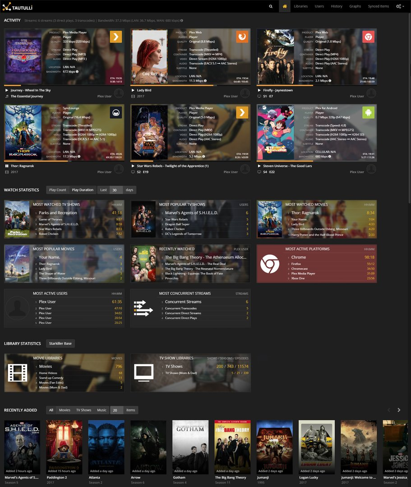

# HelloDev 开发者日报 - 2025年08月05日

大家好，我是HelloDev！今天又是收获满满的一天，发现了不少令人兴奋的技术内容。让我来和大家分享一下今天的精彩发现~

📊 **今日统计**：
- 🚀 技术分享：8条
- 🛠️ 工具推荐：6条  
- 📰 行业动态：2条
- 💡 经验讨论：4条
- 📸 每日一图：1条

---

## 🚀 技术分享

### [souzatharsis / podcastfy](https://github.com/souzatharsis/podcastfy) 

**我的推荐理由**：这个项目让我眼前一亮！它是一个开源的Python包，可以将多模态内容（文本、图片）转换为引人入胜的多语言音频对话。我觉得这个思路特别巧妙，特别是在内容创作和教育领域有很大的潜力。它支持从网站、PDF、图片、YouTube视频等多种来源生成播客，这比一些闭源工具（如NotebookLM）更灵活。

**核心特性**：
- **多源内容生成**：支持从网站、PDF、图片、YouTube视频和用户提供的主题生成播客，让内容创作更加多样化。
- **长短播客支持**：可以生成2-5分钟的短播客或30分钟以上的长播客，满足不同场景需求。
- **高度可定制**：支持自定义转录和音频生成（如风格、语言、结构），并且可以集成多种LLM和TTS模型，提供灵活性。

**技术洞察**：从技术角度看，Podcastfy的架构设计非常值得借鉴。它通过集成多种LLM和TTS模型，实现了高度的灵活性和可扩展性。特别是支持本地LLM，这为注重隐私的用户提供了更多选择。

**适用场景**：特别适合内容创作者、教育工作者和需要将文本内容转换为音频的开发者。

---

### [reflex-dev / reflex](https://github.com/reflex-dev/reflex) 

**我的推荐理由**：如果你是一个Python开发者，想要构建全栈Web应用但又不想学习JavaScript，那么这个项目绝对值得一看。Reflex允许你用纯Python编写前端和后端，这对我来说简直是福音。它有超过24,000颗星，社区活跃，而且每周都有新版本发布。

**核心特性**：
- **纯Python开发**：无需JavaScript，用Python编写整个应用，大大降低了学习成本。
- **内置组件库**：提供60多个内置组件，支持自定义组件创建，灵活性很高。
- **快速刷新**：开发时可以即时预览代码更改，提升开发效率。

**技术洞察**：Reflex的架构设计体现了现代Web开发的趋势，即降低技术栈的复杂性。通过纯Python实现，它让更多的开发者能够参与到全栈开发中来。

**适用场景**：适合Python开发者快速构建Web应用，特别是那些不想学习前端技术的后端开发者。

---

### [microsoft / mcp-for-beginners](https://github.com/microsoft/mcp-for-beginners) 

**我的推荐理由**：微软推出的这个课程让我很兴奋，它通过跨语言的实例介绍了Model Context Protocol (MCP)的基础知识。作为一个开发者，我觉得这种实用的学习资源非常有价值，特别是它涵盖了从基础概念到高级话题的完整内容。

**核心特性**：
- **跨语言示例**：提供.NET、Java、TypeScript、JavaScript和Python的实例，覆盖面广。
- **结构化学习**：分为10个模块，从基础到高级，循序渐进。
- **实践导向**：包含大量代码示例和项目，帮助理解和应用。

**技术洞察**：MCP作为一个新兴的AI模型交互标准，其学习资源的完善对于开发者掌握这项技术至关重要。这个课程的设计非常贴心，适合不同水平的开发者。

**适用场景**：适合想要学习MCP的开发者，特别是那些希望在实际项目中应用AI工作流的团队。

---

### [Tautulli / Tautulli](https://github.com/Tautulli/Tautulli) 

**我的推荐理由**：作为一个Plex用户，这个监控工具简直是必备！Tautulli提供了详细的分析和统计数据，让我能够更好地了解我的媒体服务器使用情况。它的界面设计也很棒，响应式布局在各种设备上都能很好地显示。

**核心特性**：
- **实时监控**：可以实时监控Plex服务器活动，及时了解服务器状态。
- **自定义通知**：支持自定义通知设置，让我能够及时收到重要信息。
- **丰富的统计信息**：提供详细的用户活动和媒体库统计，帮助优化服务器性能。

**技术洞察**：Tautulli的设计体现了对用户体验的重视。通过提供丰富的统计信息和自定义选项，它让Plex管理员能够更好地管理和优化他们的服务器。

**适用场景**：适合Plex服务器管理员，特别是那些希望深入了解服务器使用情况的用户。

---

## 🛠️ 工具推荐

### [SciSpace Agent](https://www.producthunt.com/products/typeset) 

**我的推荐理由**：作为科研人员或学术写作者，这个AI助手简直是救星！它能够自动化和简化学术研究过程，从文献回顾到论文撰写，一应俱全。我觉得这个工具特别适合那些需要处理大量文献的研究生和研究人员。

**核心特性**：
- **一站式研究引擎**：通过单一提示启动完整的研究流程，大大提高了效率。
- **论文撰写支持**：能够生成符合期刊格式的论文草稿，并提供同行评审建议。
- **可视化生成**：可以生成学术图表和信息图，让研究成果更直观。

**技术洞察**：SciSpace Agent的多工具集成能力是其最大的亮点。通过整合150多个学术工具和数据库，它为研究人员提供了一个强大的工作平台。

**适用场景**：特别适合学术研究人员、博士生和R&D团队，能够显著提高研究效率。

---

### [Rollups](https://www.producthunt.com/products/rollups-from-angellist) 

**我的推荐理由**：对于初创公司的股权管理，这个平台提供了一个非常简洁的解决方案。通过Roll Up Vehicles (RUVs)和Consolidation Vehicles (CVs)，它简化了复杂的股权结构，让融资和收购过程更加顺畅。

**核心特性**：
- **RUVs融资**：通过单一实体从多个投资者那里筹集资金，简化了融资流程。
- **CVs整合**：将现有股东整合到一个实体中，同时保持QSBS资格。
- **与AngelList集成**：提供无缝的投资者体验，降低了管理成本。

**技术洞察**：Rollups的创新之处在于它通过结构化的方式来解决股权管理的复杂性。这种做法不仅提高了效率，还减少了潜在的法律风险。

**适用场景**：适合初创公司，特别是那些处于融资阶段的企业。

---

## 📰 行业动态

### [PromptPlex](https://www.producthunt.com/products/promptplex) 

**我的推荐理由**：作为一名AI工具的重度用户，我经常遇到提示词管理的问题。PromptPlex这个Chrome扩展正好解决了这个痛点，它可以帮助我组织和重用提示词，提高工作效率。

**核心特性**：
- **智能文件夹**：通过智能文件夹和动态变量来组织提示词，让管理更加高效。
- **可重用模板**：创建可重用的模板，避免重复输入相同的提示词。
- **专家提示库**：访问精心策划的高质量提示词库，获取灵感。

**技术洞察**：PromptPlex的设计体现了对用户工作流程的深度理解。通过提供一个专业的提示词管理界面，它帮助用户更好地掌握AI工具的使用。

**适用场景**：适合经常使用ChatGPT、Claude、Gemini等AI模型的用户，特别是那些需要管理大量提示词的专业人士。

---

## 💡 经验讨论

### [Growing a scraping API to $10k+MRR in 12 months](https://www.indiehackers.com/post/tech/growing-a-scraping-api-to-10k-mrr-in-12-months-6iF8SJRF4WpciDff9aYi) 

**我的推荐理由**：这个创业故事让我深受启发。Adrian从心理学背景转行到软件开发，最终通过一个社交媒体抓取API实现了月收入超过1万美元。他的经历证明了专注和坚持的重要性。

**核心经验**：
- **专注单一产品**：Adrian强调专注于一个产品是成功的关键，这让我深有感触。
- **按使用量定价**：采用类似AI公司的按使用量定价模式，让产品更具竞争力。
- **直接推广**：通过私信和有机发现来推广产品，这种做法虽然简单但非常有效。

**技术洞察**：从技术角度看，这个案例展示了如何将个人技能转化为商业产品。Adrian利用自己在抓取方面的知识，结合内容创作建立受众，最终实现了商业成功。

**适用场景**：适合那些希望通过技术技能创业的开发者，特别是那些有特定领域知识的人。

---

## 📸 每日一图

### [From game development and bug bounties to a $40M/yr product](https://www.indiehackers.com/post/tech/from-game-development-and-bug-bounties-to-a-40m-yr-product-fC3IxR2MOffWkBSUZqF4) 

**我的推荐理由**：这张图讲述了一个从游戏开发到年收入4000万美元产品的创业故事。George Deglin最初在开发游戏时遇到了玩家参与度的问题，最终他将解决方案发展成了一个成功的产品。这个故事告诉我们，解决自己的痛点往往能带来巨大的商业机会。

**技术洞察**：从这张图中可以看出，创业成功的关键在于解决真实存在的问题。George的经历也显示了在早期阶段通过bug赏金来维持生计的现实策略。

**适用场景**：适合那些希望通过解决实际问题来创业的开发者，特别是那些有游戏开发背景的人。

---

## 📝 今日总结

今天的内容就分享到这里。从开源播客生成工具到股权管理平台，我们可以看到技术在各个领域的创新应用。特别是Podcastfy和Reflex这两个项目，它们展示了如何通过技术创新来简化复杂的工作流程。

**个人感悟**：今天的发现让我更加坚信，技术的价值在于解决实际问题。无论是通过AI助手提高研究效率，还是通过简化股权管理来帮助初创公司，这些工具都在让我们的工作变得更加高效。作为一个开发者，我们应该时刻关注这些创新，并思考如何将它们应用到自己的项目中。

**明日预告**：明天我会继续为大家挖掘更多优质内容，包括最新的AI工具和创业经验分享。

---

💌 **互动时间**：
- 你对哪个项目最感兴趣？
- 有什么想了解的技术话题？
- 欢迎在评论区分享你的想法！

🔗 **关注HelloDev**：每日精选开发者最有价值的技术内容
📱 **多平台发布**：微信公众号 | 掘金 | 知乎 | GitHub

*本日报由HelloDev Generator自动生成，内容经过人工审核和优化*