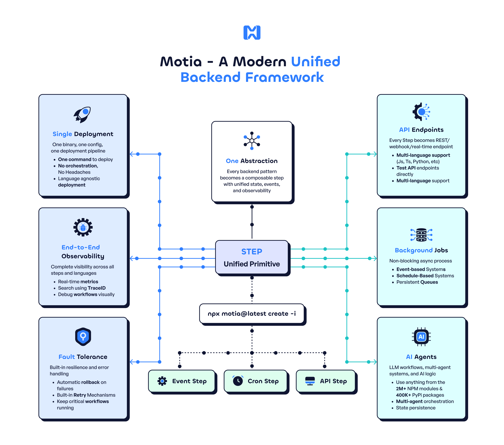
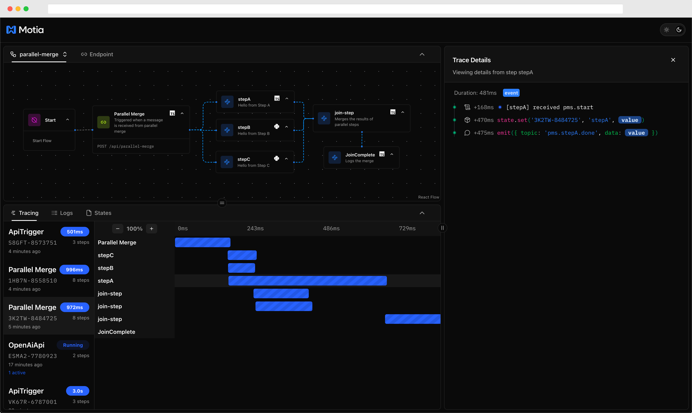

# HelloDev 开发者日报 - 2025年08月04日

大家好，我是HelloDev！今天又是收获满满的一天，发现了不少令人兴奋的技术内容。让我来和大家分享一下今天的精彩发现~

📊 **今日统计**：
- 🚀 技术分享：8条
- 🛠️ 工具推荐：0条  
- 📰 行业动态：5条
- 💡 经验讨论：4条
- 📸 每日一图：0条

---

## 🚀 技术分享

### [rasbt / LLMs-from-scratch](https://github.com/rasbt/LLMs-from-scratch) 

**我的推荐理由**：这个项目让我眼前一亮！作为一个对深度学习和大语言模型充满好奇的开发者，我一直在寻找能够深入理解LLM内部工作原理的学习资源。这个项目正好满足了我的需求，它不仅提供了从零开始构建GPT-like模型的完整代码，还配套了详细的书籍内容，让我能够系统地学习整个过程。

**核心特性**：
- **逐步实现GPT-like LLM**：项目采用PyTorch逐步实现了一个类似GPT的大语言模型，涵盖了从基础概念到实际训练的全过程，非常适合想要深入了解LLM内部机制的学习者。
- **核心概念全覆盖**：包括注意力机制、数据加载、模型训练等关键概念，通过实际代码演示，帮助用户更好地理解这些抽象概念。
- **硬件友好设计**：项目设计可以在普通笔记本电脑上运行，无需高端硬件支持，降低了学习门槛，让更多人可以参与其中。

**技术洞察**：这个项目的价值不仅在于代码实现，更在于它提供了一种学习方法。通过亲手构建一个模型，我们可以更深入地理解其工作原理，这对于未来在实际项目中应用LLM技术大有裨益。

**适用场景**：特别适合想要深入学习大语言模型的开发者、研究人员和学生，也适合那些希望在实际项目中应用LLM技术的人。

---

### [actualbudget / actual](https://github.com/actualbudget/actual)

**我的推荐理由**：作为一个对个人财务管理工具非常感兴趣的开发者，我一直在寻找一款既免费又功能强大的开源解决方案。Actual正好满足了我的需求，它不仅提供了本地优先的数据控制，还支持跨设备同步，这让我对数据安全和便利性都有了保障。

**核心特性**：
- **本地优先个人财务管理**：Actual强调本地数据控制，同时提供跨设备同步功能，让用户既能享受本地存储的安全性，又能获得云端同步的便利性。
- **多种部署选项**：支持一键部署、托管服务、Docker镜像和本地应用等多种部署方式，适应不同用户的技术背景和需求。
- **信封预算法支持**：实现了经过验证的信封预算法，帮助用户更有效地管理个人财务，这是一种非常实用的预算管理方法。

**技术洞察**：Actual的设计理念体现了现代应用开发的趋势，即在保证用户数据隐私的同时，提供便捷的使用体验。这种平衡对于个人财务管理工具尤为重要。

**适用场景**：适合需要管理个人财务的用户，特别是那些注重数据隐私和希望灵活部署的用户。

---

### [wg-easy / wg-easy](https://github.com/wg-easy/wg-easy)

**我的推荐理由**：作为一个对网络安全非常关注的开发者，我一直想找一个简单易用的VPN管理工具。wg-easy正好满足了我的需求，它将WireGuard与Web UI完美结合，大大简化了VPN的安装和管理过程。

**核心特性**：
- **一体化安装与管理**：将WireGuard与Web UI结合，提供了一体化的安装和管理体验，用户可以通过简单的Web界面完成复杂的VPN配置。
- **全面的客户端管理**：支持客户端的创建、编辑、删除、启用和禁用等操作，并提供QR码生成和配置文件下载功能，方便用户快速连接。
- **丰富的附加功能**：支持Gravatar、自动切换明暗模式、多语言、一次性链接、客户端过期、Prometheus指标、IPv6、CIDR和2FA等高级功能，提升了用户体验。

**技术洞察**：wg-easy的成功在于它将复杂的技术简单化，让普通用户也能轻松管理和使用VPN，这体现了优秀的用户体验设计。

**适用场景**：适合需要在Linux主机上安装和管理WireGuard VPN的用户，特别是那些希望简化管理过程的用户。

---

### [dyad-sh / dyad](https://github.com/dyad-sh/dyad)

**我的推荐理由**：作为一个对AI应用开发充满热情的开发者，我一直希望能找到一个可以在本地快速构建AI应用的工具。dyad正好满足了我的需求，它不仅支持本地运行，还允许用户使用自己的API密钥，避免了供应商锁定问题。

**核心特性**：
- **本地执行**：支持在本地机器上快速、私密地开发AI应用，无需依赖云端服务，保障了数据安全。
- **自带API密钥**：用户可以使用自己的AI API密钥，避免了供应商锁定问题，增加了灵活性。
- **跨平台支持**：支持Mac和Windows平台，让不同操作系统的用户都能轻松使用。

**技术洞察**：dyad的设计理念体现了现代开发者对数据隐私和灵活性的重视，它为AI应用开发提供了一个安全、高效的本地解决方案。

**适用场景**：适合希望在本地快速构建AI应用的开发者，特别是那些注重数据隐私和希望避免供应商锁定的用户。

---

### [reflex-dev / reflex](https://github.com/reflex-dev/reflex)

**我的推荐理由**：作为一个Python开发者，我一直希望能用纯Python构建全栈Web应用，而无需学习JavaScript。reflex正好满足了我的需求，它不仅支持快速开发和部署，还提供了丰富的UI组件，让Web开发变得更加简单。

**核心特性**：
- **纯Python开发**：支持使用纯Python开发前端和后端，无需学习JavaScript，降低了学习成本。
- **快速刷新**：支持快速刷新功能，让开发者能够即时看到代码更新的效果，提高了开发效率。
- **丰富的UI组件**：提供了超过60个内置UI组件，满足了大部分Web应用的界面需求。

**技术洞察**：reflex的出现反映了Python在Web开发领域的潜力，它为Python开发者提供了一个全新的全栈开发解决方案。

**适用场景**：适合希望使用纯Python构建全栈Web应用的开发者，特别是那些不想学习JavaScript的用户。

---

### [MotiaDev / motia](https://github.com/MotiaDev/motia)

**我的推荐理由**：作为一个对后端开发充满热情的开发者，我一直希望能找到一个能够统一API、后台任务、工作流和AI代理的框架。motia正好满足了我的需求，它不仅支持多种编程语言，还提供了内置的状态管理和可观测性，让后端开发变得更加简单。

**核心特性**：
- **统一系统**：将API、后台任务、工作流和AI代理统一到一个系统中，简化了后端架构。
- **多语言支持**：支持JavaScript、TypeScript和Python等多种编程语言，让开发者可以选择自己熟悉的语言。
- **内置状态管理和可观测性**：提供了内置的状态管理和可观测性功能，帮助开发者更好地监控和调试应用。

**技术洞察**：motia的设计理念体现了现代后端开发的趋势，即通过统一的框架简化复杂的后端架构，提高开发效率。

**适用场景**：适合需要构建复杂后端系统的开发者，特别是那些希望简化架构和提高开发效率的用户。

---

### [jellyfin / jellyfin](https://github.com/jellyfin/jellyfin)

**我的推荐理由**：作为一个对媒体服务器非常感兴趣的用户，我一直希望能找到一个完全免费且开源的替代方案。jellyfin正好满足了我的需求，它不仅支持多种媒体格式，还提供了灵活的部署选项，让我可以根据自己的需求进行配置。

**核心特性**：
- **完全免费开源**：jellyfin是一个完全免费且开源的媒体系统，没有隐藏费用或高级功能限制。
- **跨平台支持**：基于.NET Core框架构建，支持Windows、Linux和macOS等多个平台。
- **社区驱动开发**：强调社区协作，欢迎开发者和用户的贡献，形成了一个活跃的社区。

**技术洞察**：jellyfin的成功在于它提供了一个完全免费且功能强大的媒体服务器解决方案，满足了用户对自由和开放的渴望。

**适用场景**：适合需要管理个人媒体库的用户，特别是那些希望使用免费且开源解决方案的用户。

---

## 📰 行业动态

### [Hitting a 7-figure ARR by adding value in niche communities](https://www.indiehackers.com/post/hitting-a-7-figure-arr-by-adding-value-in-niche-communities-U2wOWstNmRCIrAEAlMqm)

**我的推荐理由**：这篇文章让我深受启发！作为一个对创业充满热情的开发者，我一直希望能找到成功的创业路径。这篇文章通过Mas Hossain的真实经历，展示了如何通过在小众社区中提供价值来实现业务增长，这给了我很大的启发。

**核心观点**：
- **创始人与市场的契合度**：解决自己亲身经历的问题，能够提供更深刻的洞察和动力。
- **社区驱动增长**：通过在Discord和LinkedIn等小众社区中建立信任，实现有机增长。
- **产品迭代**：专注于用户真正需要的功能，避免过度工程化。

**技术洞察**：这篇文章强调了社区建设和用户反馈在产品开发中的重要性，这对于任何创业者来说都是非常宝贵的建议。

**适用场景**：适合正在寻找创业方向或希望提升现有业务的创业者，特别是那些希望通过社区建设实现增长的用户。

---

### [GHz spiking neuromorphic photonic chip with in-situ training](https://arxiv.org/abs/2506.14272)

**我的推荐理由**：这篇论文让我对未来的AI硬件充满了期待！作为一个对AI技术充满热情的开发者，我一直关注着硬件技术的发展。这篇论文介绍了一种全新的光子脉冲神经网络芯片，它不仅实现了全栈类脑计算，还具备现场学习能力，这让我对未来的AI应用充满了想象。

**核心观点**：
- **全栈类脑计算**：首次在CMOS兼容的硅平台上实现全栈类脑计算，为未来的AI硬件发展指明了方向。
- **现场学习能力**：具备监督突触可塑性的现场学习能力，让芯片能够不断优化自身性能。
- **高效处理**：在KTH视频识别数据集上实现了80%的准确率，速度比传统方法快100倍。

**技术洞察**：这项技术代表了AI硬件发展的一个重要里程碑，它将为未来的实时动态视觉处理和自适应决策应用提供强大的支持。

**适用场景**：适合对AI硬件技术感兴趣的研究人员和开发者，特别是那些希望了解未来AI发展趋势的用户。

---

### [Scientists Shine a Laser Through a Human Head](https://spectrum.ieee.org/optical-brain-imaging)

**我的推荐理由**：这项研究让我对光学脑成像技术充满了好奇！作为一个对生物医学工程感兴趣的开发者，我一直关注着脑成像技术的发展。这项研究通过近红外光穿透整个人类头部，为更便宜、更便捷的深度脑成像提供了可能，这让我对未来的医疗应用充满了期待。

**核心观点**：
- **光学穿透**：成功将近红外光穿透整个人类头部，为深度脑成像提供了新的可能性。
- **临床应用**：有望实现床边快速中风诊断和更好的脑健康量化。
- **技术突破**：打破了昂贵深度成像(fMRI)和便宜浅层成像(EEG)之间的权衡。

**技术洞察**：这项技术的发展将为脑科学研究和临床诊断带来革命性的变化，它将使更多人能够享受到高质量的脑成像服务。

**适用场景**：适合对生物医学工程和脑成像技术感兴趣的研究人员和开发者，特别是那些希望了解最新医疗技术发展的用户。

---

### [My Ideal Array Language](https://www.ashermancinelli.com/csblog/2025-7-20-Ideal-Array-Language.html)

**我的推荐理由**：这篇文章让我对数组编程语言的设计有了更深入的理解！作为一个对编程语言设计感兴趣的开发者，我一直希望能找到一种能够充分利用现代硬件异构性的编程语言。这篇文章通过探讨理想数组语言的设计原则，为我提供了很多有价值的见解。

**核心观点**：
- **现代硬件趋势**：现代硬件异构性要求编程语言能够围绕多样性进行优化。
- **秩多态性**：用户可扩展的秩多态性是核心特性，使语言能够支持高性能数组操作。
- **值语义**：值语义和自动缓冲对于编译器优化至关重要。

**技术洞察**：这篇文章强调了编程语言设计需要与硬件发展趋势保持一致，这对于未来高性能计算语言的发展具有重要意义。

**适用场景**：适合对编程语言设计和高性能计算感兴趣的开发者，特别是那些希望了解数组编程语言发展趋势的用户。

---

### [The Toyota Corolla of Programming](https://deprogrammaticaipsum.com/the-toyota-corolla-of-programming/)

**我的推荐理由**：这篇文章让我重新审视了PHP的价值！作为一个曾经对PHP有些偏见的开发者，我一直认为它是一种过时的语言。但这篇文章通过将PHP比作丰田卡罗拉，让我意识到PHP的可靠性和实用性，这让我对PHP有了全新的认识。

**核心观点**：
- **可靠性**：PHP就像丰田卡罗拉一样，虽然不华丽，但非常可靠和实用。
- **现代化**：PHP已经发展成为一种现代语言，具备面向对象编程和函数式编程等特性。
- **生态系统**：PHP拥有庞大的生态系统和活跃的社区，为开发者提供了丰富的资源。

**技术洞察**：这篇文章提醒我们不要因为偏见而忽视一种语言的价值，PHP在Web开发领域仍然具有不可替代的作用。

**适用场景**：适合对编程语言选择感到困惑的开发者，特别是那些希望了解PHP现代发展的用户。

---

## 💡 经验讨论

### [Growing a scraping API to $10k+MRR in 12 months](https://www.indiehackers.com/post/tech/growing-a-scraping-api-to-10k-mrr-in-12-months-6iF8SJRF4WpciDff9aYi)

**我的推荐理由**：这篇文章让我深受鼓舞！作为一个对创业充满热情的开发者，我一直希望能找到成功的创业路径。这篇文章通过Adrian Horning的真实经历，展示了如何通过专注和社区建设实现快速增长，这给了我很大的启发。

**核心观点**：
- **社区建设**：通过在Twitter上建立受众，实现有机增长。
- **专注产品**：专注于一个产品，避免分散精力。
- **直接接触**：通过直接消息接触早期客户，建立信任。

**技术洞察**：这篇文章强调了社区建设和用户反馈在产品开发中的重要性，这对于任何创业者来说都是非常宝贵的建议。

**适用场景**：适合正在寻找创业方向或希望提升现有业务的创业者，特别是那些希望通过社区建设实现增长的用户。

---

### [From desperation and dwindling runway to $10k MRR](https://www.indiehackers.com/post/tech/from-desperation-and-dwindling-runway-to-10k-mrr-VRQprGga5zF3UFDqiCqw)

**我的推荐理由**：这篇文章让我深受启发！作为一个对创业充满热情的开发者，我一直希望能找到成功的创业路径。这篇文章通过Josef Büttgen的真实经历，展示了如何通过快速迭代和有机增长实现业务成功，这给了我很大的启发。

**核心观点**：
- **快速迭代**：不要过度思考，快速推出产品并根据反馈进行迭代。
- **有机增长**：通过SEO内容和邮件列表实现有机增长。
- **社区支持**：与正确的社区和导师建立联系，获取支持和指导。

**技术洞察**：这篇文章强调了快速迭代和社区支持在创业过程中的重要性，这对于任何创业者来说都是非常宝贵的建议。

**适用场景**：适合正在寻找创业方向或希望提升现有业务的创业者，特别是那些希望通过快速迭代和社区支持实现增长的用户。

---

### [Flux Krea: A Solo Developer’s Journey Through Technical Challenges and Growth](https://www.indiehackers.com/post/flux-krea-a-solo-developer-s-journey-through-technical-challenges-and-growth-66866fe9b6)

**我的推荐理由**：这篇文章让我深受启发！作为一个对AI应用开发充满热情的开发者，我一直希望能找到成功的开发路径。这篇文章通过一个独立开发者的真实经历，展示了如何通过开源框架和云服务克服技术挑战，这给了我很大的启发。

**核心观点**：
- **开源框架**：利用TensorFlow、PyTorch和Hugging Face等开源框架加速开发。
- **云服务**：利用AWS和Google Cloud等云服务克服计算资源限制。
- **用户反馈**：通过用户反馈识别痛点并改进产品。

**技术洞察**：这篇文章强调了开源框架和云服务在独立开发中的重要性，这对于任何独立开发者来说都是非常宝贵的建议。

**适用场景**：适合希望利用开源框架和云服务进行独立开发的开发者，特别是那些希望克服资源限制的用户。

---

### [I stopped charging fixed prices. Here's why.](https://www.indiehackers.com/post/i-stopped-charging-fixed-prices-heres-why-cc3ae2af4e)

**我的推荐理由**：这篇文章让我对定价策略有了全新的认识！作为一个自由职业者，我一直使用固定价格，但这篇文章让我意识到动态定价的优势。通过让客户先解释问题，再提供定制报价，不仅提高了转化率，还减少了低预算客户的流失。

**核心观点**：
- **动态定价**：根据客户需求提供动态报价，提高转化率。
- **客户沟通**：让客户先解释问题，确保双方理解一致。
- **灵活调整**：根据项目规模、紧急程度和清晰度调整价格。

**技术洞察**：这篇文章强调了灵活定价策略在自由职业中的重要性，这对于任何自由职业者来说都是非常宝贵的建议。

**适用场景**：适合希望提高转化率和减少客户流失的自由职业者，特别是那些希望灵活调整价格的用户。

---

## 📝 今日总结

今天的内容就分享到这里。从[深入学习LLM的rasbt/LLMs-from-scratch项目]到[PHP的现代价值再认识]，我们可以看到技术领域的多样性和不断演进的趋势。

**个人感悟**：今天的内容让我深刻体会到，无论是深入技术底层的学习，还是对传统技术的重新审视，亦或是创业经验的分享，都体现了技术社区的活力和创新精神。作为一个开发者，保持好奇心和学习热情，不断探索新技术和新思路，是我们在这个快速变化的时代中保持竞争力的关键。

**明日预告**：明天我会继续为大家挖掘更多优质内容，包括最新的AI硬件进展、Web开发框架评测以及独立开发者的实战经验分享。

---

💌 **互动时间**：
- 你对哪个项目最感兴趣？
- 有什么想了解的技术话题？
- 欢迎在评论区分享你的想法！

🔗 **关注HelloDev**：每日精选开发者最有价值的技术内容
📱 **多平台发布**：微信公众号 | 掘金 | 知乎 | GitHub

*本日报由HelloDev Generator自动生成，内容经过人工审核和优化*