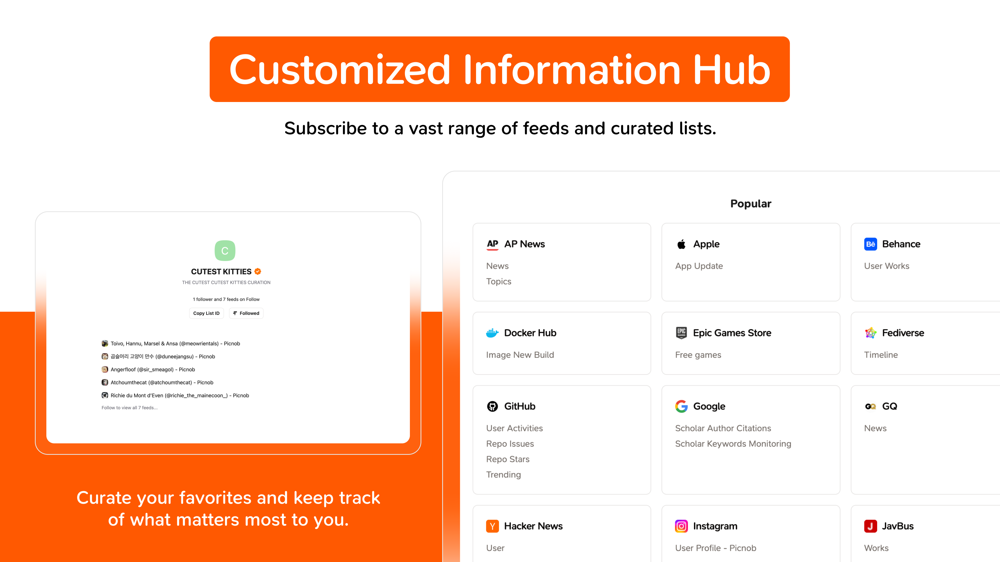
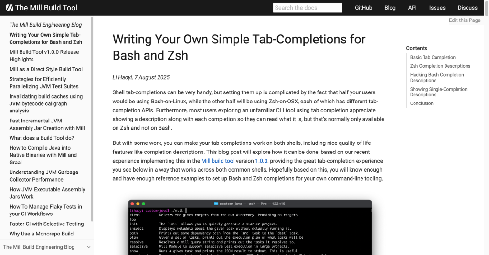
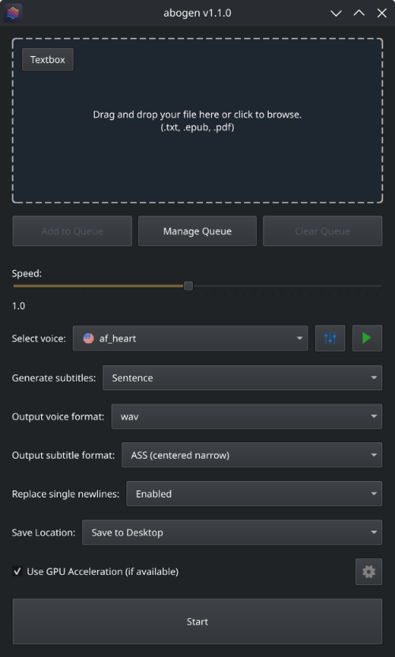
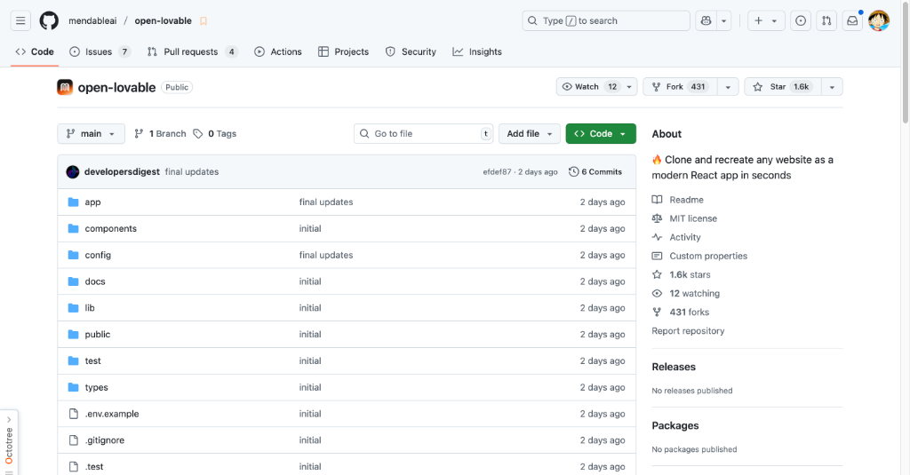

# HelloDev 开发者日报 - 2025年08月10日

大家好，我是HelloDev！今天又是收获满满的一天，发现了不少令人兴奋的技术内容。让我来和大家分享一下今天的精彩发现~

📊 **今日统计**：
- 🚀 技术分享：5条
- 🛠️ 工具推荐：0条  
- 📰 行业动态：5条
- 💡 经验讨论：0条
- 📸 每日一图：1条

---

## 🚀 技术分享

### [fastapi / full-stack-fastapi-template](https://github.com/fastapi/full-stack-fastapi-template) 

**我的推荐理由**：作为一个经常需要快速搭建全栈应用的开发者，我发现这个模板真的太贴心了。它不仅仅是一个简单的代码架子，而是考虑了从开发到部署的整个流程。特别是对于那些想要快速验证想法或者构建MVP的团队来说，这个模板可以节省大量的时间和精力。我亲自试用了它的认证系统和Docker部署流程，体验非常流畅。

**核心特性**：
- **完整的全栈解决方案**：后端使用FastAPI，前端使用React，这种组合在现代Web开发中非常流行，既保证了后端的高性能，又提供了前端的响应式体验。
- **现代化的开发实践**：集成了Docker、GitHub Actions等现代开发工具，让开发、测试、部署流程自动化，大大提高了开发效率。
- **开箱即用的安全特性**：JWT认证和安全密码哈希等安全功能直接集成，对于注重安全性的应用来说非常实用。

**技术洞察**：这个模板的架构设计非常值得学习，特别是在微服务架构越来越流行的今天，它展示了如何将前后端分离、数据库抽象、安全认证等复杂问题优雅地解决。

**适用场景**：适用于需要快速搭建现代Web应用的开发团队，特别是那些希望采用最新技术栈的初创公司和独立开发者。

---

### [libsdl-org / SDL](https://github.com/libsdl-org/SDL)

虽然没有配图，但这个项目的想法真的很棒！SDL是一个跨平台的多媒体开发库，广泛应用于游戏开发和模拟器领域。它为开发者提供了对音频、键盘、鼠标、手柄和图形硬件的底层访问能力。如果你正在开发需要跨平台支持的游戏或者多媒体应用，SDL绝对是一个值得考虑的选择。

**技术洞察**：SDL的跨平台特性让它成为了许多大型项目的底层依赖，比如Valve的游戏和许多Humble Bundle上的游戏都使用了SDL。它的zlib许可证也非常友好，允许在开源和商业项目中自由使用。

**适用场景**：适用于游戏开发、多媒体应用开发以及需要底层硬件访问能力的项目。

---

### [menloresearch/jan: Jan is an open source alternative to ChatGPT that runs 100% offline on your computer](https://github.com/menloresearch/jan)

**我的推荐理由**：随着AI技术的发展，越来越多的开发者开始关注本地运行AI模型的可能性。Jan正好满足了这一需求，它不仅支持多种主流的LLM模型，还能在本地运行，完全保护用户隐私。对于那些对数据安全有严格要求的用户来说，Jan提供了一个很好的解决方案。

**核心特性**：
- **完全本地运行**：所有AI模型都在本地执行，无需上传数据到云端，确保了数据的隐私和安全。
- **多模型支持**：支持Llama、Gemma、Qwen等多种主流LLM模型，用户可以根据需求选择合适的模型。
- **云服务集成**：虽然主打本地运行，但也支持连接到OpenAI、Anthropic等云服务，提供了灵活的使用方式。

**技术洞察**：Jan的架构设计非常巧妙，通过Tauri和Llama.cpp等现代技术实现了跨平台支持。它的开源特性也鼓励了社区的积极参与和贡献。

**适用场景**：适用于对数据隐私有严格要求的用户，以及希望在本地环境中使用AI模型的开发者。

---

### [umami-software / umami](https://github.com/umami-software/umami)

**我的推荐理由**：作为一个注重隐私的网站分析工具，Umami让我印象深刻。它不仅界面简洁直观，而且完全自托管，用户可以完全控制自己的数据。对于那些不想依赖Google Analytics等第三方服务的网站来说，Umami是一个很好的替代方案。

**核心特性**：
- **注重隐私**：不收集用户个人信息，完全自托管，用户对自己的数据有完全的控制权。
- **易于部署**：支持Docker和从源码安装两种方式，部署过程简单明了。
- **直观界面**：提供了清晰的图表和统计数据，方便用户分析网站流量。

**技术洞察**：Umami的设计理念非常符合当前用户对隐私保护的需求，它的开源特性和活跃的社区支持也确保了项目的持续发展和改进。

**适用场景**：适用于希望保护用户隐私、完全控制数据的网站分析需求。

---

### [RSSNext/Folo: 🧡 Follow everything in one place](https://github.com/RSSNext/Folo)

**我的推荐理由**：作为一个重度RSS用户，我对Folo的AI增强功能非常感兴趣。它不仅支持传统的RSS订阅，还加入了AI摘要和翻译功能，让信息获取更加高效。特别是它的创作者经济模式，通过$POWER代币鼓励内容创作者，这在当前的内容生态中是一个创新的尝试。

**核心特性**：
- **AI增强**：提供AI摘要和翻译功能，帮助用户快速获取信息要点。
- **多平台支持**：支持Web、iOS、Android、macOS和Windows等多个平台，满足不同用户的需求。
- **创作者经济**：通过$POWER代币建立了一个新的创作者激励机制。

**技术洞察**：Folo将传统的RSS阅读与现代AI技术相结合，展现了内容聚合平台的未来发展方向。它的开源特性和社区驱动模式也确保了项目的持续创新。

**适用场景**：适用于需要高效获取和管理信息的用户，特别是那些关注内容创作和分享的用户。

---

## 📰 行业动态

### [Microsoft POML – Prompt Orchestration Markup Language](https://github.com/microsoft/poml)

**我的观点**：Prompt工程正在成为LLM应用开发中的一个重要环节，而POML的出现为这一领域带来了结构化和标准化的解决方案。它通过类似HTML的语法和CSS样式的解耦设计，让Prompt的编写和维护变得更加清晰和高效。对于那些正在构建复杂LLM应用的开发者来说，POML值得深入了解。

**技术洞察**：POML的架构设计体现了微软在Prompt工程领域的深度思考，它不仅解决了Prompt编写中的常见问题，还通过丰富的开发工具包提升了开发体验。

**适用场景**：适用于需要构建复杂Prompt驱动的LLM应用的开发者。

---

### [Writing Your Own Simple Tab-Completions for Bash and Zsh](https://mill-build.org/blog/14-bash-zsh-completion.html)

**我的观点**：Shell补全是提升命令行效率的重要工具，但实现跨Shell兼容的补全功能却并不容易。这篇文章通过Mill构建工具的实例，详细讲解了如何在Bash和Zsh中实现一致的补全体验。对于那些希望提升命令行工具用户体验的开发者来说，这是一篇非常实用的指南。

**技术洞察**：文章深入剖析了Bash和Zsh在补全机制上的差异，并提供了巧妙的解决方案，特别是对Bash中补全描述的实现方式让人印象深刻。

**适用场景**：适用于开发命令行工具并希望提供良好用户体验的开发者。

---

### [Abogen – Generate audiobooks from EPUBs, PDFs and text](https://github.com/denizsafak/abogen)

**我的观点**：随着内容消费方式的多样化，将文本转换为音频的需求越来越旺盛。Abogen通过强大的TTS引擎和友好的GUI界面，让这一过程变得简单高效。特别是它的批量处理和自定义语音功能，非常适合内容创作者使用。

**技术洞察**：Abogen的架构设计充分利用了现代TTS技术，通过GPU加速实现了快速的文本转语音转换。它的跨平台支持也让用户可以在不同系统上使用。

**适用场景**：适用于需要将文本内容转换为音频的用户，特别是内容创作者和播客制作者。

---

### [Open Lovable](https://github.com/mendableai/open-lovable)

**我的观点**：AI辅助开发正在改变我们构建应用的方式。Open Lovable通过AI技术实现了网站到React应用的快速转换，这为快速原型开发提供了新的可能性。虽然目前还处于早期阶段，但它的潜力不容小觑。

**技术洞察**：Open Lovable的实现展示了AI在Web开发中的应用前景，通过与各种AI服务和网络爬虫的集成，它能够快速理解和重构网站结构。

**适用场景**：适用于需要快速构建React应用原型的开发者。

---

### [GTP Blind Voting: GPT-5 vs. 4o](https://gptblindvoting.vercel.app/)

虽然没有配图，但这个项目的想法很有趣。通过盲投方式比较不同版本的GPT模型，可以帮助用户更客观地评估模型性能。在AI模型快速发展的今天，这样的评估工具非常有价值。

---

## 📸 每日一图

### [Curious about the training data of OpenAI's new GPT-OSS models? I was too](https://twitter.com/jxmnop/status/1953899426075816164)

这张图展示了对OpenAI最新开源GPT模型训练数据的分析结果。作者生成了1000万个样本并进行了分析，结果令人意外。这提醒我们，即使是大型AI模型，其训练数据的质量和多样性也可能存在意想不到的问题。对于AI研究者和开发者来说，这样的分析非常有价值。

---

## 📝 今日总结

今天的内容就分享到这里。从全栈开发模板到AI模型分析，我们可以看到技术领域的多样性和创新性。特别是AI技术的快速发展，正在深刻地改变着我们的开发方式和产品形态。

**个人感悟**：今天的发现让我再次感受到开源社区的活力和创新精神。无论是FastAPI的全栈模板，还是Jan这样的本地AI解决方案，都体现了开发者们对效率和隐私的追求。而像POML这样的新工具，则展现了大模型应用开发的标准化趋势。

**明日预告**：明天我会继续为大家挖掘更多优质内容，包括更多AI工具和Web开发新技术。

---

💌 **互动时间**：
- 你对哪个项目最感兴趣？
- 有什么想了解的技术话题？
- 欢迎在评论区分享你的想法！

🔗 **关注HelloDev**：每日精选开发者最有价值的技术内容
📱 **多平台发布**：微信公众号 | 掘金 | 知乎 | GitHub

*本日报由HelloDev Generator自动生成，内容经过人工审核和优化*