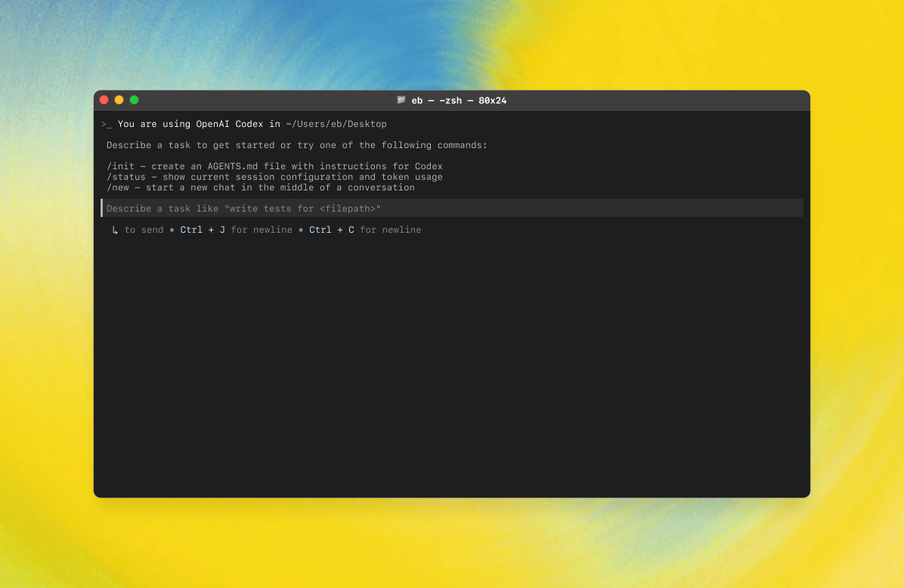
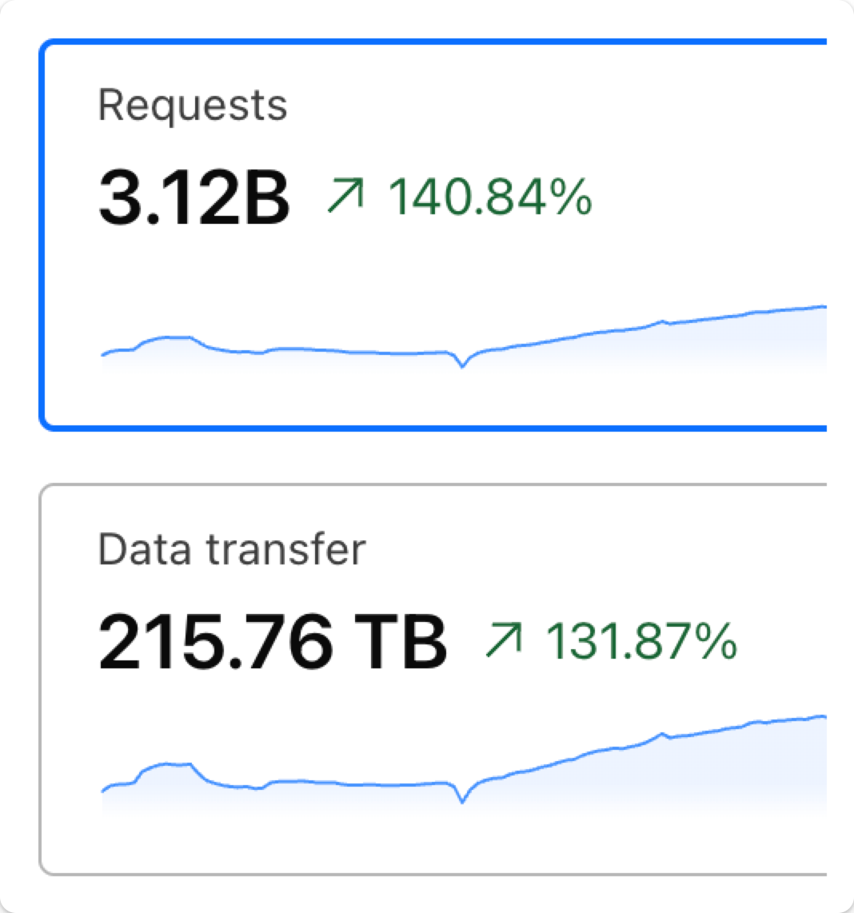

# HelloDev 开发者日报 - 2025年08月10日

大家好，我是HelloDev！今天又是收获满满的一天，发现了不少令人兴奋的技术内容。让我来和大家分享一下今天的精彩发现~

📊 **今日统计**：
- 🚀 技术分享：8条
- 🛠️ 工具推荐：4条  
- 📰 行业动态：2条
- 💡 经验讨论：0条
- 📸 每日一图：2条

---

## 🚀 技术分享

### [openai / openai-python](https://github.com/openai/openai-python) 
这个项目是OpenAI官方的Python SDK，我觉得每个使用OpenAI API的Python开发者都应该了解一下。它不仅提供了完整的类型定义，还支持同步和异步两种客户端模式，这在处理高并发请求时特别有用。

**我的推荐理由**：我在项目中集成OpenAI API时，这个库让我的开发效率提升了不少。特别是它的自动重试机制和超时控制，在生产环境中非常实用。而且它对最新OpenAI功能的支持也很及时，比如最新的Realtime API beta。

**核心特性**：
- 类型安全：所有请求参数和响应字段都有完整的类型定义，IDE提示非常友好
- 双模式支持：同步和异步客户端可以根据应用需求灵活选择
- 功能完整：支持聊天完成、视觉能力、流式响应和Webhook验证等所有API特性

**技术洞察**：这个库使用httpx作为HTTP客户端，这让我很欣赏。httpx的异步支持和现代化设计比传统的requests更符合现在的开发需求。而且它对Microsoft Azure OpenAI服务的支持，让企业用户也能无缝切换。

**适用场景**：特别适合需要稳定、高效集成OpenAI API的Python项目，无论是Web应用还是数据处理脚本都很适用。

---

### [openai / codex](https://github.com/openai/codex) 

这个项目让我眼前一亮！它是一个可以在终端中直接使用的AI编码助手，而且可以在本地运行。作为一个经常在终端工作的开发者，我觉得这个工具特别有潜力。

**我的推荐理由**：Codex CLI的设计理念我很认同 - 安全第一。它在沙盒环境中运行，让我可以放心地让它处理我的代码。而且支持不同的自主级别（只读、工作区写入、完全访问），这种细粒度的控制非常贴心。

**核心特性**：
- 本地运行：不需要上传代码到云端，保护隐私安全
- 沙盒安全：默认在受限环境中运行，防止意外修改
- 灵活认证：支持ChatGPT账户和API密钥两种认证方式
- 平台兼容：支持macOS、Linux和Windows（通过WSL2）

**技术洞察**：我特别欣赏它对开源模型的支持，通过`--oss`标志可以使用像Ollama这样的本地模型。这意味着即使没有OpenAI的访问权限，也能享受到AI编码辅助的好处。这种开放性设计让工具的适用范围大大扩展。

**适用场景**：非常适合需要在终端环境中编码的开发者，特别是那些注重代码隐私和安全的团队。

---

### [nomic-ai / gpt4all](https://github.com/nomic-ai/gpt4all) 

如果你想要在本地运行大语言模型，那这个项目绝对值得一看。它让我能够在普通的笔记本电脑上体验到强大的AI能力，而不需要依赖云服务。

**我的推荐理由**：作为一个注重隐私的开发者，我很欣赏GPT4All对离线使用的支持。它不仅提供了桌面应用，还有Python客户端，这让我可以在不同的场景中灵活使用。最近更新的DeepSeek R1 Distillations支持也很令人期待。

**核心特性**：
- 本地运行：无需API调用或GPU，普通设备即可运行
- 多平台支持：提供Windows、macOS和Linux的桌面安装程序
- 模型丰富：支持多种架构的模型和量化方式
- 隐私保护：所有处理都在本地进行，数据不会上传

**技术洞察**：项目的LocalDocs功能让我印象深刻，它允许我用自己的文档与模型对话。这对于企业内部知识库的智能查询特别有用。而且它与Langchain等流行工具的集成，让扩展功能变得很容易。

**适用场景**：特别适合需要保护数据隐私的企业用户，或者希望在没有网络连接时也能使用AI功能的开发者。

---

### [exo-explore / exo](https://github.com/exo-explore/exo) 

这个项目的想法真的很酷 - 用家里的各种设备搭建一个AI集群。作为一个喜欢折腾技术的开发者，我觉得这个项目的潜力巨大。

**我的推荐理由**：exo的零配置自动发现功能让我很惊喜。我只需要在不同的设备上运行它，它们就能自动组成一个集群。这种简化复杂性的设计思路值得学习。而且支持异构设备网络，意味着我可以用手机、笔记本等不同设备协同工作。

**核心特性**：
- 设备发现：自动发现网络中的其他设备，无需手动配置
- 模型分区：根据设备资源动态分割模型，优化性能
- API兼容：提供与ChatGPT兼容的API接口
- 架构先进：采用对等网络架构，没有主从节点的限制

**技术洞察**：我认为这种分布式AI计算的思路很有前瞻性。随着边缘计算的发展，将AI推理分布到多个设备上会成为趋势。exo在这个方向上的探索很有价值，特别是它对LLaMA、Mistral等主流模型的支持。

**适用场景**：适合喜欢尝试新技术的开发者，或者希望在资源有限的情况下运行大型AI模型的研究人员。

---

## 🛠️ 工具推荐

### [VibeScan](https://www.producthunt.com/products/vibescan) 
AI代码生成已经很普遍了，但如何确保生成的代码质量呢？VibeScan就是为了解决这个问题而生的工具。

**我的推荐理由**：作为一个经常使用AI辅助编码的开发者，我发现AI生成的代码确实存在安全隐患和性能问题。VibeScan的浏览器端零配置扫描功能让我可以快速检查代码质量，而且它提供的AI就绪修复提示非常实用。

**核心优势**：
- 零配置使用：无需安装任何本地工具，浏览器直接使用
- 全面检测：能发现安全漏洞、性能瓶颈和代码质量问题
- 智能修复：不仅发现问题，还提供AI就绪的修复建议
- 操作简单：一键扫描，界面友好

**使用建议**：我建议在将AI生成的代码集成到生产环境之前，先用VibeScan扫描一下。特别是对于非安全专家的开发者来说，这个工具能大大降低风险。

---

### [Guided Learning in Gemini](https://www.producthunt.com/products/gemini-6) 
Google Gemini的这个新功能让我很感兴趣。它不是简单地提供答案，而是帮助用户深入理解问题。

**我的推荐理由**：在技术学习中，我们经常需要的不是标准答案，而是解题思路。Guided Learning通过逐步分解问题、提供可视化和测验的方式，真正帮助用户掌握知识。这比传统的问答模式更有教育价值。

**特色功能**：
- 步骤引导：将复杂问题分解为易理解的步骤
- 多媒体支持：结合视觉化内容增强理解
- 互动测验：通过练习巩固学习成果
- 个性化体验：根据用户进度调整内容

**适用人群**：特别适合正在学习新技术的开发者，或者希望深入理解某个技术领域的工程师。

---

## 📰 行业动态

### [OpenFreeMap survived 100k requests per second](https://blog.hyperknot.com/p/openfreemap-survived-100000-requests) 

这个案例让我对系统架构设计有了新的认识。OpenFreeMap通过创新的文件系统级实现，成功应对了每秒10万请求的流量高峰。

**技术亮点**：
- 文件系统优化：使用Btrfs分区镜像和硬链接文件提供静态服务
- CDN策略：99.38%的缓存命中率大大减轻了源服务器压力
- nginx调优：针对高并发场景的配置优化

**启发思考**：这个案例告诉我们，有时候回归基础架构优化比引入复杂的分布式系统更有效。对于提供静态内容的服务来说，文件系统层面的优化能带来惊人的性能提升。

---

## 📸 每日一图

### [sinaptik-ai / pandas-ai](https://github.com/sinaptik-ai/pandas-ai) 

这个项目让数据分析变得更有趣了。通过自然语言就能查询数据，还能生成可视化图表，这对于非技术用户来说简直是福音。

**我的体验**：试用了这个工具后，我发现它确实能大大降低数据分析的门槛。比如用"显示销售额前5的国家"这样的自然语言，就能得到相应的数据结果和图表。这对于业务人员快速获取数据洞察非常有帮助。

**技术特色**：
- 自然语言接口：用大白话就能进行数据分析
- 多数据源支持：可以连接SQL数据库、CSV文件等多种数据源
- 安全沙盒：Docker环境确保代码执行安全
- 可视化能力：自动生成图表，让数据更直观

---

## 📝 今日总结

今天的内容就分享到这里。从OpenAI的官方Python SDK到本地AI集群，再到数据分析的自然语言接口，我们可以看到AI技术正在各个层面深入开发者的工作流程。

**个人感悟**：今天的发现让我意识到，AI工具不再是简单的代码生成器，而是正在成为开发者工作流程中不可或缺的一部分。从安全保障（VibeScan）到学习辅助（Guided Learning），再到数据处理（PandasAI），AI正在以更智能、更安全、更易用的方式帮助我们提高效率。

**明日预告**：明天我会继续为大家挖掘更多优质内容，包括更多AI工具的实际应用案例和系统架构设计的最佳实践。

---

💌 **互动时间**：
- 你对哪个项目最感兴趣？
- 有什么想了解的技术话题？
- 欢迎在评论区分享你的想法！

🔗 **关注HelloDev**：每日精选开发者最有价值的技术内容
📱 **多平台发布**：微信公众号 | 掘金 | 知乎 | GitHub

*本日报由HelloDev Generator自动生成，内容经过人工审核和优化*