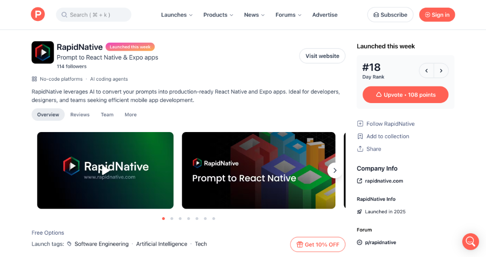
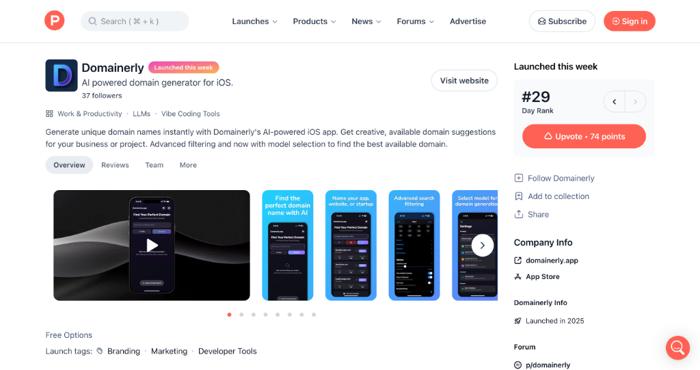
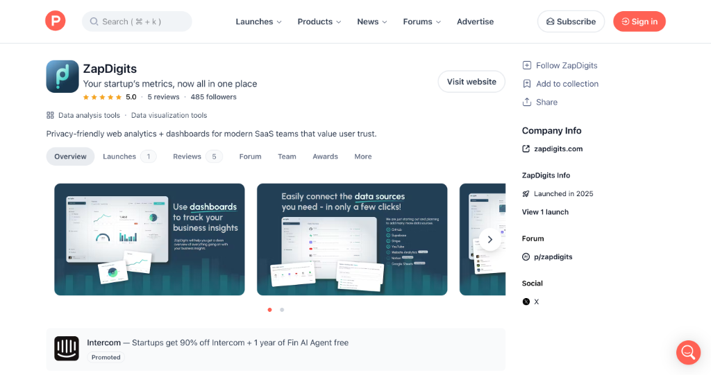
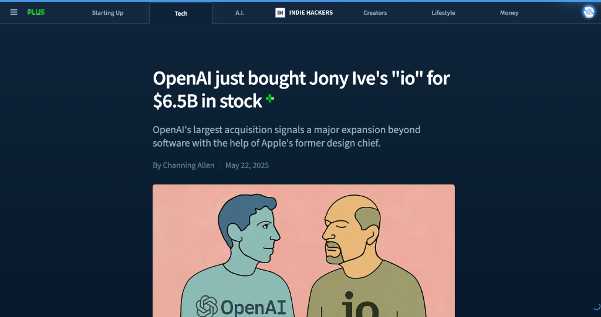
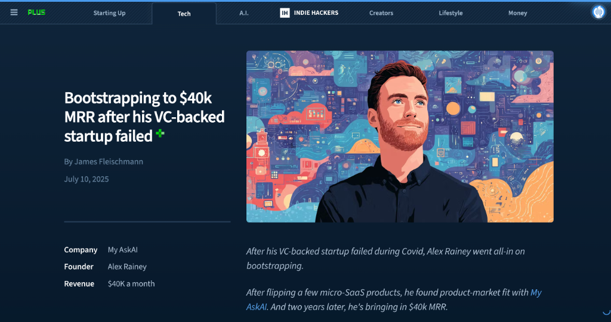
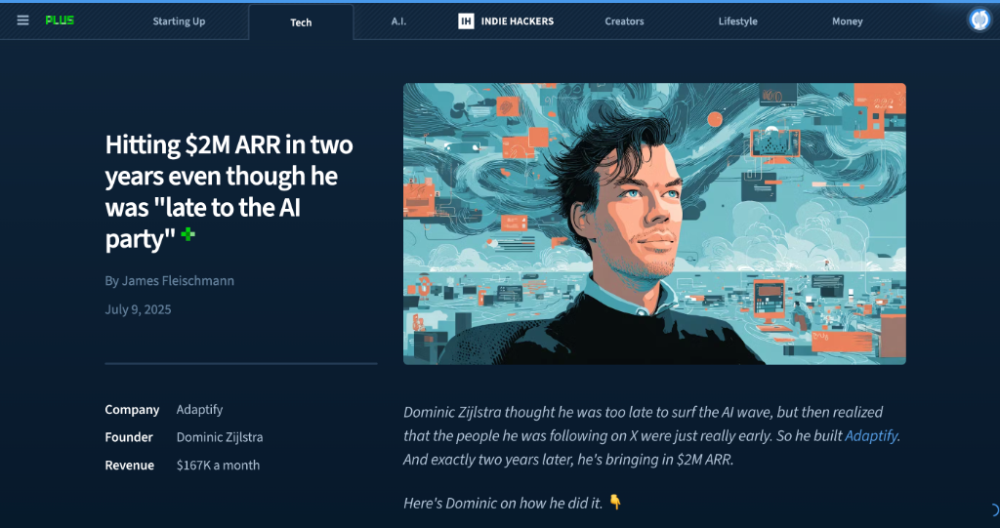
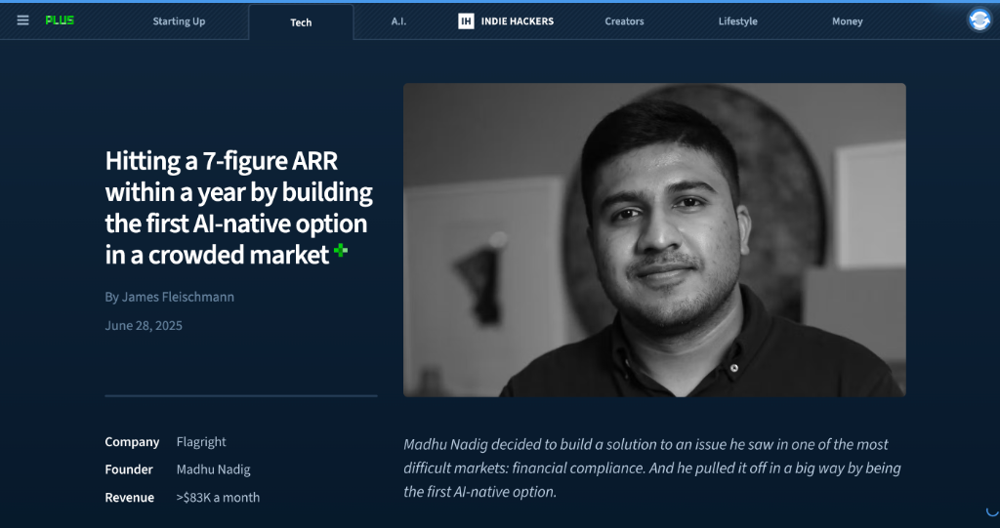

# HelloDev 开发者日报 - 2025年08月10日

大家好，我是HelloDev！今天又是收获满满的一天，发现了不少令人兴奋的技术内容。让我来和大家分享一下今天的精彩发现~

📊 **今日统计**：
- 🚀 技术分享：0条
- 🛠️ 工具推荐：3条  
- 📰 行业动态：2条
- 💡 经验讨论：2条
- 📸 每日一图：2条

---

## 🛠️ 工具推荐

### [RapidNative](https://www.producthunt.com/products/rapidnative) 

**我的推荐理由**：这个工具让我眼前一亮！作为一个经常需要快速构建移动应用原型的开发者，我发现RapidNative真正解决了从想法到代码的转换难题。它不只是生成一堆模板代码，而是能理解你的需求并生成结构良好的React Native应用。特别适合产品经理、设计师和开发者团队协作时快速验证想法。

**核心特性**：
- **自然语言转代码**：只需用英语描述你的应用想法，它就能生成对应的移动应用界面，这大大降低了技术门槛
- **现代化技术栈**：基于React Native、Expo和NativeWind构建，生成的代码质量很高，样式处理也很优雅
- **AI聊天界面优化**：支持通过AI聊天来迭代优化界面，这种交互方式比传统的配置选项更加直观和高效

**技术洞察**：RapidNative的亮点在于它没有试图替代开发者，而是作为开发者的智能助手。它生成的代码结构清晰、模块化，便于后续的定制开发。这对于需要快速迭代的项目来说非常有价值。

**适用场景**：特别适合用于产品原型设计、MVP开发和快速验证商业想法。

---

### [Domainerly](https://www.producthunt.com/products/domainerly)

**我的推荐理由**：作为一名经常需要为项目寻找合适域名的开发者，Domainerly简直是救星！它解决了找域名过程中最头疼的问题——既要创意又要可用性。这个AI驱动的工具不仅能生成独特的域名建议，还能实时检查可用性，大大节省了时间。

**核心特性**：
- **AI生成创意域名**：利用AI技术生成独特且有创意的域名建议，突破传统命名思维的限制
- **实时可用性检查**：即时检查所有顶级域名的可用性，避免了在不可用域名上浪费时间
- **个性化筛选功能**：支持多种AI模型和高级过滤选项，可以根据项目需求定制搜索结果

**技术洞察**：Domainerly的价值在于它将AI生成与实用性检查完美结合。很多域名生成工具只能提供创意，但Domainerly还能确保这些创意是可行的，这在实际项目中非常重要。

**适用场景**：适用于创业项目命名、个人品牌建设以及任何需要寻找独特域名的场景。

---

### [ZapDigits](https://www.producthunt.com/products/zapdigits)

**我的推荐理由**：如果你和我一样关心用户隐私，但又需要详细的网站分析数据，那么ZapDigits绝对值得一看。它在提供强大分析功能的同时，把用户隐私保护放在了首位。作为一个注重隐私的SaaS团队工具，它让我能够在不侵犯用户隐私的情况下深入了解用户行为。

**核心特性**：
- **隐私友好设计**：专注于保护用户隐私的网络分析，符合现代用户对数据保护的期望
- **全面的分析功能**：提供自定义事件跟踪、页面浏览量分析、设备分布等全面的网站分析功能
- **直观的仪表板**：为SaaS团队设计的直观仪表板，让数据解读变得更加简单

**技术洞察**：ZapDigits代表了Web分析工具的一个重要趋势——在数据驱动和隐私保护之间找到平衡。它证明了我们不必为了获取分析数据而牺牲用户隐私。

**适用场景**：特别适合注重用户隐私的SaaS初创公司和需要合规分析的网站。

---

## 📰 行业动态

### [Anthropic just launched Claude 4, the new state-of-the-art in AI coding](https://www.indiehackers.com/post/fhohDY4zlh1oaGhia6xE)

Anthropic刚刚发布了Claude 4，这在AI编码领域引起了巨大轰动。从我的角度来看，这次更新最令人兴奋的是Claude Sonnet 4在SWE-bench测试中达到了72.7%的得分，相比前代版本有了显著提升。特别是它现在支持扩展思维模式，让开发者可以更好地控制推理过程，这在处理复杂项目时非常有用。

更让我感兴趣的是Claude Code的正式发布，这个终端编码助手看起来很有潜力。从演示来看，它不仅能处理Git操作，还能进行测试和调试，这可能会改变我们编写代码的方式。

### [OpenAI just bought Jony Ive's "io" for $6.5B in stock](https://www.indiehackers.com/post/9Racp7DbHiUXxw2Qmmn0)

OpenAI收购Jony Ive的设计工作室"io"这一消息让我非常震惊。65亿美元的交易额显示了OpenAI对硬件领域的雄心壮志。从我的分析来看，这不仅仅是一次简单的收购，更是OpenAI试图重新定义人机交互方式的战略举措。

不过，历史告诉我们AI硬件的道路并不平坦。Humane的AI Pin和Rabbit R1的失败提醒我们，再好的设计和技术也需要解决实用性问题。我很好奇OpenAI如何避免这些陷阱，创造出真正有价值的AI硬件产品。

---

## 💡 经验讨论

### [Bootstrapping to $40k MRR after his VC-backed startup failed](https://www.indiehackers.com/post/LF1CwRs1vL3oVLcuoIoE)

这个案例让我深受启发。Alex Rainey在VC支持的初创公司失败后，仅用两人团队就将My AskAI做到了4万美元的月经常性收入。他的经历告诉我们，失败并不可怕，关键是如何从中学习并重新开始。

我特别认同他的观点：约束能带来专注。在资源有限的情况下，他们被迫专注于核心功能，最终找到了真正的市场需求。他们的SEO策略也很聪明，通过明确的价值主张("比Intercom便宜5倍")来吸引客户。

### [Hitting $2M ARR in two years even though he was "late to the AI party"](https://www.indiehackers.com/post/zC8I9EvIpANvyntOTDzk)

Dominic Zijlstra的故事让我重新思考了"时机"的重要性。虽然他觉得自己进入AI领域较晚，但正是这种"迟到"让他能够从早期玩家那里学习经验，避免了他们的错误。

他的付费广告验证策略非常实用。把付费广告当作"真相血清"来测试市场需求，这种方法比传统的市场调研更加直接有效。对于正在考虑进入AI领域的朋友们，我强烈推荐学习这种验证方法。

---

## 📸 每日一图

### [Hitting a 7-figure ARR within a year by building the first AI-native option in a crowded market](https://www.indiehackers.com/post/G1GYzLnZFna2wyZI9BF0)

这张图展示了Flagright如何在竞争激烈的金融合规市场中脱颖而出。他们的成功秘诀在于构建了真正的AI原生解决方案，而不是简单地在现有产品上添加AI功能。

我特别欣赏他们将市场推广视为工程系统来优化的做法。这种系统化的思维方式值得每个创业者学习。同时，他们专注于早期客户的策略也证明了在创业初期深度服务少数客户比广泛覆盖更多客户更重要。

---

## 📝 今日总结

今天的内容就分享到这里。从RapidNative这样的AI开发工具到Claude 4这样的编码AI模型更新，我们可以看到AI正在深刻地改变软件开发的方方面面。同时，像My AskAI和Adaptify这样的创业故事也告诉我们，即使在竞争激烈的AI市场中，通过专注和执行力依然能够取得成功。

**个人感悟**：今天的发现让我更加确信，AI工具的价值不在于替代开发者，而在于增强开发者的能力。无论是RapidNative帮助快速构建原型，还是Claude 4提升编码效率，这些工具都在让我们变得更强大而不是被淘汰。作为开发者，我们需要拥抱这些变化，学会与AI协作。

**明日预告**：明天我会继续为大家挖掘更多优质内容，包括更多实用的开发工具和前沿技术趋势分析。

---

💌 **互动时间**：
- 你对哪个项目最感兴趣？
- 有什么想了解的技术话题？
- 欢迎在评论区分享你的想法！

🔗 **关注HelloDev**：每日精选开发者最有价值的技术内容
📱 **多平台发布**：微信公众号 | 掘金 | 知乎 | GitHub

*本日报由HelloDev Generator自动生成，内容经过人工审核和优化*