# HelloDev 开发者日报 - 2025年08月11日

大家好，我是HelloDev！今天又是收获满满的一天，发现了不少令人兴奋的技术内容。让我来和大家分享一下今天的精彩发现~

📊 **今日统计**：
- 🚀 技术分享：8条
- 🛠️ 工具推荐：6条  
- 📰 行业动态：5条
- 💡 经验讨论：0条
- 📸 每日一图：2条

---

## 🚀 技术分享

### [yt-dlp / yt-dlp](https://github.com/yt-dlp/yt-dlp) 
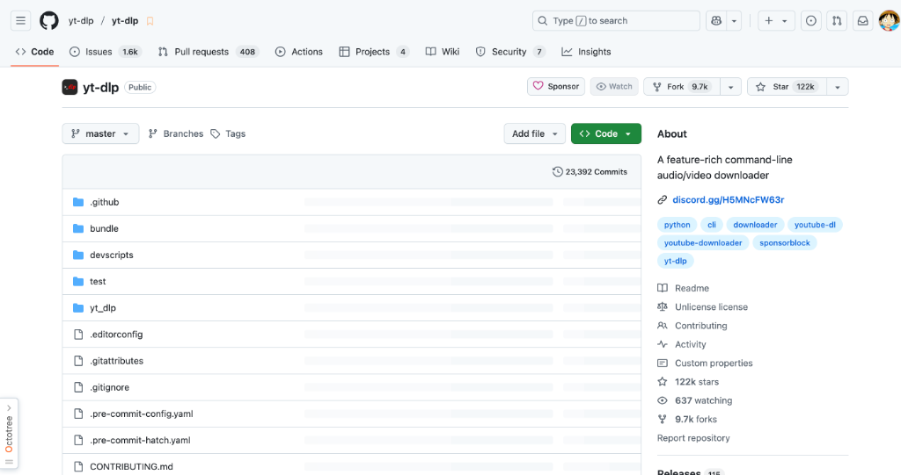

**我的推荐理由**：作为一个经常需要下载视频内容的开发者，yt-dlp 是我不可或缺的工具。它不仅支持数千个网站，还提供了比原版 youtube-dl 更多的功能和更好的性能。从格式选择到元数据嵌入，再到 SponsorBlock 集成，这个工具真的考虑到了每一个细节。

**核心特性**：
- **多站点支持**：支持从数千个网站下载音频和视频，覆盖面广
- **高级格式控制**：可以精确选择下载格式和排序选项，满足不同需求
- **SponsorBlock 集成**：自动跳过赞助内容，提升观看体验
- **多线程下载**：通过分片多线程下载显著提升速度
- **浏览器Cookie提取**：支持从主流浏览器提取Cookie，简化认证流程

**技术洞察**：yt-dlp 的架构设计体现了对复杂下载场景的深度理解，特别是对直播流和DRM内容的处理能力，使其在同类工具中脱颖而出。

**适用场景**：适合需要批量下载视频内容的开发者、内容创作者或研究人员

---

### [unslothai / unsloth](https://github.com/unslothai/unsloth) 

**我的推荐理由**：如果你正在做LLM微调，那一定要看看这个项目！它通过优化内核将训练速度提升2倍，显存使用减少70%，这在资源受限的环境中简直是救星。特别是对于像我这样在消费级GPU上做实验的人来说，这个工具大大降低了门槛。

**核心特性**：
- **性能优化**：训练速度提升2倍，显存使用减少70%
- **广泛模型支持**：支持gpt-oss、Qwen3、Llama 4等多种前沿模型
- **全精度训练**：0%准确率损失，所有计算精确无近似
- **多GPU支持**：兼容NVIDIA自2018年以来的大多数GPU
- **跨平台**：支持Linux和Windows系统

**技术洞察**：Unsloth 通过使用OpenAI Triton语言编写内核和手动反向传播引擎，实现了在不牺牲精度的前提下大幅提升性能，这种技术路径值得借鉴。

**适用场景**：适合需要在有限资源下进行LLM微调和强化学习的研究人员和开发者

---

### [nottelabs/notte: 🔥 Reliable Browser AI agents (YC S25)]](https://github.com/nottelabs/notte) 

**我的推荐理由**：这个项目让我对Web自动化有了全新的认识。它通过混合方法将LLM成本降低50%以上，同时提升可靠性，这种思路非常巧妙。特别是对于需要大规模Web操作的项目，Notte提供了一个可靠的解决方案。

**核心特性**：
- **混合工作流**：结合传统脚本和AI，仅在必要时使用AI干预
- **结构化输出**：使用Pydantic模型确保输出一致性
- **隐身浏览器**：支持CAPTCHA解决和代理，避免被检测
- **企业级安全**：提供Secrets Vaults和Digital Personas功能
- **高性能**：在基准测试中表现出96.6%的任务可靠性

**技术洞察**：Notte的混合架构解决了纯AI方法成本高和纯脚本方法灵活性差的问题，为Web自动化提供了一个平衡的解决方案。

**适用场景**：适合需要可靠Web自动化的开发者和企业，特别是那些对成本敏感的项目

---

### [omkarcloud / botasaurus](https://github.com/omkarcloud/botasaurus) 

**我的推荐理由**：做爬虫的朋友一定要关注这个项目！它提供了全面的反检测解决方案，从Cloudflare绕过到指纹识别规避，应有尽有。我特别喜欢它的代理成本降低技术，可以节省高达97%的成本。

**核心特性**：
- **反检测能力**：绕过Cloudflare、Datadome等主流反爬系统
- **代理优化**：通过浏览器请求将代理成本降低97%
- **多平台支持**：可转换为桌面应用，支持Mac、Windows和Linux
- **人性化自动化**：模拟真实用户行为，避免被识别
- **并行执行**：支持缓存和并行处理，提升大规模爬取效率

**技术洞察**：Botasaurus通过创新的代理使用和浏览器请求优化，解决了现代Web爬取中的核心挑战——成本和检测。

**适用场景**：适合需要大规模、高质量数据爬取的开发者和数据科学家

---

### [modelscope / DiffSynth-Studio](https://github.com/modelscope/DiffSynth-Studio) 

**我的推荐理由**：在AI图像生成领域，DiffSynth-Studio是一个值得关注的项目。它不仅支持主流的扩散模型，还引入了Qwen-Image系列这样的创新模型，特别是实体级控制功能让我很兴奋。

**核心特性**：
- **高效内存管理**：针对扩散模型优化的内存管理机制
- **新模型支持**：支持Qwen-Image系列和FLUX等最新模型
- **统一架构**：Nexus-Gen实现图像理解、生成和编辑一体化
- **低显存部署**：支持层-by-layer卸载，降低硬件要求
- **灵活训练**：支持LoRA和全量训练

**技术洞察**：DiffSynth-Studio通过统一架构和高效内存管理，为扩散模型的学术研究和工业部署搭建了桥梁。

**适用场景**：适合AI图像生成和编辑的研究人员、开发者和创意工作者

---

### [PacktPublishing / LLM-Engineers-Handbook](https://github.com/PacktPublishing/LLM-Engineers-Handbook) 
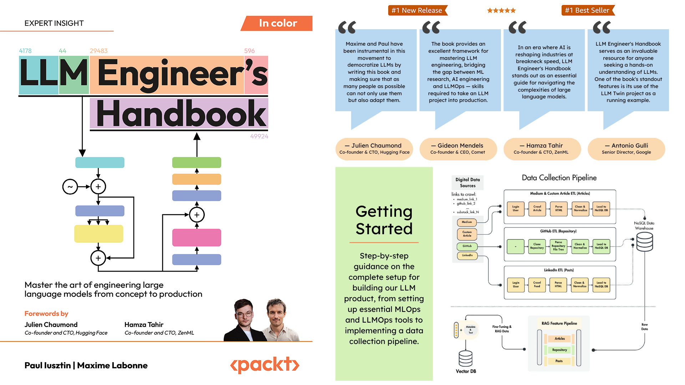

**我的推荐理由**：这不仅仅是一本书的代码仓库，更是一个完整的LLM工程实践指南。从数据收集到部署监控，覆盖了整个生命周期，对于想要系统学习LLM工程的开发者来说是不可多得的资源。

**核心特性**：
- **全生命周期覆盖**：从数据收集到部署监控的完整流程
- **云原生部署**：基于AWS的最佳实践部署方案
- **RAG系统实现**：包含简单但实用的RAG系统示例
- **监控框架**：提供全面的监控和评估机制
- **实战导向**：大量hands-on示例和最佳实践

**技术洞察**：该手册通过实际代码示例展示了LLMOps的最佳实践，特别是在云环境下的部署和监控策略，对工程化落地有重要参考价值。

**适用场景**：适合希望系统学习LLM工程实践的开发者、数据科学家和MLOps工程师

---

### [commaai / openpilot](https://github.com/commaai/openpilot) 
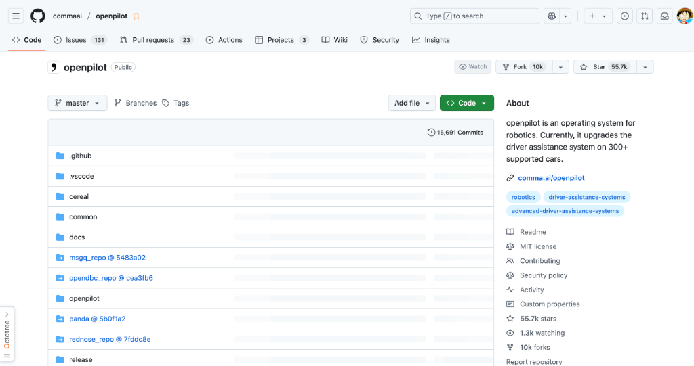

**我的推荐理由**：作为一个开源爱好者，我对openpilot的社区驱动开发模式很感兴趣。它让300多种车型都能享受到高级驾驶辅助功能，这种普惠技术的理念很赞。

**核心特性**：
- **广泛兼容性**：支持300+车型的驾驶辅助系统升级
- **多分支开发**：提供稳定版、预发布版和开发版满足不同需求
- **安全优先**：遵循ISO26262标准，具备完善的测试套件
- **开源社区**：活跃的社区驱动开发，支持贡献和赏金
- **硬件支持**：专为comma 3/3X硬件优化

**技术洞察**：openpilot通过严格的测试和标准化流程，将开源社区的力量应用于汽车安全领域，展示了开源在关键系统中的潜力。

**适用场景**：适合对自动驾驶技术感兴趣的开发者、汽车爱好者和希望升级车辆辅助系统的车主

---

### [ucbepic / docetl](https://github.com/ucbepic/docetl) 

**我的推荐理由**：处理非结构化文档数据一直是个挑战，DocETL通过LLM赋能提供了一个优雅的解决方案。它的交互式UI和生产级Python包的双模式设计很贴心。

**核心特性**：
- **交互式开发**：DocWrangler提供prompt工程和管道开发的游乐场
- **生产部署**：提供Python包支持命令行和代码调用
- **多LLM集成**：支持OpenAI和AWS Bedrock等主流LLM服务
- **容器化部署**：基于Docker的快速部署方案
- **详细文档**：完善的教程和文档支持

**技术洞察**：DocETL通过将LLM能力与ETL流程结合，为文档数据处理提供了新的思路，特别是在prompt工程和管道编排方面。

**适用场景**：适合需要处理大量非结构化文档数据的开发者、数据工程师和研究人员

---

## 🛠️ 工具推荐

### [Simular Pro](https://www.producthunt.com/products/simular)
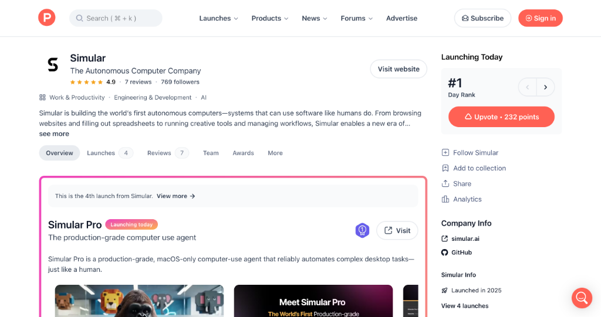

**推荐理由**：这是我见过的最聪明的桌面自动化工具之一。它通过结合神经和符号代理解决了通用性与可重复性之间的矛盾，真正实现了像人类一样的操作。

**核心亮点**：
- **智能适应**：能够适应UI变化，保持操作的稳定性
- **无集成需求**：无需自定义集成即可自动化GUI工作流
- **生产级质量**：专为复杂任务设计，可靠性高

**适用场景**：适合需要自动化复杂桌面任务的企业用户，特别是那些处理电子表格、EMR、CRM等系统的用户

---

### [SmartPractice AI](https://www.producthunt.com/products/smartpractice-ai)
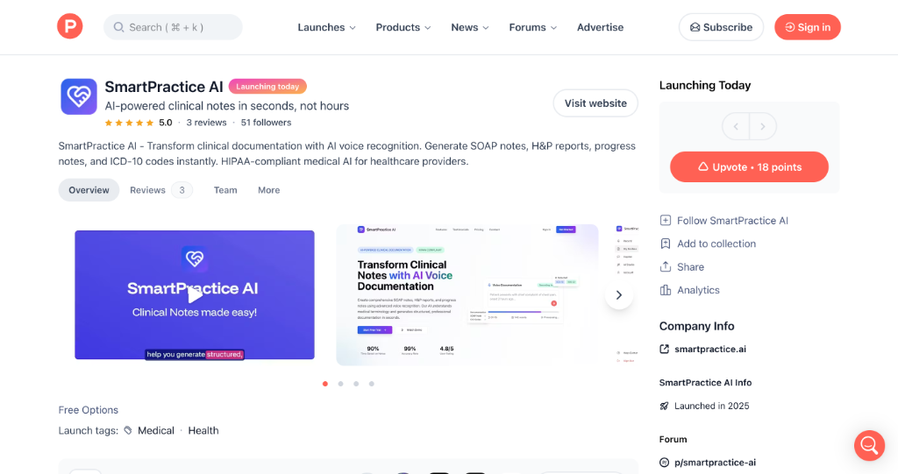

**推荐理由**：作为一名关注医疗技术的开发者，我被这个工具的实用性深深打动。它能将医生的文档时间减少80%，这对改善医患关系有重要意义。

**核心亮点**：
- **语音转SOAP笔记**：几秒钟内生成专业临床笔记
- **自动编码建议**：提供ICD-10和CPT代码建议
- **HIPAA合规**：确保医疗数据安全

**适用场景**：适合各级医疗机构的医生、远程医疗提供商和医疗记录管理人员

---

### [Shotva](https://www.producthunt.com/products/shotva)
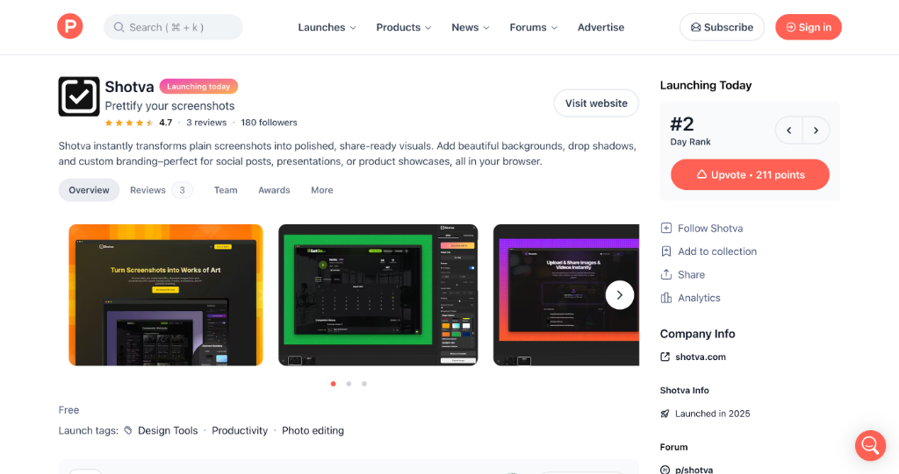

**推荐理由**：作为一个经常需要制作技术分享材料的开发者，Shotva大大简化了我的工作流程。AI自动美化功能真的很惊艳。

**核心亮点**：
- **AI自动美化**：自动分析截图并应用上下文相关设计
- **零学习成本**：无需安装和登录，浏览器直接使用
- **丰富定制选项**：数百种主题、渐变和字体选择

**适用场景**：适合需要快速制作专业截图的开发者、设计师和内容创作者

---

### [SEO Shop Audit](https://www.producthunt.com/products/seo-shop-audit)

**推荐理由**：这个工具解决了SEO顾问的一个痛点——如何在维护现有客户的同时获取新客户。三步审计流程设计很巧妙。

**核心亮点**：
- **结构化审计**：三步流程快速生成定制SEO行动计划
- **时间节省**：自动化审计过程，提高效率
- **价值展示**：清晰展示SEO改进价值，便于客户转化

**适用场景**：适合电商SEO顾问、数字营销 agency 和希望提升电商网站排名的企业

---

### [Yummery](https://www.producthunt.com/products/ai-meal-planner-recipes)
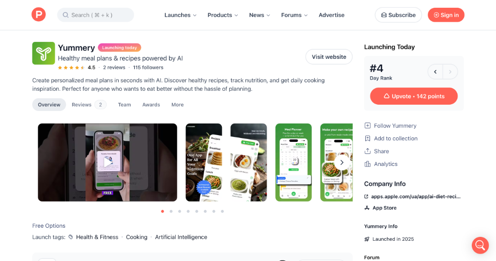

**推荐理由**：作为一个经常为吃什么发愁的开发者，Yummery简直是救星。它能根据我的偏好和目标生成个性化食谱。

**核心亮点**：
- **个性化规划**：基于用户偏好和目标生成定制食谱
- **营养追踪**：内置营养跟踪功能
- **购物清单**：自动生成购物清单

**适用场景**：适合希望改善饮食习惯、节省 meal planning 时间的健康意识人群

---

### [Reddit Growth](https://www.producthunt.com/products/reddit-growth)

**推荐理由**：Reddit营销一直是个挑战，这个服务通过人工主导的方式确保了内容质量和合规性，这在当前AI泛滥的环境下很难得。

**核心亮点**：
- **人工主导**：无自动化或AI生成内容，确保质量
- **价值优先**：专注于创造价值而非纯粹推广
- **透明报告**：每周提供增长报告

**适用场景**：适合希望通过Reddit获取高质量流量的企业和创业者

---

## 📰 行业动态

### [hesreallyhim / awesome-claude-code](https://github.com/hesreallyhim/awesome-claude-code)

**我的观点**：这个资源列表让我对Claude Code的潜力有了新的认识。Slash命令和CLAUDE.md文件的组合为开发者提供了强大的上下文管理能力。

**行业趋势**：
- **上下文增强**：通过CLAUDE.md文件提供项目上下文成为新趋势
- **社区驱动**：开发者社区正在积极分享Claude Code的最佳实践
- **工具生态**：围绕Claude Code的工具生态系统正在快速形成

**影响分析**：这类资源的出现表明AI编程助手正在从简单的代码补全向更深层次的项目理解和协作发展。

---

### [BeeSecure](https://www.producthunt.com/products/beesecure)
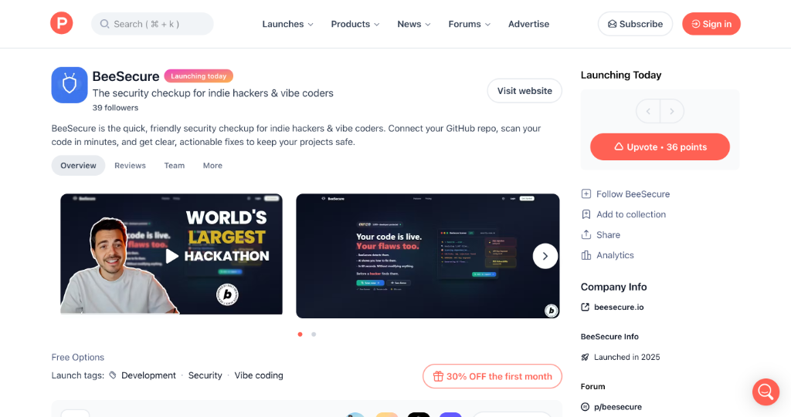

**我的观点**：安全一直是开发中的痛点，特别是对于独立开发者。BeeSecure提供的快速安全检查服务很有价值。

**行业趋势**：
- **安全即服务**：安全工具正朝着SaaS模式发展
- **AI辅助检测**：AI在漏洞检测中的应用越来越广泛
- **易用性优先**：安全工具越来越注重用户体验

**影响分析**：这类工具的普及将提高整个行业的安全水平，特别是对资源有限的初创团队意义重大。

---

### [Unclaws](https://www.producthunt.com/products/unclaws)
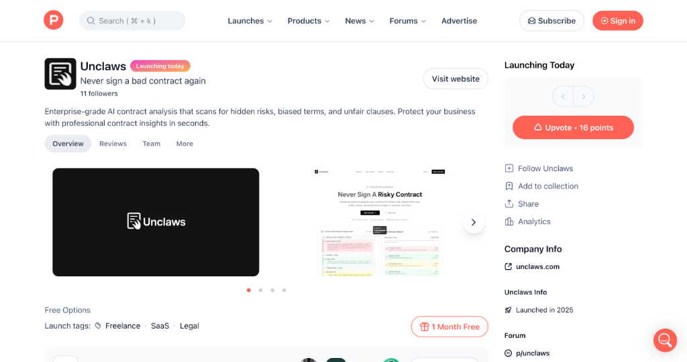

**我的观点**：合同审查是很多非法律专业人士的痛点，Unclaws通过AI技术降低了这一门槛，这个想法很棒。

**行业趋势**：
- **法律科技兴起**：AI在法律领域的应用正在快速增长
- **普惠化服务**：原本昂贵的专业服务正在变得大众化
- **风险预防**：从事后处理向事前预防转变

**影响分析**：这类工具将改变专业服务的提供方式，让更多人能够享受到高质量的专业建议。

---

### [From GPT-2 to gpt-oss: Analyzing the Architectural Advances](https://magazine.sebastianraschka.com/p/from-gpt-2-to-gpt-oss-analyzing-the)
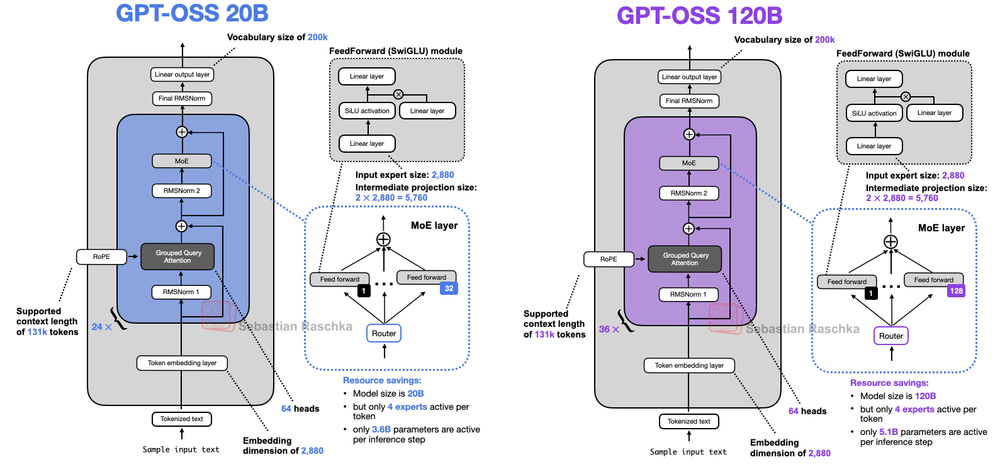

**我的观点**：这篇文章对gpt-oss模型的分析让我印象深刻。特别是MXFP4量化技术，使得单GPU部署成为可能，这对普及大模型应用意义重大。

**技术洞察**：
- **架构演进**：从GPT-2到gpt-oss体现了现代LLM架构的成熟
- **效率优化**：MoE和GQA等技术在保持性能的同时提升了效率
- **部署友好**：量化技术显著降低了部署门槛

**趋势预测**：随着开源模型质量的提升和部署技术的成熟，我们将看到更多基于开源LLM的创新应用。

---

### [Booting 5000 Erlangs on Ampere One 192-core](https://underjord.io/booting-5000-erlangs-on-ampere-one.html)
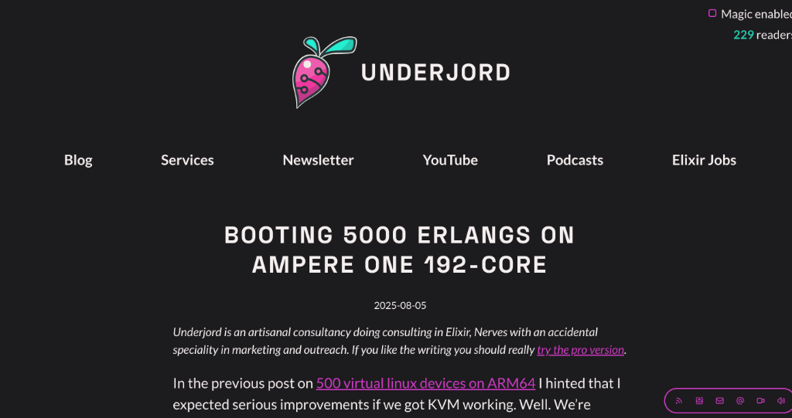

**我的观点**：在ARM架构上运行5000个Erlang进程的实验展示了现代硬件在并发处理方面的巨大潜力。

**技术亮点**：
- **ARM优势**：Ampere One在高并发场景下的表现超出预期
- **内存优化**：通过精细调优实现稳定的大规模部署
- **虚拟化加速**：KVM加速显著提升了性能

**行业影响**：这为大规模IoT设备模拟和测试提供了新的可能性，特别是在嵌入式系统开发领域。

---

## 📸 每日一图

### [funstory-ai / BabelDOC](https://github.com/funstory-ai/BabelDOC)

**技术解读**：BabelDOC专注于PDF文档翻译，特别是科学论文的高质量翻译。它的术语表功能和离线资产管理让我印象深刻，这解决了学术交流中的一个实际痛点。

**应用场景**：
- 学术论文翻译和双语对比
- 技术文档国际化
- 多语言内容生产

---

### [DevilXD / TwitchDropsMiner](https://github.com/DevilXD/TwitchDropsMiner)
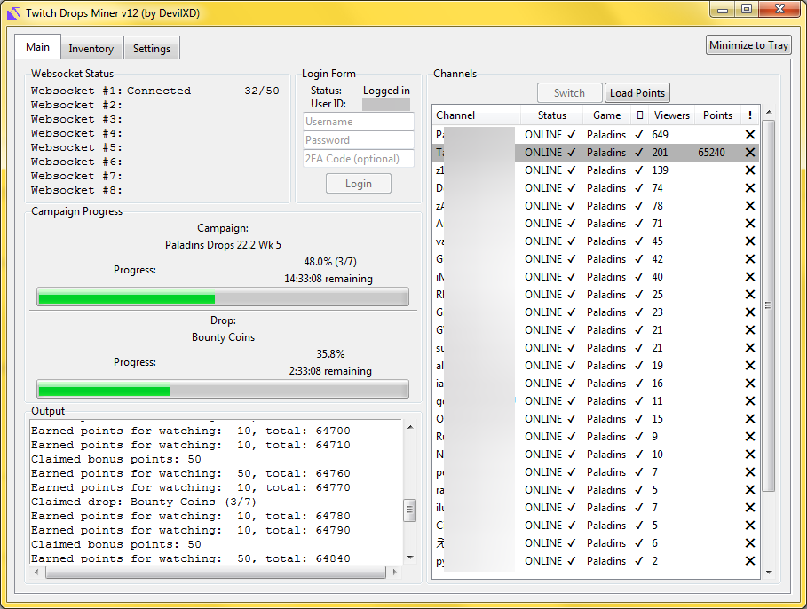

**技术解读**：这个项目通过获取流媒体元数据而非实际视频内容来"挖掘"Twitch掉落物品，这种设计既节省带宽又提高了效率。websocket跟踪和自动频道切换功能很实用。

**创新点**：
- 零带宽挖掘：只获取元数据，不下载视频流
- 智能调度：自动切换频道和管理会话
- 跨平台支持：提供Windows和Linux可执行文件

---

## 📝 今日总结

今天的内容就分享到这里。从yt-dlp这样的实用工具到unsloth这样的性能优化库，再到Notte和Botasaurus这样的AI自动化解决方案，我们可以看到开发者工具正在变得更加智能和高效。

**个人感悟**：今天的发现让我深刻感受到，AI技术正在从理论走向实践，真正解决开发者和用户的实际问题。无论是通过优化算法提升性能，还是通过智能自动化减少重复劳动，这些工具都在让技术变得更加普惠和易用。特别是看到像Unclaws这样解决普通人痛点的工具，让我意识到技术的真正价值在于改善人们的生活。

**明日预告**：明天我会继续为大家挖掘更多优质内容，包括更多AI应用案例、开发工具评测和行业趋势分析。

---

💌 **互动时间**：
- 你对哪个项目最感兴趣？
- 有什么想了解的技术话题？
- 欢迎在评论区分享你的想法！

🔗 **关注HelloDev**：每日精选开发者最有价值的技术内容
📱 **多平台发布**：微信公众号 | 掘金 | 知乎 | GitHub

*本日报由HelloDev Generator自动生成，内容经过人工审核和优化*