# HelloDev.io 开发者日报 - 第 7 期 | 2025 年 08 月 13 日

👋 Hi，这里是 HelloDev.io 开发者日报，今天是第 7 期，即将为你介绍今天的精彩发现：

📊 **今日统计**：
- 🚀 开源趋势：8 条
- 🛠️ 产品观察：6 条  
- 📰 行业动态：3 条
- 💡 经验讨论：1 条
- 📸 每日一图：1 条

---

## 🚀 开源趋势

### [fastapi / full-stack-fastapi-template](https://github.com/fastapi/full-stack-fastapi-template) 

这个项目提供了一个现代的全栈 Web 应用模板，后端使用 FastAPI，前端使用 React。它不仅仅是一个简单的模板，而是集成了大量现代开发所需的功能，比如 JWT 认证、安全的密码哈希、基于邮件的密码恢复、使用 Pytest 和 Playwright 的自动化测试、深色模式支持，以及使用 Docker Compose 和 Traefik 的自动 HTTPS 部署配置。对于想要快速启动一个功能完整的全栈项目的开发者来说，这简直是个宝藏。我觉得这个项目特别适合那些希望在生产环境中快速部署应用的团队。

### [nomic-ai / gpt4all](https://github.com/nomic-ai/gpt4all) 
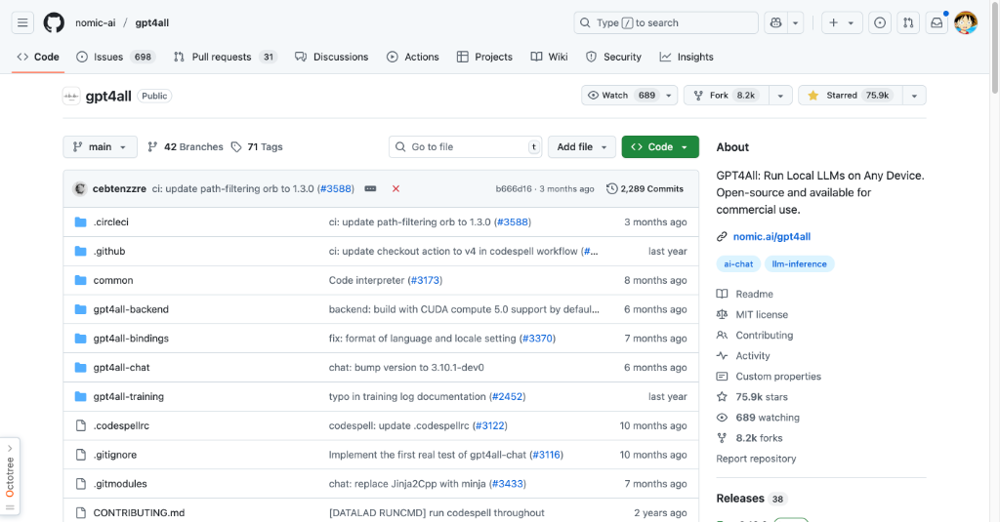

GPT4All 是一个非常棒的项目，它让大型语言模型（LLMs）可以在普通计算机上本地运行，而不需要依赖 API 调用或 GPU。这意味着你可以完全离线使用这些模型，同时还能保护你的隐私。这个项目支持多种操作系统，并且提供了桌面应用和 Python 客户端，非常方便。如果你对本地运行 LLM 感兴趣，或者想在没有网络连接的环境中使用 AI 模型，GPT4All 绝对值得一试。

### [unslothai / notebooks](https://github.com/unslothai/notebooks) 

这个仓库提供了超过 100 个针对大型语言模型（LLMs）的微调笔记本，涵盖了各种模型和任务。这些笔记本可以帮助你快速上手 LLM 的微调工作，无论是对话 AI、文本生成还是视觉任务，都能找到对应的示例。我觉得这个项目非常适合那些想要深入研究 LLM 微调的开发者，特别是初学者，因为它提供了详细的指导和示例代码。

### [conductor-oss / conductor](https://github.com/conductor-oss/conductor) 
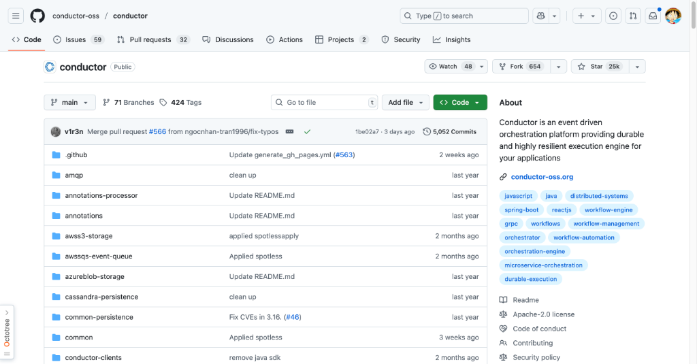

Conductor 是 Netflix 开源的一个微服务编排引擎，专门用于管理事件驱动的工作流。它提供了一个持久且高弹性的执行引擎，帮助开发者在不紧耦合服务的情况下创建灵活、可扩展的工作流。Conductor 支持多种持久化和队列选项，如 Redis、MySQL 和 Postgres，并且内置了丰富的任务类型和可定制的 UI。如果你正在构建复杂的微服务架构，Conductor 可以大大简化你的工作流程管理。

### [microsoft / poml](https://github.com/microsoft/poml) 
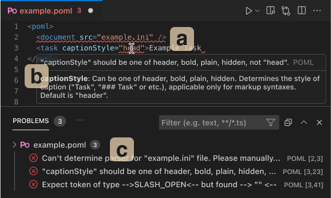

POML 是微软推出的一种新的标记语言，专门用于结构化和维护大型语言模型（LLMs）的提示工程。它使用类似 HTML 的语法，支持模块化设计，并且内置了数据处理、样式系统和模板引擎。POML 的目标是让提示工程变得更加结构化和易于维护。如果你经常处理复杂的 LLM 提示，POML 可以帮助你更好地组织和管理这些提示，提升开发效率。

### [umami-software / umami](https://github.com/umami-software/umami) 

Umami 是一个现代、注重隐私的 Google Analytics 替代品。它简单、快速，并且可以自托管，让你完全掌控自己的数据。Umami 支持多种数据库，并且可以通过 Docker 或源码轻松安装。如果你对用户隐私非常重视，或者想要一个更轻量级的网站分析工具，Umami 是一个非常好的选择。

### [donnemartin / system-design-primer](https://github.com/donnemartin/system-design-primer) 

这个 GitHub 仓库是系统设计面试的绝佳资源，涵盖了可扩展性、可用性、一致性等关键概念，并提供了详细的设计问题示例和解决方案。它还包含了 Anki 闪卡，帮助你通过间隔重复学习来巩固知识。无论你是准备面试，还是想深入了解如何构建大规模系统，这个项目都非常值得一看。

### [apple / embedding-atlas](https://github.com/apple/embedding-atlas) 
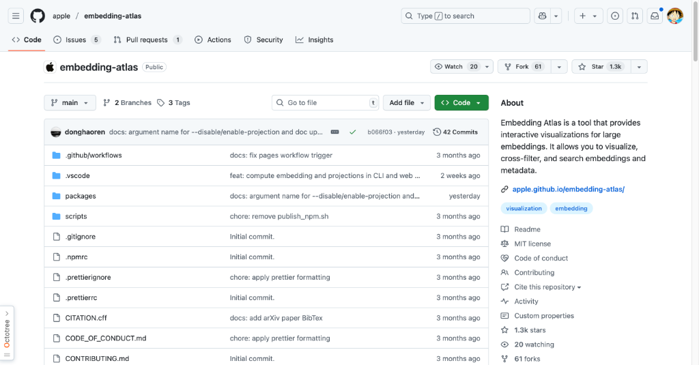

Embedding Atlas 是苹果开发的一个用于可视化大型嵌入的工具。它支持交互式的数据探索、过滤和搜索，并且利用 WebGPU 实现了高性能渲染。如果你在处理大量的嵌入数据，并且需要一个直观的方式来分析它们，Embedding Atlas 可以帮助你更好地理解数据的结构和关系。

---

## 🛠️ 产品观察

### [Gemini](https://www.producthunt.com/products/gemini-6) 
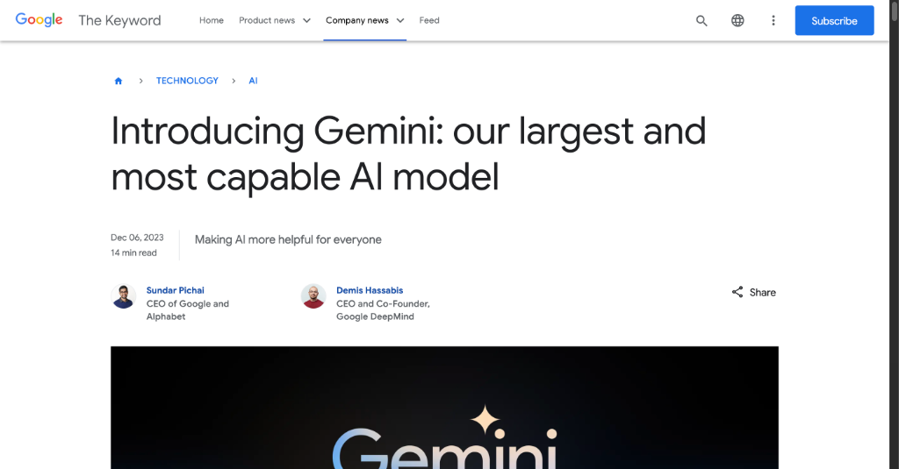

Gemini 是谷歌推出的最强大、最通用的 AI 模型，具备多模态理解能力，能够无缝处理文本、图像、音频、视频和代码。它有 Ultra、Pro 和 Nano 三种版本，分别适用于复杂任务、广泛任务和设备端任务。Gemini 在多个学术基准测试中表现出色，并且已经集成到 Bard 和 Pixel 等谷歌产品中。如果你正在寻找一个功能强大的 AI 模型来构建应用，Gemini 是一个非常值得考虑的选择。

### [OpenAI](https://www.producthunt.com/products/openai) 
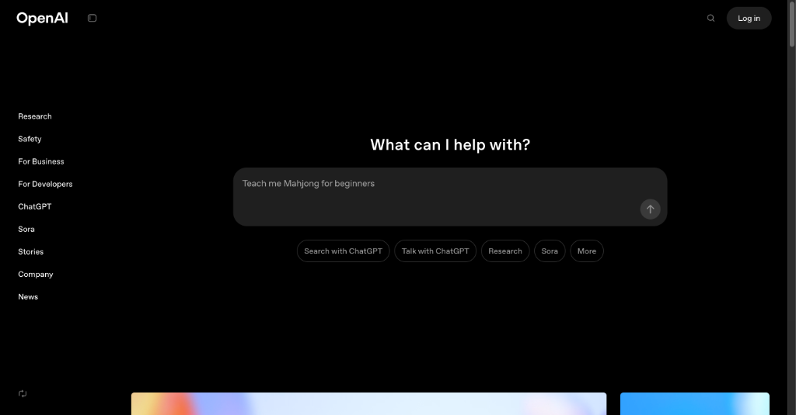

OpenAI 提供了强大的 API 和工具，帮助开发者快速构建和扩展 AI 应用。它的模型和基础设施非常先进，支持从聊天机器人到复杂推理任务的各种应用。OpenAI 的开放权重语言模型和专用 API 使其在 AI 领域保持领先地位。如果你想要快速上手 AI 开发，OpenAI 的平台是一个非常好的起点。

### [Leads Ward](https://www.producthunt.com/products/leads-ward) 
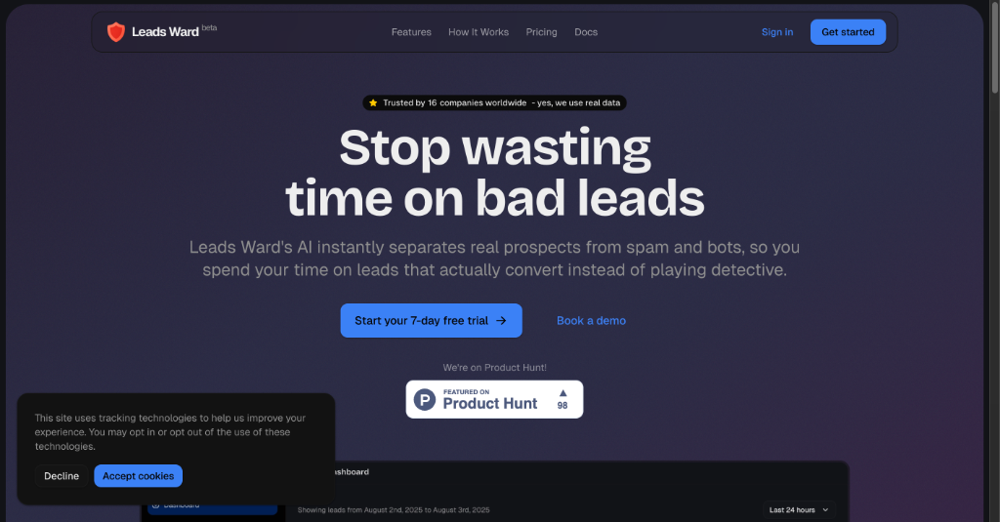

Leads Ward 是一个 AI 驱动的潜在客户过滤服务，能够实时分析表单提交，自动评分并过滤掉垃圾和低质量的线索。它通过简单的代码片段即可集成到任何网站表单中，并提供透明的评分系统和分析仪表盘。如果你经常被垃圾线索困扰，Leads Ward 可以帮你节省大量时间，专注于高质量的潜在客户。

### [Transync AI](https://www.producthunt.com/products/transync-ai) 
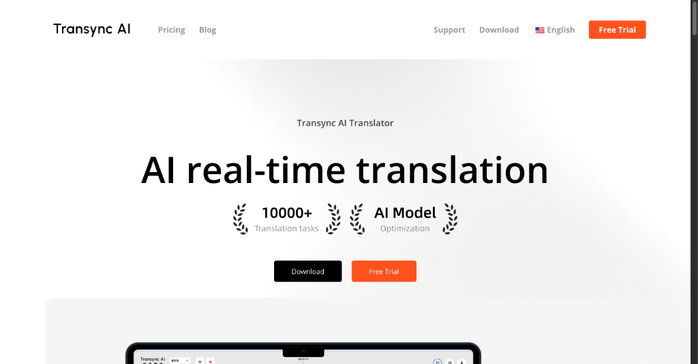

Transync AI 是一个 AI 驱动的实时同声传译助手，支持超过 60 种语言的高精度、低延迟翻译。它具备双屏显示功能，能够与 Zoom、Google Meet 和 Teams 等主流会议平台无缝集成。如果你经常参与跨国会议，Transync AI 可以让你的沟通更加顺畅，无需依赖人工翻译。

### [Coverage Cat](https://www.producthunt.com/products/coverage-cat) 

Coverage Cat 是一个 AI 原生的保险经纪人，能够回答各种保险相关的问题，包括房屋、汽车、雨伞、人寿和残疾保险。它通过分析上传的保险文件，帮助用户决定是否购买保单、如何索赔以及如何找到更好的价格。如果你对保险条款感到困惑，Coverage Cat 可以为你提供准确的信息和建议。

### [Earlytap](https://www.producthunt.com/products/earlytap) 

Earlytap 是一个产品发布平台，能够帮助用户在几分钟内创建 AI 驱动的落地页、邮件等待列表和反馈调查。它专为创业者、产品经理和营销人员设计，无需任何编码或设计技能即可快速验证产品想法。如果你正在准备发布新产品，Earlytap 可以帮助你快速收集早期用户反馈，节省大量时间和资源。

---

## 📰 行业动态

### [libsdl-org / SDL](https://github.com/libsdl-org/SDL) 

SDL 是一个跨平台的多媒体开发库，广泛用于游戏和模拟器的开发。它提供了对音频、键盘、鼠标、手柄和图形硬件的底层访问，并且支持 Windows、macOS、Linux、iOS 和 Android 等多个平台。SDL 的 zlib 许可证使其可以自由用于开源和商业项目。如果你正在开发多媒体应用，SDL 是一个非常值得信赖的工具。

### [FiloSottile / mkcert](https://github.com/FiloSottile/mkcert) 
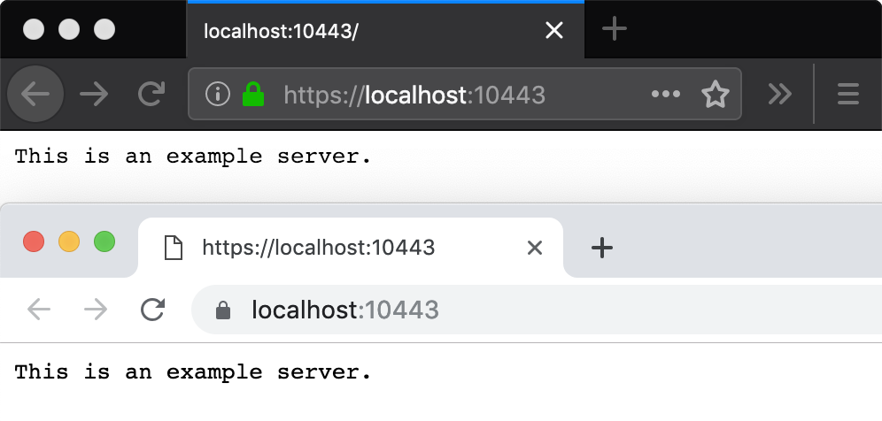

mkcert 是一个简单易用的工具，用于生成本地受信任的开发证书。它能够自动创建并安装本地证书颁发机构（CA），从而避免自签名证书带来的信任问题。mkcert 支持多种操作系统和浏览器，特别适合需要为 localhost 生成 HTTPS 证书的开发场景。如果你在本地开发中遇到证书问题，mkcert 可以帮你轻松解决。

### [ubicloud / ubicloud](https://github.com/ubicloud/ubicloud) 
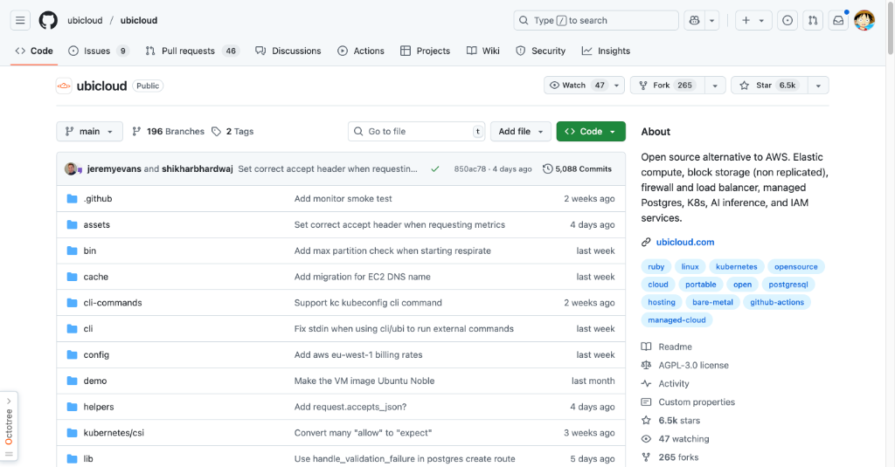

Ubicloud 是一个开源的云平台，旨在替代 AWS 等专有云提供商。它提供了基础设施即服务（IaaS）功能，支持在 Hetzner、Leaseweb 等裸金属提供商上运行。Ubicloud 具备弹性计算、安全网络、块存储和细粒度权限控制等功能，并且完全开源。如果你想要一个更便宜、更灵活的云解决方案，Ubicloud 是一个非常值得尝试的选择。

---

## 💡 经验讨论

### [Hitting $100M ARR in eight months with an AI software builder](https://www.indiehackers.com/post/ONMaxjB3rix2PnBCnrDr) 
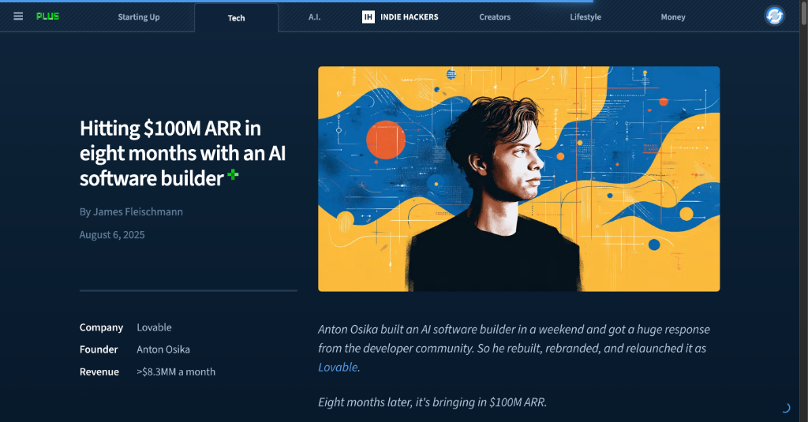

这篇文章分享了 Anton Osika 如何在短短八个月内将 AI 软件构建工具 Lovable 做到 1 亿美元的年经常性收入（ARR）。从最初的周末项目 GPT-Engineer 到如今的成功，Lovable 的成长速度令人惊叹。文章详细介绍了社区建设、社交媒体推广、定价策略和团队建设等关键因素。如果你对创业或 AI 产品开发感兴趣，这篇文章绝对值得一读。

---

## 📸 每日一图

### [trailofbits/buttercup: A Cyber Reasoning System for AI Cyber Challenge](https://github.com/trailofbits/buttercup) 
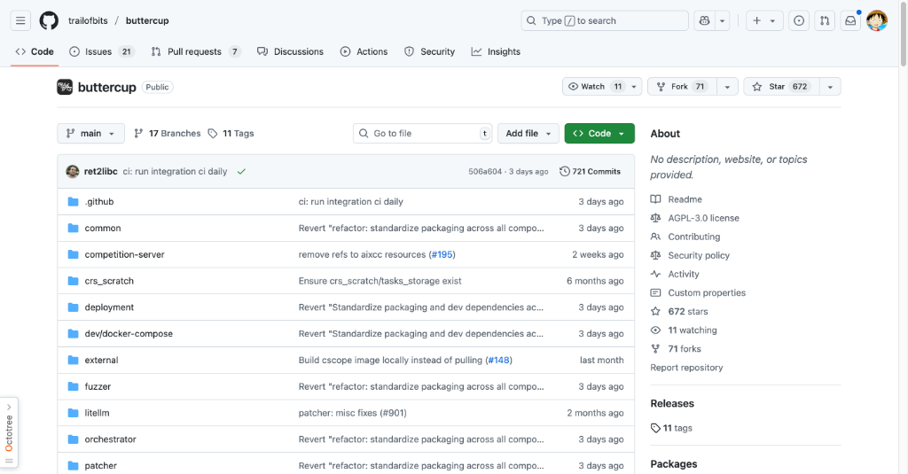

Buttercup 是 Trail of Bits 为 DARPA AI Cyber Challenge 开发的网络安全推理系统。它能够自动发现并修复开源代码中的漏洞，利用 AI/ML 辅助的模糊测试和多代理 AI 驱动的补丁程序。这个项目展示了 AI 在网络安全领域的巨大潜力，特别是在自动化漏洞修复方面。

---

## 📝 结语

明天见。Bye 👋
---

💌 **互动时间**：
- 你对哪个项目最感兴趣？
- 有什么想了解的技术话题？
- 欢迎在评论区分享你的想法！

🔗 **关注 HelloDev.io**：每日精选最有价值的内容，5 分钟了解行业最新进展
📱 **多平台发布**：微信公众号 | 掘金 | 知乎 | GitHub