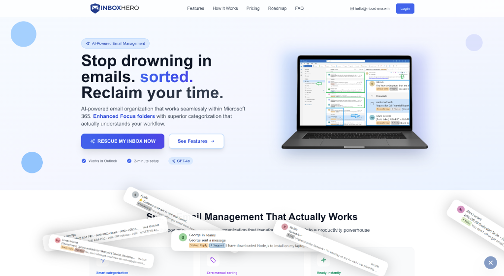

# HelloDev.io 开发者日报 - 第 7 期 | 2025 年 08 月 13 日

👋 Hi，这里是 HelloDev.io 开发者日报，今天是第 7 期，即将为你介绍今天的精彩发现：

📊 **今日统计**：
- 🚀 开源趋势：8 条
- 🛠️ 产品观察：6 条  
- 📰 行业动态：3 条
- 💡 经验讨论：1 条
- 📸 每日一图：1 条

---

## 🚀 开源趋势

### [nomic-ai / gpt4all](https://github.com/nomic-ai/gpt4all) 

*▲ GPT4All v3.0 的全新 UI 界面，简洁而强大*

GPT4All 是一个让大型语言模型（LLM）在普通电脑上也能轻松运行的开源项目。它不需要 API 调用或 GPU，用户可以完全离线、私密地使用各种 LLM 模型。从 Llama 到 Gemma，再到最新的 DeepSeek R1 Distillations，GPT4All 都能支持。它为 Windows、macOS 和 Linux 提供了安装包，也支持 Python 集成，方便开发者将其整合到自己的应用中。如果你经常删数据库的朋友一定知道，本地运行 LLM 不仅安全，还能避免网络延迟带来的困扰。

对于需要在本地处理敏感数据或希望完全掌控模型的开发者来说，GPT4All 是一个非常不错的选择。特别适合那些不想依赖云服务，但又需要强大 AI 能力的场景。

---

### [microsoft / generative-ai-for-beginners](https://github.com/microsoft/generative-ai-for-beginners) 

*▲ 课程内容结构清晰，适合初学者快速上手*

微软推出的这个 21 节课的生成式 AI 入门课程，简直是为新手量身打造的宝藏资源。从基础概念到实际应用，涵盖了提示工程、负责任 AI 使用、文本生成、聊天机器人、搜索和图像生成等内容。每节课都有视频讲解、书面指南和 Python/TypeScript 代码示例，真正做到理论与实践结合。多语言支持也让全球开发者都能无障碍学习。

如果你是刚接触生成式 AI 的开发者，或者想系统性地了解这一领域，这套课程绝对值得你花时间深入学习。尤其适合团队内部培训或自学提升。

---

### [fastapi / full-stack-fastapi-template](https://github.com/fastapi/full-stack-fastapi-template) 

*▲ 前后端一体化模板，开箱即用*

这是一个集成了 FastAPI 后端和 React 前端的全栈 Web 应用模板。它内置了 SQLModel 数据库交互、Docker 容器化、GitHub Actions CI/CD、JWT 认证、自动 HTTPS 等功能。无论是开发环境还是生产部署，这个模板都考虑得非常周全。Copier 支持也让项目定制变得简单。

对于想要快速搭建一个现代化 Web 应用的开发者来说，这个模板简直是福音。它不仅节省了大量的配置时间，还确保了项目的安全性和可维护性。

---

### [mendableai / firecrawl](https://github.com/mendableai/firecrawl) 

Firecrawl 是一个强大的开源工具，能够将整个网站转换为 LLM-ready 的 markdown 或结构化数据。它提供了一套完整的 API，支持爬取、抓取和提取网页内容，非常适合用于 AI 应用的数据准备。用户可以通过简单的 API 调用实现复杂的网页数据采集任务，包括处理动态内容、绕过反爬机制等。

如果你正在构建需要大量网页数据的 AI 应用，Firecrawl 可以大大简化你的数据预处理流程。它的高度可定制性和多种输出格式支持，让它成为数据工程师和 AI 开发者的得力助手。

---

### [umami-software / umami](https://github.com/umami-software/umami) 

*▲ 简洁直观的仪表盘界面*

Umami 是一个注重隐私的 Google Analytics 替代品。它不使用 cookies，也不收集个人数据，完全符合 GDPR 和 CCPA 等隐私法规。作为一个开源项目，Umami 可以自托管，让你对自己的数据拥有完全控制权。支持 PostgreSQL、MySQL 和 MariaDB，部署也非常简单。

对于那些对用户隐私有严格要求的网站来说，Umami 是一个理想的分析工具。它既保留了必要的统计功能，又避免了隐私泄露的风险。

---

### [tadata-org / fastapi_mcp](https://github.com/tadata-org/fastapi_mcp) 

FastAPI-MCP 是一个将 FastAPI 端点暴露为模型上下文协议（MCP）工具的库。它不是简单的 OpenAPI 到 MCP 转换器，而是 FastAPI 的原生扩展。这意味着它可以无缝集成到现有的 FastAPI 项目中，提供内置认证、灵活部署和高效的 ASGI 通信。

如果你正在使用 FastAPI 构建 AI 应用，并希望将其与 MCP 工具链集成，FastAPI-MCP 是一个非常值得尝试的解决方案。它减少了集成复杂度，提升了开发效率。

---

### [trailofbits/buttercup: A Cyber Reasoning System for Automated Vulnerability Detection and Patching](https://github.com/trailofbits/buttercup) 

*▲ Buttercup 的架构设计，体现了其强大的自动化能力*

Buttercup 是 Trail of Bits 为 DARPA AIxCC 挑战赛开发的高级网络推理系统。它通过 AI/ML 辅助模糊测试自动发现开源项目中的漏洞，并使用多代理 AI 驱动的补丁程序生成和应用修复。该系统支持 C 和 Java 项目，需要较高的硬件资源（8 核 CPU、16GB RAM、100GB 存储），并集成了 OpenAI 和 Anthropic 等第三方 AI 提供商。

对于从事网络安全研究或希望提升项目安全性的开发者来说，Buttercup 提供了一个强大的自动化解决方案。它不仅能发现漏洞，还能自动生成修复方案，极大地提高了安全防护效率。

---

### [patchy631 / ai-engineering-hub](https://github.com/patchy631/ai-engineering-hub) 

*▲ 丰富的教程和示例，涵盖 LLM、RAG 和 AI 代理*

AI Engineering Hub 是一个全面的 GitHub 仓库，提供了关于大语言模型（LLM）、检索增强生成（RAG）和真实世界 AI 代理应用的深入教程和实践示例。无论你是初学者还是研究人员，都能在这里找到有价值的学习资源。MIT 许可证也让社区贡献变得更加容易。

如果你想深入了解 AI 工程领域的最新技术和最佳实践，这个仓库绝对不容错过。它不仅提供了丰富的学习材料，还鼓励社区成员共同参与改进。

---

## 🛠️ 产品观察

### [nFactorial AI](https://www.producthunt.com/products/nfactorial-ai-6) 

*▲ 与传奇人物进行一对一视频通话，体验真正的“大师课”*

nFactorial AI 提供了一种全新的学习方式——通过 Zoom 与世界顶级专家进行一对一视频通话。这些 AI 导师基于 Paul Graham、Elon Musk、Terence Tao 等传奇人物的真实思想、写作和行为模式，提供个性化的教学体验。你可以随时请求定制讲座，获得最前沿的知识和见解。

对于渴望与行业顶尖人物交流的学习者来说，nFactorial AI 打开了通往知识殿堂的大门。它不仅提供了高质量的学习内容，还创造了前所未有的互动机会。

---

### [SuperCraft](https://www.producthunt.com/products/supercraft) 

*▲ 用自然语言设计物理产品，告别传统 CAD*

SuperCraft 是一款革命性的设计工具，允许团队通过自然语言创建物理产品，就像 Figma 用于数字设计一样。它取代了传统的草图绘制、CAD 建模和渲染过程，让用户能够快速生成多个设计变体、从草图创建逼真的渲染图，并通过文本指令精确编辑设计。特别适用于消费电子、时尚、家具、室内设计和包装等行业。

对于设计师和产品经理来说，SuperCraft 大大降低了物理产品设计的门槛。它不仅加速了创意实现的过程，还让非技术人员也能参与到产品设计中来。

---

### [Embedding Atlas](https://github.com/apple/ml-embedding-atlas) 

*▲ 数百万数据点的可视化效果，流畅且直观*

Embedding Atlas 是苹果开源的一个交互式嵌入可视化工具。它支持实时搜索、自动数据聚类和多协调视图，用于元数据探索。通过 WebGPU 和 WebGL 2 回退技术，它能够在浏览器中平滑渲染数百万个数据点。对于需要分析复杂数据结构、识别异常值和导航密集数据区域的开发者来说，这是一个非常有用的工具。

如果你正在处理大规模嵌入数据，Embedding Atlas 可以帮助你更直观地理解和分析数据分布。它的高性能渲染能力确保了良好的用户体验。

---

### [Inbox Hero](https://www.producthunt.com/products/inbox-hero) 

*▲ 邮件分类清晰明了，工作效率显著提升*

Inbox Hero 是一款专为 Microsoft 365 用户设计的 AI 邮件管理工具。它通过 superior AI 分类，自动将可操作邮件归类到 Focus 文件夹，将非必要邮件归类到 Other 文件夹。支持超过 25 种智能分类（如销售、支持、财务等），并提供状态跟踪、智能规则和自动归档功能。用户每天可以节省 2-3 小时的邮件处理时间，工作效率大幅提升。

对于每天被邮件淹没的职场人士来说，Inbox Hero 是一个解放双手的神器。它不仅减少了手动分类的麻烦，还帮助用户专注于真正重要的任务。

---

### [Saleslift](https://www.producthunt.com/products/saleslift) 

*▲ Saleslift 在 Google Meet 中自主进行销售会议*

Saleslift 是一款 AI 驱动的销售会议工具，它不仅仅是记录或做笔记，而是主动参与 Google Meet 会议，扮演顶级销售人员的角色。它可以展示材料、回应异议、实时安排后续行动，甚至独立完成高价值交易。这种创新方法旨在防止因跟进缓慢或错过机会而导致的交易流失。

对于销售团队来说，Saleslift 是一个强大的自动化助手。它不仅能提高会议效率，还能在关键时刻发挥作用，确保每个潜在客户都不被遗漏。

---

### [Hyprnote](https://www.producthunt.com/products/hyprnote) 

*▲ 本地运行，隐私无忧*

Hyprnote 是一款专注于隐私的 AI 记事本，专为会议设计，完全在设备上运行。它可以在本地转录和总结会议内容，确保数据不会发送到云端。非常适合法律、金融和医疗等对合规性要求极高的行业。支持多种本地 AI 模型，如 Llama、Qwen 和 Gemma，并且是开源的。

对于需要在安全环境中处理敏感信息的专业人士来说，Hyprnote 提供了一个可靠的解决方案。它不仅保护了数据隐私，还提升了会议记录的效率。

---

## 📰 行业动态

### [menloresearch / jan](https://github.com/menloresearch/jan) 

*▲ Jan 的桌面应用界面，简洁易用*

Jan 是一个开源的 ChatGPT 替代品，完全离线运行在你的电脑上。用户可以下载并运行 Llama、Gemma、Qwen 等大语言模型，享受完全的隐私和控制权。它支持 Windows、macOS 和 Linux 平台，并提供稳定版和夜间版构建。Jan 还集成了云服务（如 OpenAI 和 Anthropic）、自定义 AI 助手和 OpenAI 兼容的本地 API 服务器。

对于那些希望在本地运行 AI 模型的用户来说，Jan 提供了一个强大的选择。它不仅保障了数据隐私，还提供了丰富的功能和良好的用户体验。

---

### [midday-ai / midday](https://github.com/midday-ai/midday) 

*▲ Midday 的一体化业务管理平台*

Midday 是一个专为自由职业者、承包商、顾问和独立创业者设计的一体化业务管理工具。它集成了发票、时间跟踪、文件对账、存储和财务概览等功能，并配备了一个 AI 助手，提供个性化的财务见解。基于 TypeScript、Next.js、Supabase 和 Tauri 构建，适用于非商业用途。

对于需要管理多个业务流程的独立工作者来说，Midday 提供了一个高效的解决方案。它不仅简化了日常操作，还通过 AI 助手帮助用户优化财务决策。

---

### [idosal / git-mcp](https://github.com/idosal/git-mcp) 

*▲ GitMCP 的架构图，清晰展示了其工作原理*

GitMCP 是一个免费、开源的远程模型上下文协议（MCP）服务器，旨在通过为 AI 工具（如 Cursor）提供最新的 GitHub 项目文档和代码，消除代码幻觉。它支持两种模式：特定仓库访问或通用服务器，具有零设置、嵌入式聊天、多 AI 助手支持和强大的隐私保障。

对于使用 AI 开发工具的开发者来说，GitMCP 是一个非常有价值的资源。它不仅提高了代码生成的准确性，还确保了数据的安全性。

---

## 💡 经验讨论

### [Hitting $100M ARR in eight months with an AI software builder](https://www.indiehackers.com/post/ONMaxjB3rix2PnBCnrDr) 

*▲ Lovable 的快速增长曲线，令人惊叹*

Anton Osika 创立的 Lovable 平台在短短八个月内实现了 1 亿美元的年经常性收入（ARR）。这个 AI 软件构建器最初是作为 GPT-Engineer 项目起步的，现在已经发展成为一个拥有 230 万活跃用户的全球平台。Osika 认为，编码是阻碍普通人实现创意的最大障碍，因此他致力于打造一个让任何人都能快速将想法转化为产品的工具。

Lovable 的成功秘诀在于社区建设、社交媒体推广、战略性定价（例如免费协作功能）以及充分利用斯德哥尔摩科技生态系统的优势。它的快速增长证明了市场需求的强大，也为其他创业者提供了宝贵的经验。

---

## 📸 每日一图

### [openai / codex](https://github.com/openai/codex) 

*▲ 在终端中直接与 Codex 模型交互，效率倍增*

OpenAI Codex CLI 是一个轻量级的编码代理，可以直接在终端中运行。它允许开发者通过命令行与 OpenAI 的 Codex 模型交互，执行代码生成、重构、测试和解释等任务。支持多种沙箱模式以确保安全，兼容 ChatGPT 计划，并可通过配置文件进行自定义。Codex CLI 还可以与开源模型（如 Ollama）配合使用，为开发者提供了极大的灵活性。

对于喜欢在终端中工作的开发者来说，Codex CLI 是一个提升生产力的利器。它不仅简化了编码流程，还提供了强大的安全保障。

---

## 📝 结语

今天的日报就到这里，感谢你的阅读！我们明天见。Bye 👋

---

💌 **互动时间**：
- 你对哪个项目最感兴趣？
- 有什么想了解的技术话题？
- 欢迎在评论区分享你的想法！

🔗 **关注 HelloDev.io**：每日精选最有价值的内容，5 分钟了解行业最新进展
📱 **多平台发布**：微信公众号 | 掘金 | 知乎 | GitHub