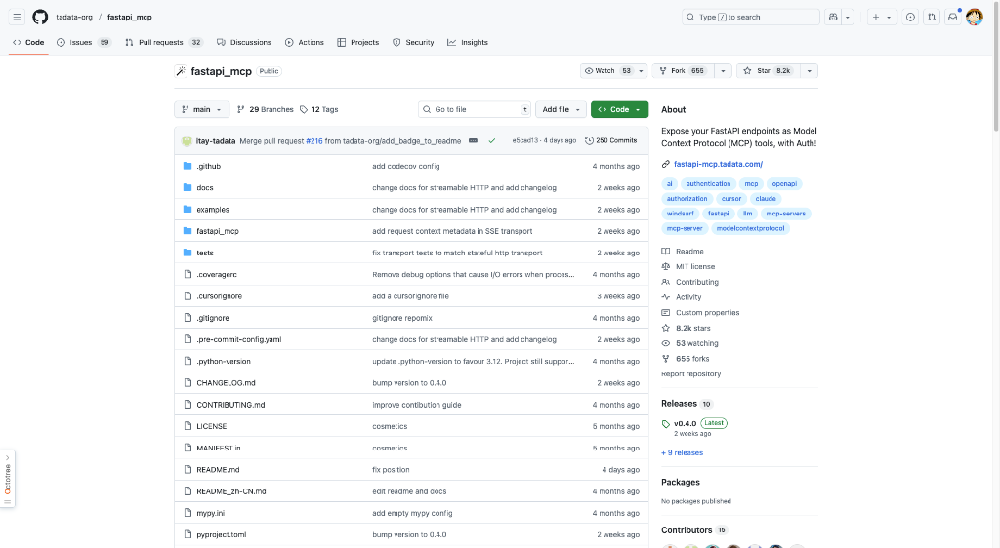
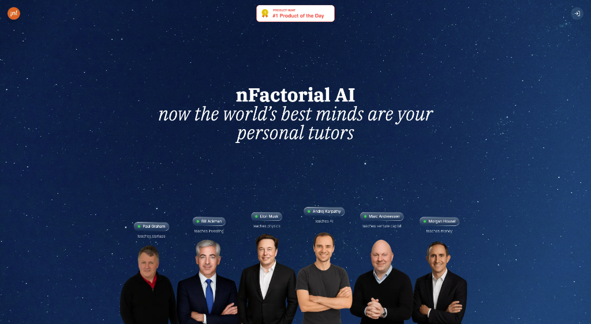
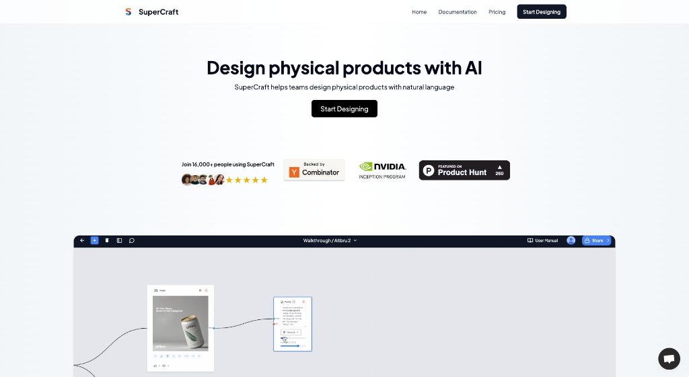
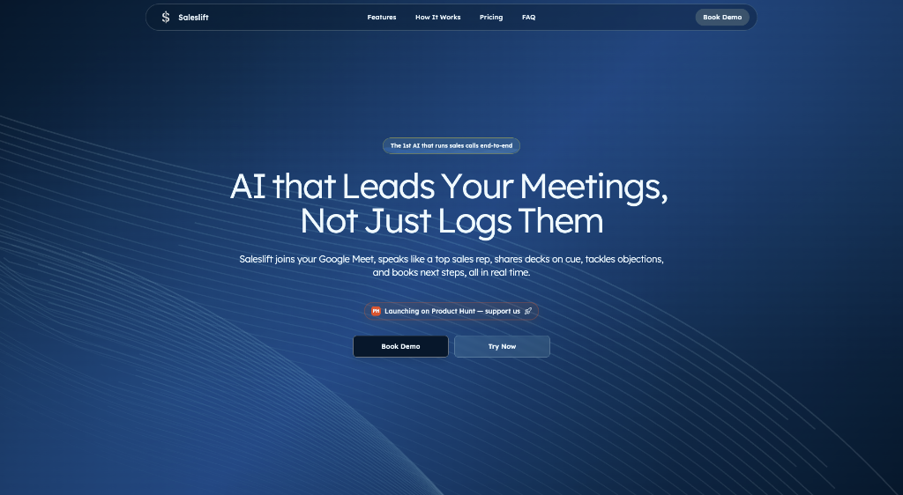
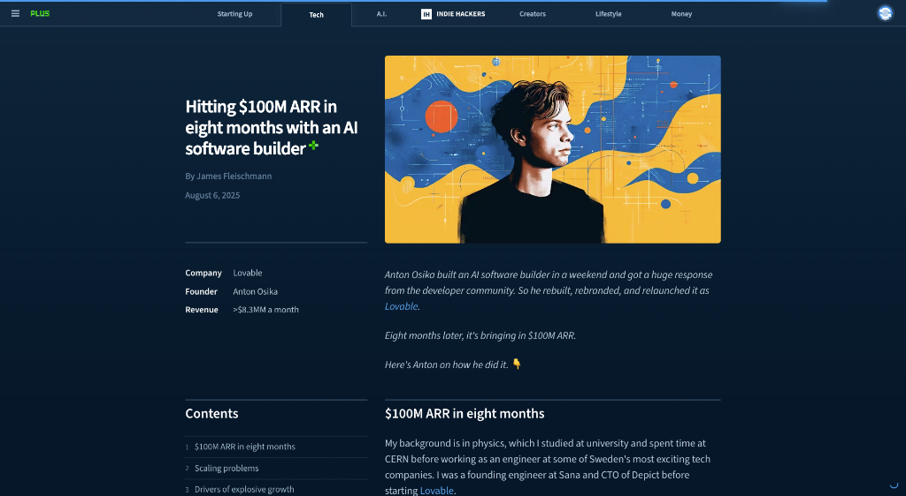

# HelloDev.io 开发者日报 - 第 8 期 | 2025 年 08 月 14 日

👋 Hi，这里是 HelloDev.io 开发者日报，今天是第 8 期，即将为你介绍今天的精彩发现：

📊 **今日统计**：
- 🚀 开源趋势：8 条
- 🛠️ 产品观察：6 条  
- 📰 行业动态：3 条
- 💡 经验讨论：1 条
- 📸 每日一图：1 条

---

## 🚀 开源趋势

### 让本地运行 LLM 变得简单的开源明星：GPT4All

GPT4All 是一个让大型语言模型（LLM）能在普通电脑上运行的开源项目。它不需要 API 调用或 GPU，用户可以私密地下载和使用 LLM。这个项目支持多种模型架构，并为 Windows、macOS 和 Linux 提供安装程序。GPT4All 还提供 Python 绑定，方便与应用程序集成，并支持与 Langchain 和 Weaviate 等工具集成。它拥有强大的社区支持，更新频繁，贡献活跃。最近的 V3.0.0 版本带来了全新的聊天应用 UI 和对 DeepSeek R1 Distillations 的支持，让本地 AI 体验更上一层楼。

对于想要在本地运行 AI 模型、保护隐私或在没有网络连接的情况下工作的开发者来说，GPT4All 是一个绝佳的选择。它特别适合那些希望在消费级硬件上体验 LLM 能力的用户。

> 🔗 **项目链接**
> 
> https://github.com/nomic-ai/gpt4all

---

### 微软出品的生成式 AI 入门课程：Generative AI for Beginners

微软推出的这个 GitHub 仓库提供了一门全面的 21 节课的生成式 AI 入门课程。课程内容涵盖了生成式 AI 和大型语言模型（LLM）的基础概念、提示工程和负责任的 AI 使用。通过 Azure OpenAI、OpenAI API 和开源模型，课程还教授如何构建文本生成、聊天、搜索和图像生成等实际应用。每节课都配有视频介绍、书面指南和 Python 与 TypeScript 的代码示例。该课程支持多种编程环境，并为初学者提供了详细的设置说明。此外，通过 GitHub Actions 实现的多语言支持让它能触达全球用户。

这个课程非常适合刚接触生成式 AI 的开发者，特别是那些希望通过动手实践来学习的人。课程结构清晰，内容实用，是进入生成式 AI 领域的绝佳起点。

> 🔗 **项目链接**
> 
> https://github.com/microsoft/generative-ai-for-beginners

---

### 全栈开发者的理想模板：Full Stack FastAPI Template

这个现代 Web 应用模板结合了 FastAPI 作为后端和 React 作为前端，为全栈开发者提供了一套完整的解决方案。它集成了 SQLModel 用于 PostgreSQL 数据库交互，Docker 用于容器化，以及 GitHub Actions 用于 CI/CD。模板内置了自动 HTTPS 设置（Traefik）、JWT 认证、安全密码哈希、邮件密码恢复和暗黑模式支持。它还提供了完整的开发环境，包括预配置的开发工具、测试框架（Pytest 和 Playwright）和部署说明。通过 Copier 支持项目生成，可以轻松定制。

对于希望快速启动现代 Web 应用开发的团队或个人开发者来说，这是一个非常实用的选择。它涵盖了从开发到部署的各个环节，大大减少了项目初始化的时间。

> 🔗 **项目链接**
> 
> https://github.com/fastapi/full-stack-fastapi-template

---

### 网站数据采集的利器：Firecrawl

Firecrawl 是一个强大的开源工具，能够将整个网站转换为 LLM-ready 的 markdown 或结构化数据。它提供了一套完整的 API，支持爬取、抓取和提取网页内容，非常适合 AI 应用的数据准备。用户可以通过简单的 API 调用实现复杂的网页数据采集任务，包括处理动态内容、绕过反爬机制等。Firecrawl 支持多种输出格式，并具备高度可定制性，如排除特定标签、设置最大爬取深度等。

对于需要为 AI 应用准备大量网页数据的开发者来说，Firecrawl 是一个不可或缺的工具。它简化了数据预处理流程，提高了数据采集的效率。

> 🔗 **项目链接**
> 
> https://github.com/mendableai/firecrawl

---

### 隐私优先的网站分析工具：Umami

Umami 是一个现代、注重隐私的 Google Analytics 替代品。它是一个简单、快速的网站分析工具，允许网站所有者在不侵犯用户隐私的情况下跟踪和分析访问者数据。与 Google Analytics 不同，Umami 不使用 cookie 或收集个人数据，使其符合 GDPR 和 CCPA 等隐私法规。该工具是开源的，可以自托管，提供对数据的完全控制。它支持 PostgreSQL、MySQL 和 MariaDB 等多种数据库，并通过 Docker 或从源代码安装提供简单的设置过程。

对于注重用户隐私的网站所有者，或者需要合规性保障的企业来说，Umami 是一个理想的网站分析解决方案。

> 🔗 **项目链接**
> 
> https://github.com/umami-software/umami

---

### FastAPI 的 MCP 原生扩展：FastAPI-MCP

FastAPI-MCP 是一个将 FastAPI 端点暴露为模型上下文协议（MCP）工具的库，具有内置认证功能。它采用 FastAPI 原生方法，不是简单的 OpenAPI 到 MCP 转换器，而是作为 FastAPI 的原生扩展。该项目支持零/最小配置，保留请求和响应模型的模式以及端点文档，提供灵活部署选项（可挂载到同一应用或单独部署），并使用 FastAPI 的 ASGI 接口进行高效通信。

对于已经在使用 FastAPI 并希望集成 MCP 功能的开发者来说，FastAPI-MCP 提供了一个无缝的解决方案，能够轻松扩展应用能力。

> 🔗 **项目链接**
> 
> https://github.com/tadata-org/fastapi_mcp

---

### 自动化漏洞检测与修复系统：Buttercup

Buttercup 是由 Trail of Bits 为 DARPA AIxCC（AI 网络挑战赛）开发的先进网络推理系统（CRS）。它自动化地检测和修复开源仓库中的软件漏洞。该系统利用 AI/ML 辅助的模糊测试（基于 oss-fuzz）来发现漏洞，然后使用多代理 AI 驱动的补丁程序生成和应用修复。关键组件包括用于工作流管理的编排器、用于输入创建的种子生成器、用于漏洞发现的模糊器、用于代码分析的程序模型和用于漏洞修复的补丁程序。Buttercup 支持与 OSS-Fuzz 兼容的 C 和 Java 源代码仓库，并需要大量系统资源（8 核心，16GB RAM，100GB 存储）。它与 OpenAI 和 Anthropic 等第三方 AI 提供商集成，产生运营成本。

对于需要自动化安全解决方案的开源项目维护者或安全研究人员来说，Buttercup 提供了一个强大的工具来提升代码安全性。

> 🔗 **项目链接**
> 
> https://github.com/trailofbits/buttercup

---

### AI 工程师的全面学习资源：AI Engineering Hub

AI Engineering Hub 是一个全面的 GitHub 仓库，提供关于大型语言模型（LLMs）、检索增强生成（RAG）和现实世界 AI 代理应用的深入教程和实际示例。它为从初学者到研究人员的用户提供资源，包括代码实现、时事通讯订阅以获取更新，以及社区贡献的机会。该仓库采用 MIT 许可证，包含各种 AI 工程材料。

对于希望深入学习 AI 工程的开发者来说，这个仓库是一个宝贵的资源库，提供了从理论到实践的全面指导。

> 🔗 **项目链接**
> 
> https://github.com/patchy631/ai-engineering-hub

---

## 🛠️ 产品观察

### 与传奇人物一对一学习的机会：nFactorial AI

nFactorial AI 提供与世界顶尖思想家进行视频通话的机会，作为个人导师，提供类似大师课的学习体验。用户可以与 Paul Graham、Elon Musk、Terence Tao 等传奇人物进行实时视频会话，提问并要求定制任何主题的讲座。AI 导师基于这些专家的实际思想、著作和行为方式，旨在提供真实且高质量的学习体验。

对于渴望从行业顶尖人物那里获得知识和指导的学习者来说，nFactorial AI 提供了一个前所未有的学习机会。

> 🔗 **产品链接**
> 
> https://www.producthunt.com/products/nfactorial-ai-6

---

### 用自然语言设计物理产品：SuperCraft

SuperCraft 是一款设计工具，使团队能够使用自然语言创建物理产品，类似于 Figma 用于数字设计的方式。它旨在通过用 AI 驱动的界面取代传统的草图、CAD 建模和渲染过程来民主化物理产品设计。用户可以快速生成多个设计变体，从草图创建逼真的渲染，并通过文本指令进行精确编辑。该工具在消费电子、时尚、家具、室内设计和包装等行业中特别有用。

对于希望快速迭代产品概念的设计师和产品开发团队来说，SuperCraft 是一个强大的工具，能够显著加速设计过程。

> 🔗 **产品链接**
> 
> https://www.producthunt.com/products/supercraft

---

### 大规模嵌入可视化工具：Embedding Atlas

Embedding Atlas 是苹果公司开发的开源工具，可实现大规模嵌入的交互式可视化。它支持实时搜索、自动数据聚类和用于元数据探索的多协调视图。为实现性能，它使用 WebGPU 与 WebGL 2 回退来在浏览器中流畅地渲染数百万个数据点。该工具特别适用于探索和分析复杂的数据结构、识别异常值和导航密集数据区域。

对于从事机器学习或数据科学工作的研究人员和开发者来说，Embedding Atlas 提供了一个强大的工具来理解和分析高维数据。

> 🔗 **产品链接**
> 
> https://www.producthunt.com/products/embedding-atlas

---

### AI 驱动的邮件管理工具：Inbox Hero

Inbox Hero 是一款专为 Microsoft 365 用户设计的 AI 驱动的电子邮件管理工具。它通过卓越的 AI 分类增强了 Outlook 的“专注”和“其他”文件夹，自动将可操作的电子邮件分类到“专注”中，将非可操作的电子邮件分类到“其他”中。该工具具有智能电子邮件分类功能，可将电子邮件分类到 25 多个类别（销售、支持、财务等），状态跟踪（待办、回复、紧急），智能电子邮件规则用于自动化，以及智能自动归档功能。

对于每天被邮件淹没的职场人士来说，Inbox Hero 能够显著提高工作效率，减少邮件管理时间。

> 🔗 **产品链接**
> 
> https://www.producthunt.com/products/inbox-hero

---

### 自主进行销售会议的 AI 工具：Saleslift

Saleslift 是一款 AI 驱动的工具，可自主进行销售会议。与仅记录或做笔记的传统会议工具不同，Saleslift 会积极参与 Google Meet 会话，扮演顶级销售人员的角色。它可以展示材料、回应异议并实时安排后续行动，无需人工干预。据报道，该 AI 已独立完成了多项高额交易，展示了其处理整个销售过程的能力。

对于销售团队来说，Saleslift 提供了一个创新的解决方案，能够自动处理销售会议，提高成交率。

> 🔗 **产品链接**
> 
> https://www.producthunt.com/products/saleslift

---

### 隐私优先的 AI 会议记事本：Hyprnote

Hyprnote 是一款为会议设计的隐私优先 AI 记事本，完全在您的设备上运行。它在本地转录和总结会议，确保数据不会发送到云端。这使其成为法律、金融和医疗保健等需要合规性的安全或隔离环境中的专业人士和团队的理想选择。该工具监听麦克风和扬声器输入，根据用户笔记生成简洁的摘要，并支持各种设备上的 AI 模型。

对于需要在高度安全环境中进行会议记录的专业人士来说，Hyprnote 提供了一个可靠的解决方案，既能提高效率又能保护隐私。

> 🔗 **产品链接**
> 
> https://www.producthunt.com/products/hyprnote

---

## 📰 行业动态

### 离线运行的 ChatGPT 替代品：Jan

Jan 是一个开源的 ChatGPT 替代品，完全在您的计算机上离线运行。它允许用户下载和运行大型语言模型（LLM），如 Llama、Gemma 和 Qwen，具有完全的控制权和隐私保护。该项目支持 Windows、macOS 和 Linux 等各种平台，并提供稳定版和夜间版构建。Jan 还提供云集成（如 OpenAI 和 Anthropic）、自定义 AI 助手和 OpenAI 兼容的本地 API 服务器等功能。

对于注重隐私和希望在没有网络连接的情况下使用 AI 的用户来说，Jan 提供了一个强大的解决方案。

> 🔗 **相关链接**
> 
> https://github.com/menloresearch/jan

---

### 自由职业者的全能业务管理工具：Midday

Midday 是一个为自由职业者、承包商、顾问和独立企业家设计的全能工具，旨在高效管理业务运营。它将发票、时间跟踪、文件对账、存储和财务概览等多种功能集成到一个平台中。该工具还具有 AI 助手，提供量身定制的财务见解。它使用 TypeScript、Next.js、Supabase 和 Tauri 等现代技术构建，并在 AGPL-3.0 许可证下用于非商业用途。

对于希望简化业务管理流程的自由职业者来说，Midday 提供了一个集成的解决方案，能够提高工作效率。

> 🔗 **相关链接**
> 
> https://github.com/midday-ai/midday

---

### 消除代码幻觉的 MCP 服务器：GitMCP

GitMCP 是一个免费、开源的远程模型上下文协议（MCP）服务器，旨在通过为 Cursor 等 AI 工具提供任何 GitHub 项目的最新文档和代码来消除代码幻觉。它支持两种模式：特定仓库访问或通用服务器以实现灵活使用。主要功能包括零设置、嵌入式聊天、支持多个 AI 助手和强大的隐私保证。

对于希望提高 AI 编程工具准确性的开发者来说，GitMCP 提供了一个有效的解决方案，能够显著减少代码生成中的错误。

> 🔗 **相关链接**
> 
> https://github.com/idosal/git-mcp

---

## 💡 经验讨论

### 8 个月达到 1 亿美元年经常性收入的 AI 软件构建平台：Lovable 创始人经验分享

Anton Osika，Lovable 的创始人，在短短八个月内就实现了 1 亿美元的年经常性收入（ARR）。最初作为一个周末项目启动的 GPT-Engineer，平台演变成了 Lovable，现在拥有来自 190 多个国家的 230 万活跃用户。Osika 拥有物理学背景，曾在 CERN 和瑞典科技公司工作，他发现编码是拥有伟大想法的人面临的最大障碍。Lovable 的爆炸性增长得益于社区建设、社交媒体参与、战略定价（包括免费协作）以及利用斯德哥尔摩科技生态系统。公司现在不断推出新产品，旨在创造一个任何人都能在几分钟内将想法变成企业的世界。

对于希望快速扩展 SaaS 业务的创业者来说，Lovable 的经验提供了宝贵的见解，特别是在社区驱动增长和定价策略方面。

> 🔗 **参考资料**
> 
> https://www.indiehackers.com/post/ONMaxjB3rix2PnBCnrDr

---

## 📸 每日一图

### 在终端中运行的 AI 编码助手：OpenAI Codex CLI

OpenAI Codex CLI 是一个在终端中本地运行的轻量级编码代理。它使开发人员能够直接从命令行与 OpenAI 的 Codex 模型交互，执行代码生成、重构、测试和解释等任务。该工具支持多种沙箱模式以确保安全，提供与 ChatGPT 计划的集成，并允许通过配置文件进行自定义。Codex CLI 还可以通过兼容的主机（如 Ollama）与开源模型一起运行。它专为希望通过 AI 辅助增强本地开发工作流程的开发人员而设计。

这张图清晰地展示了如何在终端中使用 AI 工具进行编码，体现了现代开发工具的简洁性和强大功能。

> 🔗 **图片来源**
> 
> https://github.com/openai/codex

---

## 📝 结语

明天见。Bye 👋

---

💌 **互动时间**：
- 你对哪个项目最感兴趣？
- 有什么想了解的技术话题？
- 欢迎在评论区分享你的想法！

🔗 **关注 HelloDev.io**：每日精选最有价值的内容，5 分钟了解行业最新进展

📱 **多平台发布**：微信公众号 | 掘金 | 知乎 | GitHub