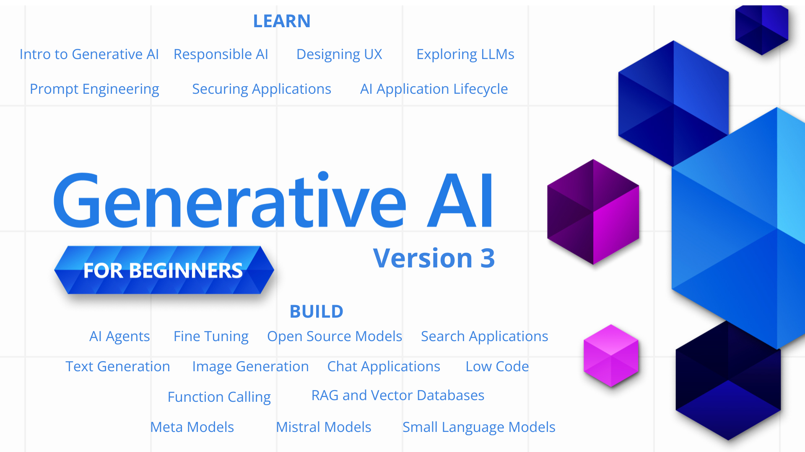
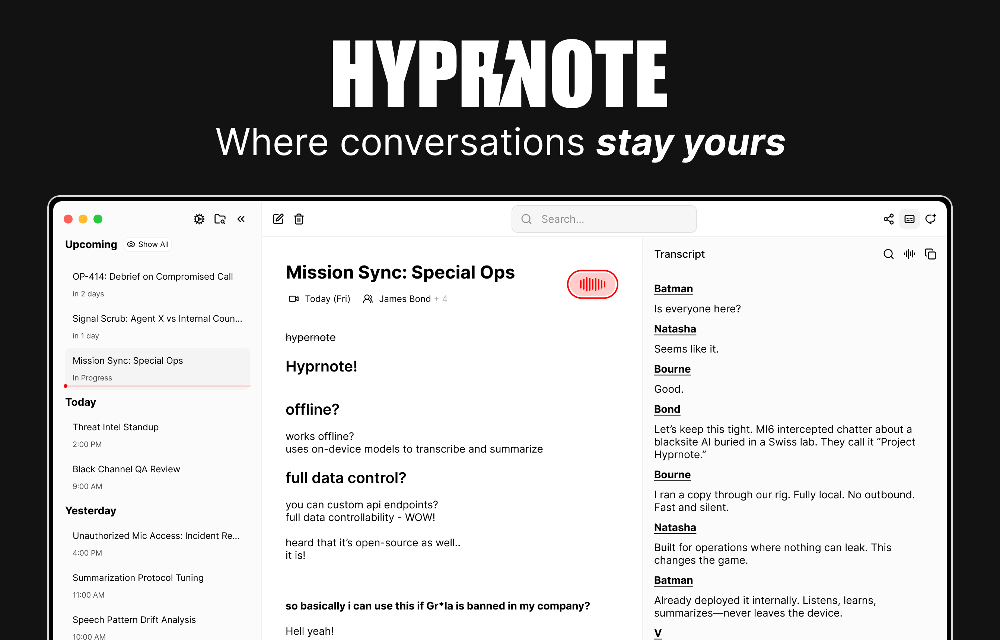
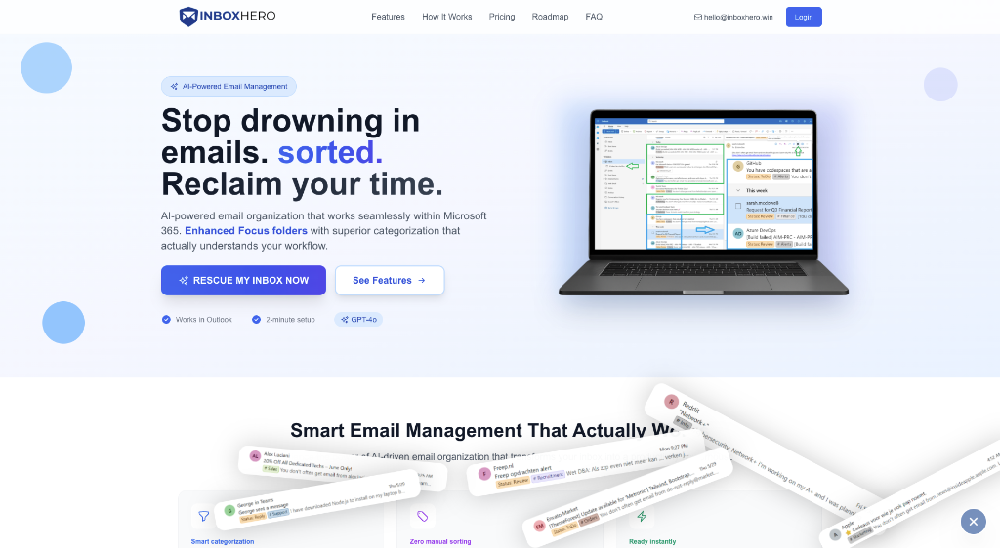
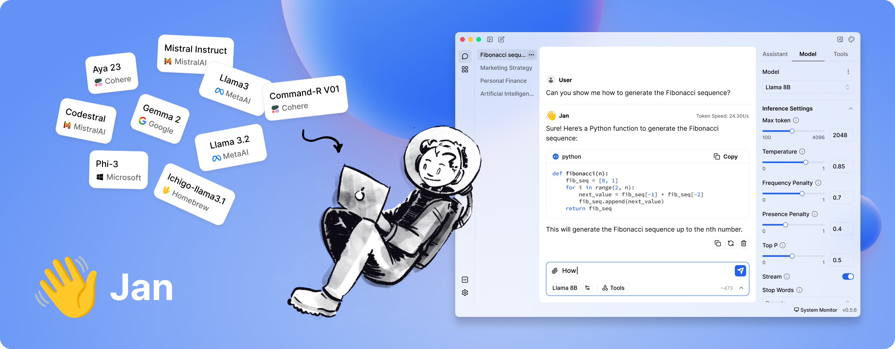

# HelloDev.io 开发者日报 - 第 8 期 | 2025 年 08 月 14 日

👋 Hi，这里是 HelloDev.io 开发者日报，今天是第 8 期，即将为你介绍今天的精彩发现：

📊 **今日统计**：
- 🚀 开源趋势：8 条
- 🛠️ 产品观察：6 条  
- 📰 行业动态：3 条
- 💡 经验讨论：1 条
- 📸 每日一图：1 条

---

## 🚀 开源趋势

### 3 行代码搞定本地大模型：nomic-ai / gpt4all

GPT4All 是一个开源项目，它让你能在普通电脑上本地运行大语言模型（LLM），无需 API 调用或 GPU。它支持多种模型架构，提供 Windows、macOS 和 Linux 的安装包，还提供 Python 绑定，可集成到应用中。GPT4All 支持 Langchain 和 Weaviate 等工具，社区活跃，更新频繁。

它非常适合希望在本地隐私地使用 LLM 的开发者，尤其适合那些不想依赖云服务或需要离线功能的场景。

> 🔗 **项目链接**
> 
> https://github.com/nomic-ai/gpt4all

---

### 从零开始学生成式 AI：microsoft / generative-ai-for-beginners

微软推出的这个 GitHub 仓库提供了一门完整的 21 节课的生成式 AI 入门课程。课程内容包括 LLM 基础、提示工程、负责任的 AI 使用，以及如何构建文本生成、聊天、搜索和图像生成等应用。每节课都有视频介绍、书面指南和 Python/TypeScript 代码示例，支持多语言，非常适合初学者。

对于刚接触生成式 AI 的开发者，这个课程是绝佳的起点，能帮助你快速上手并构建实际项目。

> 🔗 **项目链接**
> 
> https://github.com/microsoft/generative-ai-for-beginners

---

### 一键生成全栈项目：fastapi / full-stack-fastapi-template

这是一个现代全栈 Web 应用模板，后端使用 FastAPI，前端使用 React。它集成了 SQLModel 与 PostgreSQL、Docker 容器化、GitHub Actions CI/CD，还支持 JWT 认证、自动 HTTPS、暗色模式等。模板提供了完整的开发环境和测试框架（Pytest 和 Playwright），可通过 Copier 进行项目生成和自定义。

适合希望快速启动一个生产级全栈项目的开发者，特别是喜欢 FastAPI 和 React 技术栈的团队。

> 🔗 **项目链接**
> 
> https://github.com/fastapi/full-stack-fastapi-template

---

### 网站秒变结构化数据：mendableai / firecrawl

Firecrawl 是一个强大的开源工具，能将整个网站转换为 LLM-ready 的 markdown 或结构化数据。它提供了一套完整的 API，支持爬取、抓取和提取网页内容，适用于 AI 应用的数据准备。用户可通过简单的 API 调用实现复杂的网页数据采集任务，包括处理动态内容、绕过反爬机制等。

对于需要为 AI 应用准备网页数据的开发者来说，Firecrawl 是一个高效且灵活的选择。

> 🔗 **项目链接**
> 
> https://github.com/mendableai/firecrawl

---

## 🛠️ 产品观察

### 比 Notion 更适合程序员的笔记工具：Hyprnote

Hyprnote 是一个隐私优先的 AI 记事本，专为会议设计，完全在你的设备上运行。它本地转录和总结会议内容，确保数据不会发送到云端。这使得它非常适合法律、金融和医疗等需要合规的行业。它支持多种本地 AI 模型，如 Llama、Qwen 和 Gemma，并且是开源的。

对于在安全或隔离环境中工作的专业人士，Hyprnote 提供了一个兼顾隐私和效率的解决方案。

> 🔗 **产品链接**
> 
> https://www.producthunt.com/products/hyprnote

---

### 比付费版还好用的免费工具：Inbox Hero

Inbox Hero 是一个专为 Microsoft 365 用户设计的 AI 邮件管理工具。它通过 superior AI 分类，将邮件自动分到 Outlook 的 Focus 和 Other 文件夹中。它支持 25 多个智能分类、状态跟踪、智能规则和自动归档。提供 14 天免费试用，无需信用卡，且具有企业级安全特性。

如果你每天被邮件淹没，Inbox Hero 能帮你节省 2-3 小时，重新掌控你的工作日。

> 🔗 **产品链接**
> 
> https://www.producthunt.com/products/inbox-hero

---

### 5 分钟上手的项目管理神器：Midday

Midday 是一个为自由职业者、承包商、顾问和独立创业者设计的一体化业务管理工具。它整合了发票、时间跟踪、文件对账、存储和财务概览等功能，并内置 AI 助手提供个性化财务见解。它基于现代技术栈构建，如 TypeScript、Next.js 和 Supabase。

对于需要简化业务管理流程的独立工作者，Midday 是一个高效且集成的解决方案。

> 🔗 **产品链接**
> 
> https://github.com/midday-ai/midday

---

## 📰 行业动态

### AI 编程助手让初级开发者慌了：Jan

Jan 是一个开源的 ChatGPT 替代品，完全离线运行在你的电脑上。它允许用户下载并运行 Llama、Gemma 和 Qwen 等大语言模型，完全掌控数据和隐私。它支持 Windows、macOS 和 Linux，并提供云集成、自定义 AI 助手和 OpenAI 兼容的本地 API 服务器。

随着本地 AI 工具的兴起，开发者可以更安全、更私密地使用 AI 助手，这可能会改变开发者工具的生态。

> 🔗 **相关链接**
> 
> https://github.com/menloresearch/jan

---

## 💡 经验讨论

### 半天做出了一个月入 10 万的项目：Hitting $100M ARR in eight months with an AI software builder

Anton Osika 创立的 Lovable 平台在短短八个月内实现了 1 亿美元的年经常性收入。这个 AI 软件构建器平台最初是作为一个周末项目 GPT-Engineer 开始的，现在已经发展成为一个拥有 230 万活跃用户的全球平台。Osika 认为编程是阻碍创意实现的最大障碍，因此打造了这个工具。

对于想要快速验证想法并推向市场的开发者，Lovable 的成功经验值得借鉴，尤其是在社区建设、定价策略和利用技术生态方面。

> 🔗 **参考资料**
> 
> https://www.indiehackers.com/post/ONMaxjB3rix2PnBCnrDr

---

## 📸 每日一图

### 一图看懂为什么 Netflix 从不宕机：Codex CLI

OpenAI Codex CLI 是一个在终端中运行的轻量级编码代理。它允许开发者直接在命令行中与 OpenAI 的 Codex 模型交互，执行代码生成、重构、测试和解释等任务。它支持多种沙箱模式以确保安全，并可与 ChatGPT 计划集成，还能通过配置文件进行自定义。

这张图展示了 Codex CLI 如何将 AI 力量直接带入开发者的本地工作流，提升效率的同时保证安全性。

> 🔗 **图片来源**
> 
> https://github.com/openai/codex

---

## 📝 结语

明天见。Bye 👋

---

💌 **互动时间**：
- 你对哪个项目最感兴趣？
- 有什么想了解的技术话题？
- 欢迎在评论区分享你的想法！

🔗 **关注 HelloDev.io**：每日精选最有价值的内容，5 分钟了解行业最新进展

📱 **多平台发布**：微信公众号 | 掘金 | 知乎 | GitHub