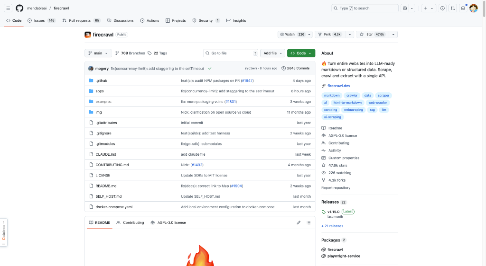
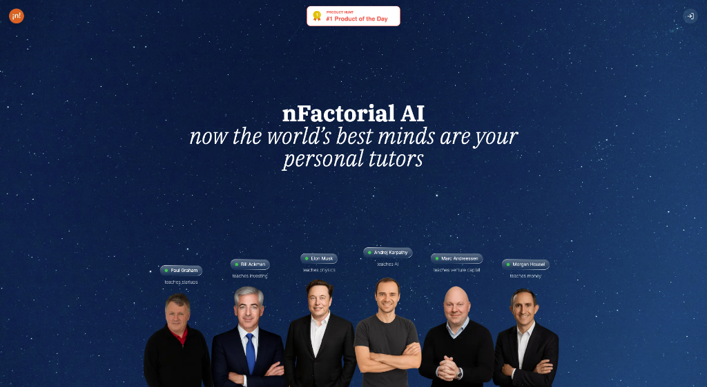
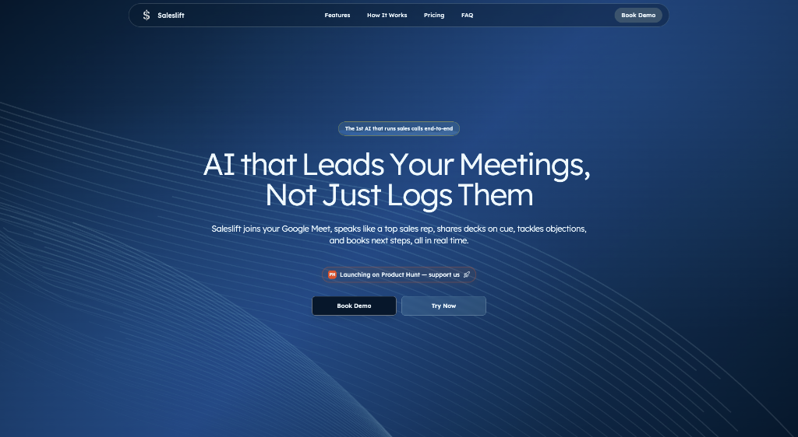

# HelloDev.io 开发者日报 - 第 8 期 | 2025 年 08 月 14 日

👋 Hi，这里是 HelloDev.io 开发者日报，今天是第 8 期，即将为你介绍今天的精彩发现：

📊 **今日统计**：
- 🚀 开源趋势：8 条
- 🛠️ 产品观察：6 条  
- 📰 行业动态：3 条
- 💡 经验讨论：1 条
- 📸 每日一图：1 条

---

## 🚀 开源趋势

### 3 行代码搞定本地大模型：nomic-ai / gpt4all

GPT4All 是一个强大的开源项目，让你可以在普通电脑上本地运行大语言模型（LLM），无需 API 调用或 GPU。它支持多种模型架构，包括最新的 DeepSeek R1 Distillations，并提供了 Windows、macOS 和 Linux 的安装包。除了图形界面，它还提供 Python 接口，方便集成到你的应用中，支持 Langchain 和 Weaviate 等工具。

特别适合注重隐私、希望离线使用 LLM 的开发者，或者需要在资源受限的环境中部署 AI 能力的场景。

---

### 微软出品的 21 节 AI 入门课：microsoft / generative-ai-for-beginners

这是微软官方推出的 21 节生成式 AI 入门课程，涵盖从基础概念到实际应用的完整学习路径。每节课都配有视频讲解、书面指南和 Python/TypeScript 代码示例，内容涉及提示工程、文本生成、聊天机器人、搜索应用和图像生成等。项目还支持多语言，通过 GitHub Actions 自动化翻译，非常适合全球开发者学习。

对于想要系统学习生成式 AI 的初学者，或者希望在团队内部进行技术培训的负责人来说，这是一份不可多得的免费资源。

---

### 一键生成全栈项目：fastapi / full-stack-fastapi-template

这个模板为现代 Web 开发提供了一个完整的起点，结合了 FastAPI 后端和 React 前端。它内置了 JWT 认证、PostgreSQL 数据库、Docker 容器化、GitHub Actions CI/CD 以及自动 HTTPS 配置。前端支持 TypeScript、Vite 和 Chakra UI，并带有暗黑模式。

适合希望快速启动一个生产就绪的全栈项目，特别是那些追求现代开发实践（如容器化、自动化测试）的团队。

---

### 网站数据秒变结构化：mendableai / firecrawl

Firecrawl 是一个强大的开源工具，可以将整个网站转换为 LLM-ready 的 Markdown 或结构化数据。它提供了一套完整的 API，支持爬取、抓取和提取网页内容，甚至能处理动态内容和反爬机制。支持多种输出格式，并具备高度可定制性。

非常适合需要为 AI 应用准备数据的开发者，比如构建 RAG 系统时需要从网站提取知识库。

---

### 拒绝隐私泄露的网站分析：umami-software / umami

Umami 是一个现代、注重隐私的 Google Analytics 替代品。它不使用 Cookie，也不收集个人数据，完全符合 GDPR 和 CCPA 等隐私法规。项目开源且支持自托管，可以轻松部署在 Docker 或服务器上，提供访客跟踪、页面浏览、来源分析和自定义事件跟踪等功能。

对于注重用户隐私的网站所有者，或者需要合规性审计的企业来说，Umami 是一个理想的选择。

---

### FastAPI 原生 MCP 扩展：tadata-org / fastapi_mcp

FastAPI-MCP 是一个将 FastAPI 端点暴露为模型上下文协议（MCP）工具的库。它不是简单的 OpenAPI 到 MCP 转换器，而是 FastAPI 的原生扩展，保留了请求和响应模型的模式以及端点文档。支持零配置、灵活部署，并使用 FastAPI 的 ASGI 接口进行高效通信。

对于希望为 AI 工具（如 Cursor、Claude）提供上下文信息的 FastAPI 开发者来说，这是一个无缝集成的解决方案。

---

### 自动化漏洞检测与修复：trailofbits/buttercup

Buttercup 是由 Trail of Bits 为 DARPA AIxCC 挑战赛开发的先进网络推理系统。它通过 AI/ML 辅助的模糊测试自动发现漏洞，并使用多代理 AI 驱动的补丁程序生成和应用修复。系统包括工作流管理器、种子生成器、模糊器、程序模型和补丁器等组件。

适合在开源生态系统中需要自动化安全解决方案的组织，特别是那些拥有充足计算资源的大型项目。

---

### AI 工程师的百宝箱：patchy631 / ai-engineering-hub

AI Engineering Hub 是一个全面的 GitHub 仓库，提供了关于 LLM、RAG 和 AI Agent 的深入教程和实践示例。它涵盖了从基础到高级的 AI 工程内容，适合初学者到研究人员使用。项目还提供时事通讯订阅和社区贡献机会。

对于希望深入学习 AI 工程实践的开发者，或者正在寻找实际项目案例的学习者来说，这是一个非常有价值的知识库。

---

## 🛠️ 产品观察

### 与传奇人物一对一：nFactorial AI

nFactorial AI 提供与世界顶尖专家（如 Paul Graham、Elon Musk、Terence Tao）进行视频通话的机会，这些专家以 AI 导师的形式出现。用户可以参与实时视频会议、提问，并请求定制讲座。AI 导师基于这些专家的公开写作、演讲和观点进行训练，力求提供真实的学习体验。

适合那些渴望从行业传奇身上获取第一手知识和见解的学习者。

---

### 用自然语言设计实物：SuperCraft

SuperCraft 是一个革命性的设计工具，允许团队使用自然语言创建物理产品，就像 Figma 用于数字设计一样。它取代了传统的草图、CAD 建模和渲染流程，用户可以快速生成多个设计变体、将草图转换为逼真的渲染图，并通过文本指令精确编辑设计。

对于产品设计师、工程师和创业者来说，这是一个能显著加速创意验证和原型制作的强大工具。

---

### 苹果开源的嵌入向量可视化工具：Embedding Atlas

Embedding Atlas 是苹果开源的交互式嵌入向量可视化工具。它支持实时搜索、自动数据聚类和多协调视图，使用 WebGPU 技术在浏览器中流畅渲染数百万个数据点。对于探索复杂数据结构、识别异常值和分析高维数据非常有用。

数据科学家和机器学习工程师可以用它来更好地理解和调试他们的嵌入模型。

---

### 智能邮件分类神器：Inbox Hero

Inbox Hero 是一款专为 Microsoft 365 用户设计的 AI 邮件管理工具。它通过 superior AI 分类，将可操作邮件自动归入 Outlook 的 Focus 文件夹，非操作邮件归入 Other 文件夹。支持超过 25 种智能分类、状态跟踪、智能规则和自动归档。

对于每天被邮件淹没的职场人士，特别是需要严格遵守 GDPR/HIPAA 的企业用户，这是一个能显著提升效率的解决方案。

---

### AI 自主完成销售会议：Saleslift

Saleslift 是一款 AI 驱动的工具，能够自主参与 Google Meet 销售会议。它不仅能记录或做笔记，还能主动介绍材料、回应异议并实时安排后续行动。据报道，该 AI 已独立完成多笔高额交易。

对于销售团队来说，这是一个能防止因跟进缓慢或错失机会而导致交易流失的创新工具。

---

### 本地运行的隐私笔记工具：Hyprnote

Hyprnote 是一款注重隐私的 AI 记事本，专为会议设计，完全在设备上运行。它能本地转录和总结会议内容，确保数据不会发送到云端。支持多种本地 AI 模型（如 Llama、Qwen、Gemma），非常适合法律、金融和医疗等需要合规的行业。

对于在安全或隔离环境中工作的专业人士来说，这是一个既能提高生产力又能保护隐私的理想选择。

---

## 📰 行业动态

### 本地运行的 ChatGPT 替代品：menloresearch / jan

Jan 是一个开源的 ChatGPT 替代品，完全在你的电脑上离线运行。用户可以下载并运行 Llama、Gemma、Qwen 等大语言模型，享受完全的控制权和隐私保护。它支持 Windows、macOS 和 Linux，并提供稳定版和夜间版构建。

随着人们对数据隐私的关注日益增加，像 Jan 这样的本地 AI 工具正成为越来越受欢迎的选择。

---

### 自由职业者的全能业务管理工具：midday-ai / midday

Midday 是一款专为自由职业者、承包商、顾问和独立创业者设计的全能业务管理工具。它集成了发票、时间跟踪、文件对账、存储和财务概览等功能，并配备 AI 助手提供个性化的财务见解。

对于希望简化业务运营、提高效率的独立工作者来说，Midday 提供了一个集成的解决方案。

---

### 消除 AI 代码幻觉：idosal / git-mcp

GitMCP 是一个免费、开源的远程模型上下文协议（MCP）服务器，旨在通过提供任何 GitHub 项目的最新文档和代码来消除 AI 工具的代码幻觉。它支持零设置、嵌入式聊天和多个 AI 助手。

对于使用 Cursor、Claude 等 AI 开发工具的开发者来说，GitMCP 能显著提高代码生成的准确性和相关性。

---

## 💡 经验讨论

### 8 个月做到 $100M ARR 的 AI 软件构建器创始人分享

Anton Osika 创立的 Lovable 平台在短短 8 个月内实现了 $100M 的年经常性收入。该项目最初是他在一个周末创建的 GPT-Engineer，后来发展成一个拥有 230 万活跃用户的平台。其成功关键在于社区建设、社交媒体推广、战略定价（包括免费协作功能）以及利用斯德哥尔摩科技生态系统。

对于创业者和产品负责人来说，这篇分享提供了关于如何快速验证市场、构建社区和制定定价策略的宝贵见解。

---

## 📸 每日一图

### 在终端里使用 OpenAI Codex：openai / codex

OpenAI Codex CLI 是一个轻量级的编码代理，直接在你的终端中运行。它允许开发者通过命令行与 OpenAI 的 Codex 模型交互，执行代码生成、重构、测试和解释等任务。支持多种沙盒模式以确保安全，并可与 ChatGPT 计划集成。

对于希望在本地开发环境中增强 AI 辅助能力的开发者来说，这是一个强大而灵活的工具。

---

## 📝 结语

明天见。Bye 👋

---

💌 **互动时间**：
- 你对哪个项目最感兴趣？
- 有什么想了解的技术话题？
- 欢迎在评论区分享你的想法！

🔗 **关注 HelloDev.io**：每日精选最有价值的内容，5 分钟了解行业最新进展

📱 **多平台发布**：微信公众号 | 掘金 | 知乎 | GitHub