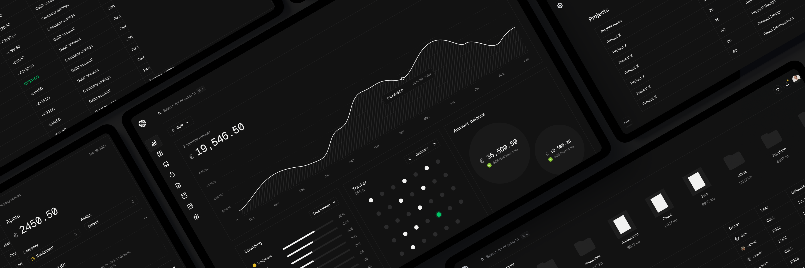

# HelloDev.io 开发者日报 - 第 7 期 | 2025 年 08 月 14 日

👋 Hi，这里是 HelloDev.io 开发者日报，今天是第 7 期，即将为你介绍今天的精彩发现：

📊 **今日统计**：
- 🚀 开源趋势：8 条
- 🛠️ 产品观察：6 条  
- 📰 行业动态：3 条
- 💡 经验讨论：1 条
- 📸 每日一图：1 条

---

## 🚀 开源趋势

### [nomic-ai / gpt4all](https://github.com/nomic-ai/gpt4all) 

GPT4All 是一个开源项目，让你能在日常设备上本地运行大语言模型（LLM），无需 API 调用或 GPU，完全离线使用。它支持多种模型架构，提供 Windows、macOS 和 Linux 的安装包，也支持 Python 绑定和 Langchain 等工具集成。最新版本增加了 DeepSeek R1 Distillations 支持，UI 也焕然一新。如果你经常删数据库的朋友一定知道，隐私和本地控制在 AI 时代有多么重要，GPT4All 正是为这种需求量身打造的。它适合任何希望在本地运行 AI 模型的开发者或研究人员。

---

### [microsoft / generative-ai-for-beginners](https://github.com/microsoft/generative-ai-for-beginners) 

微软出品的这个 21 节课程，是为生成式 AI 初学者准备的完整学习路径。课程涵盖了从 LLM 基础、提示工程到实际应用构建（如聊天机器人、图像生成）等方方面面。每节课都有视频、文字指南和 Python/TypeScript 代码示例，还支持多语言。如果你刚入门生成式 AI，或者想系统学习 AI 应用开发，这个仓库绝对值得收藏。它特别适合希望从理论到实践全面掌握生成式 AI 的开发者。

---

### [fastapi / full-stack-fastapi-template](https://github.com/fastapi/full-stack-fastapi-template) 

这是一个现代化的全栈 FastAPI 模板，后端用 FastAPI，前端用 React，集成了 SQLModel、Docker、JWT 认证、Traefik 反向代理等。它还内置了 Pytest 和 Playwright 测试框架，支持 CI/CD 和项目生成。如果你正在寻找一个开箱即用、生产就绪的全栈模板，这个项目会大大提升你的开发效率。特别适合快速构建安全、现代的 Web 应用的团队。

---

### [mendableai / firecrawl](https://github.com/mendableai/firecrawl) 

Firecrawl 是一个强大的开源工具，能将整个网站转换为 LLM 可用的 Markdown 或结构化数据。它支持动态内容处理、反爬机制绕过，并提供多种输出格式和高度可定制选项。如果你在构建需要大量网页数据的 AI 应用，Firecrawl 能大大简化你的数据预处理流程。特别适合 AI 工程师和数据科学家在构建 RAG 应用时使用。

---

### [umami-software / umami](https://github.com/umami-software/umami) 

Umami 是一个注重隐私的 Google Analytics 替代品，开源、可自部署，不使用 Cookie 也不收集个人数据，符合 GDPR 和 CCPA。它支持 PostgreSQL、MySQL 等数据库，提供简洁直观的仪表盘和自定义事件跟踪。如果你对用户隐私格外重视，或者厌倦了 Google Analytics 的复杂和侵入性，Umami 是一个绝佳的选择。特别适合注重数据主权的网站所有者。

---

### [tadata-org / fastapi_mcp](https://github.com/tadata-org/fastapi_mcp) 

FastAPI-MCP 是一个将 FastAPI 端点暴露为模型上下文协议（MCP）工具的库，具有内置认证功能。它不是简单的 OpenAPI 到 MCP 转换器，而是 FastAPI 的原生扩展，支持零配置、保留文档和灵活部署。如果你正在使用 FastAPI 构建服务，并希望将其轻松集成到 AI 工具链中，FastAPI-MCP 会让你事半功倍。特别适合希望快速为 FastAPI 服务添加 MCP 能力的开发者。

---

### [trailofbits/buttercup: A Cyber Reasoning System for Automated Vulnerability Detection and Patching](https://github.com/trailofbits/buttercup) 

Buttercup 是 Trail of Bits 为 DARPA AI Cyber Challenge 开发的高级网络推理系统，能自动化检测和修复开源项目中的漏洞。它利用 AI/ML 辅助模糊测试发现漏洞，再通过多代理 AI 驱动补丁器生成修复。如果你对自动化安全工具感兴趣，或者在维护大型开源项目，Buttercup 的思路和实现非常值得研究。特别适合安全研究人员和开源项目维护者。

---

### [patchy631 / ai-engineering-hub](https://github.com/patchy631/ai-engineering-hub) 

AI Engineering Hub 是一个全面的 GitHub 仓库，提供关于 LLM、RAG 和 AI 代理应用的深入教程和实际示例。它涵盖从入门到研究级别的资源，支持社区贡献和定期更新。如果你希望系统学习 AI 工程实践，这个仓库能为你提供丰富的实战经验和学习路径。特别适合 AI 工程师和研究人员。

---

## 🛠️ 产品观察

### [nFactorial AI](https://www.producthunt.com/products/nfactorial-ai-6) 

nFactorial AI 提供与世界顶尖人物的视频通话，让你能像上大师课一样学习。AI 导师基于这些专家的真实思想、写作和风格，提供高度拟真的学习体验。如果你渴望与 Paul Graham、Elon Musk 等传奇人物“面对面”交流，nFactorial AI 是目前最接近的选择。特别适合希望获得顶级教育资源的学习者。

---

### [SuperCraft](https://www.producthunt.com/products/supercraft) 

SuperCraft 是一个用自然语言设计物理产品的工具，类似 Figma 之于数字设计。它能快速生成多个设计方案、将草图转为逼真渲染图，并通过文本指令精确编辑。如果你在工业设计、家具或消费电子领域工作，SuperCraft 能极大加速你的创意流程。特别适合产品设计师和创业者快速验证想法。

---

### [Embedding Atlas](https://github.com/apple/ml-embedding-atlas) 

Embedding Atlas 是苹果开源的嵌入向量可视化工具，支持实时搜索、自动聚类和多视图探索。它使用 WebGPU 渲染数百万数据点，性能出色。如果你在处理大规模嵌入数据并需要可视化分析，Embedding Atlas 是一个强大的选择。特别适合机器学习工程师和数据科学家。

---

### [Inbox Hero](https://www.producthunt.com/products/inbox-hero) 

Inbox Hero 是一个为 Microsoft 365 用户设计的 AI 邮件管理工具，能自动分类邮件、跟踪状态并智能归档。用户报告每天节省 2-3 小时，准确率高达 99.2%。如果你被 Outlook 邮件淹没，Inbox Hero 能帮你重获掌控感。特别适合企业用户和重度邮件使用者。

---

### [Saleslift](https://www.producthunt.com/products/saleslift) 

Saleslift 是一个能自主参与销售会议的 AI 工具，不仅能记录会议，还能主动发言、回应异议、安排后续。它已独立完成多个高价值交易，代表了销售工具的新范式。如果你在销售团队工作，Saleslift 能帮你避免因跟进不及时而错失机会。特别适合 SaaS 销售团队。

---

### [Hyprnote](https://www.producthunt.com/products/hyprnote) 

Hyprnote 是一个完全本地运行的 AI 会议记事本，支持转录和总结，确保数据不离开设备。它支持多种本地 AI 模型，开源且注重隐私。如果你在法律、金融或医疗等合规要求高的行业工作，Hyprnote 是一个安全可靠的会议助手。特别适合注重数据隐私的专业人士。

---

## 📰 行业动态

### [menloresearch / jan](https://github.com/menloresearch/jan) 

Jan 是一个开源的 ChatGPT 替代品，完全离线运行，支持 Llama、Gemma 等模型。它提供本地 API 服务器，也支持与 OpenAI、Anthropic 等云服务集成。如果你希望在本地掌控 AI 模型，同时保留云端扩展能力，Jan 是一个灵活的选择。特别适合注重隐私和控制的开发者。

---

### [midday-ai / midday](https://github.com/midday-ai/midday) 

Midday 是一个为自由职业者和独立创业者设计的全能业务管理工具，集成了时间跟踪、发票、文件存储和财务概览等功能，并配有 AI 助手提供财务洞察。如果你是 solo entrepreneur，Midday 能帮你一站式管理业务。特别适合希望简化运营的自由职业者。

---

### [idosal / git-mcp](https://github.com/idosal/git-mcp) 

GitMCP 是一个开源的远程 MCP 服务器，能消除 AI 工具的代码幻觉，提供 GitHub 项目的实时文档和代码。它支持零配置、嵌入聊天和多 AI 助手，完全免费且注重隐私。如果你在使用 Cursor 或 Claude 等 AI 开发工具，GitMCP 能显著提升其准确性。特别适合 AI 辅助开发的工程师。

---

## 💡 经验讨论

### [Hitting $100M ARR in eight months with an AI software builder](https://www.indiehackers.com/post/ONMaxjB3rix2PnBCnrDr) 

Lovable 创始人 Anton Osika 分享了他们如何在 8 个月内实现 1 亿美元年经常性收入（ARR）的经验。从最初周末项目 GPT-Engineer 到如今的 230 万用户，其成功关键在于社区驱动增长、免费协作策略和充分利用欧洲科技生态。如果你在打造 AI 产品，Lovable 的增长策略非常值得借鉴。特别适合 SaaS 创业者和 AI 产品负责人。

---

## 📸 每日一图

### [openai / codex](https://github.com/openai/codex) 

OpenAI Codex CLI 是一个在终端中运行的轻量级编码代理，能直接与 Codex 模型交互，执行代码生成、重构、测试等任务。它支持沙盒模式、ChatGPT 集成和 CI/CD 流程。如果你喜欢在终端中工作，Codex CLI 能让你的开发流程更加高效。特别适合喜欢命令行的开发者。

---

## 📝 结语

明天见。Bye 👋

---

💌 **互动时间**：
- 你对哪个项目最感兴趣？
- 有什么想了解的技术话题？
- 欢迎在评论区分享你的想法！

🔗 **关注 HelloDev.io**：每日精选最有价值的内容，5 分钟了解行业最新进展

📱 **多平台发布**：微信公众号 | 掘金 | 知乎 | GitHub