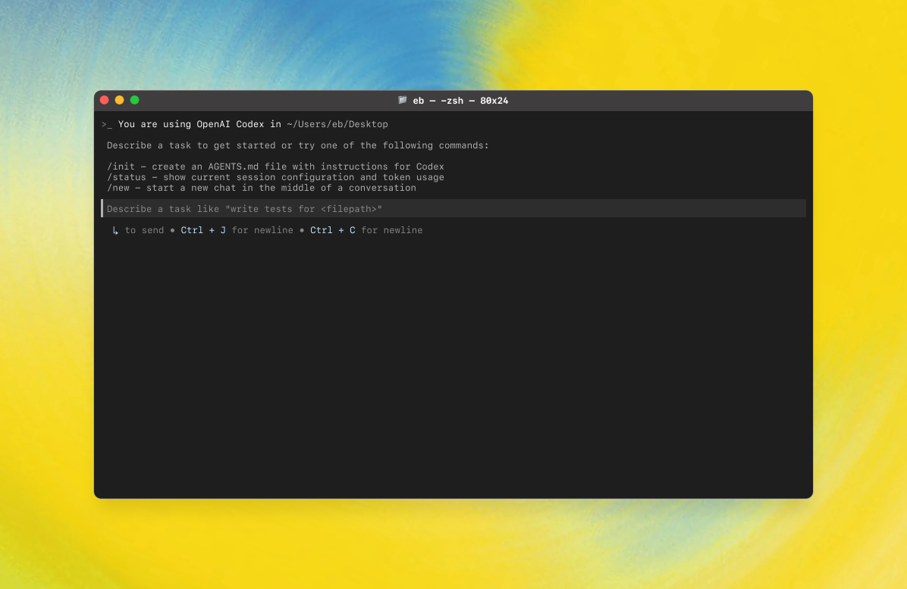

# HelloDev.io 开发者日报 - 第 8 期 | 2025 年 08 月 14 日

👋 Hi，这里是 HelloDev.io 开发者日报，今天是第 8 期，即将为你介绍今天的精彩发现：

📊 **今日统计**：
- 🚀 开源趋势：8 条
- 🛠️ 产品观察：6 条  
- 📰 行业动态：3 条
- 💡 经验讨论：1 条
- 📸 每日一图：1 条

---

## 🚀 开源趋势

### 本地运行大语言模型的最佳选择：GPT4All

GPT4All 是一个让大型语言模型（LLMs）在你的普通电脑上本地运行的开源项目。它无需 API 调用或 GPU，用户可以完全私密地下载和使用 LLMs。支持多种模型架构，并提供 Windows、macOS 和 Linux 的安装程序。GPT4All 还提供 Python 绑定，方便与应用程序集成，并支持 Langchain 和 Weaviate 等工具。

如果你需要在本地运行 LLMs，GPT4All 是一个非常值得尝试的工具，特别适合注重隐私和离线使用的开发者。

---

### 微软出品的生成式 AI 入门课程：generative-ai-for-beginners

这是微软提供的一个包含 21 堂课的生成式 AI 入门课程，专为初学者设计。课程内容涵盖生成式 AI 和 LLM 的基本概念、提示工程、负责任的 AI 使用，以及如何构建文本生成、聊天、搜索和图像生成等应用。每节课都配有视频介绍、书面指南和 Python/TypeScript 代码示例。

对于想要系统学习生成式 AI 的开发者来说，这是一个非常全面且实用的资源，尤其适合初学者快速上手。

---

### 全栈开发者的福音：Full Stack FastAPI Template

这是一个现代 Web 应用模板，结合了 FastAPI 后端和 React 前端。它集成了 SQLModel 与 PostgreSQL、Docker 容器化、GitHub Actions CI/CD 等技术。主要功能包括自动 HTTPS 设置、JWT 认证、安全密码哈希、邮件密码恢复和暗黑模式支持。

如果你正在寻找一个开箱即用的全栈开发模板，这个项目可以大大加快你的开发速度，特别适合需要快速构建安全、现代化 Web 应用的团队。

---

### 网站数据采集神器：Firecrawl

Firecrawl 是一个强大的开源工具，可以将整个网站转换为 LLM-ready 的 markdown 或结构化数据。它提供了一套完整的 API，支持爬取、抓取和提取网页内容，适用于 AI 应用的数据准备。用户可以通过简单的 API 调用实现复杂的网页数据采集任务，包括处理动态内容、绕过反爬机制等。

对于需要为 AI 应用准备数据的开发者来说，Firecrawl 是一个不可或缺的工具，特别适合处理复杂的网页结构。

---

## 🛠️ 产品观察

### 与传奇人物面对面：nFactorial AI

nFactorial AI 提供与世界顶级专家进行视频通话的机会，让你可以像上大师课一样学习。AI 导师基于这些专家的真实思想、著作和行为模式，提供真实且高质量的学习体验。

如果你渴望从行业传奇身上学到更多，这个产品绝对值得一试，尤其适合那些希望获得高质量个性化指导的学习者。

---

### 用自然语言设计物理产品：SuperCraft

SuperCraft 是一款设计工具，允许团队使用自然语言创建物理产品，类似于 Figma 在数字设计中的应用。它通过 AI 接口替代了传统的草图、CAD 建模和渲染流程，用户可以快速生成多个设计变体，并通过文本指令进行精确编辑。

对于需要快速原型设计的团队来说，SuperCraft 是一个革命性的工具，特别适合消费电子、时尚、家具等行业的设计师。

---

## 📰 行业动态

### 本地运行的 ChatGPT 替代品：Jan

Jan 是一个开源的 ChatGPT 替代品，完全在你的电脑上离线运行。用户可以下载并运行像 Llama、Gemma 和 Qwen 这样的大型语言模型，完全控制和隐私。项目支持多种平台，并提供稳定版和夜间版构建。

如果你对数据隐私有较高要求，或者希望在没有网络连接的情况下使用 AI 模型，Jan 是一个非常值得考虑的选择。

---

## 💡 经验讨论

### 如何在 8 个月内实现 1 亿美元 ARR：Lovable 创始人的分享

Anton Osika 创立的 Lovable 平台在短短 8 个月内实现了 1 亿美元的年经常性收入。他最初在周末创建了 GPT-Engineer，后来发展为 Lovable，目前拥有 230 万活跃用户。其快速增长得益于社区建设、社交媒体推广、战略定价（包括免费协作功能）以及充分利用斯德哥尔摩科技生态系统。

对于创业者来说，这篇文章提供了非常宝贵的经验，尤其是在如何通过社区驱动和定价策略实现快速增长方面。

---

## 📸 每日一图

### 在终端中使用 AI 编码：OpenAI Codex CLI

OpenAI Codex CLI 是一个轻量级的编码代理，可以在终端中直接运行。它允许开发者通过命令行与 OpenAI 的 Codex 模型交互，执行代码生成、重构、测试和解释等任务。该工具支持多种沙盒模式以确保安全，并可以与 ChatGPT 计划集成。

对于希望在终端中提升开发效率的开发者来说，Codex CLI 是一个非常实用的工具，特别适合自动化编码任务。

---

## 📝 结语

明天见。Bye 👋

---

💌 **互动时间**：
- 你对哪个项目最感兴趣？
- 有什么想了解的技术话题？
- 欢迎在评论区分享你的想法！

🔗 **关注 HelloDev.io**：每日精选最有价值的内容，5 分钟了解行业最新进展

📱 **多平台发布**：微信公众号 | 掘金 | 知乎 | GitHub