# HelloDev.io 开发者日报 - 第 8 期 | 2025 年 08 月 15 日

👋 Hi，这里是 HelloDev.io 开发者日报，今天是第 8 期，即将为你介绍今天的精彩发现：

📊 **今日统计**：
- 🚀 开源趋势：8 条
- 🛠️ 产品观察：6 条  
- 📰 行业动态：3 条
- 💡 经验讨论：1 条
- 📸 每日一图：1 条

---

## 🚀 开源趋势

### 让实时数据处理变得简单：Pathway
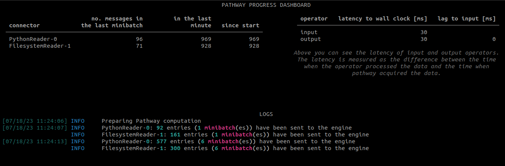

Pathway 是一个 Python ETL 框架，专为流处理、实时分析、LLM 管道和 RAG 应用而设计。它提供了一个易于使用的 Python API，能够与流行的 Python 机器学习库无缝集成，并由基于 Rust 的可扩展引擎提供支持。Pathway 支持批处理和流处理数据，使得开发、测试和生产环境可以使用相同的代码。它还提供丰富的连接器、状态转换、数据一致性保障和持久化功能。对于需要构建实时 LLM 和 RAG 应用的开发者来说，Pathway 提供了专门的工具集。

这个框架非常适合需要处理大量实时数据的应用，如物联网分析、实时推荐系统等。它通过 Rust 引擎实现了高性能，同时保持了 Python 的易用性。

> 🔗 **项目链接**
> 
> https://github.com/pathwaycom/pathway

---

### 字节跳动开源的多模态 AI 桌面代理：UI-TARS-desktop
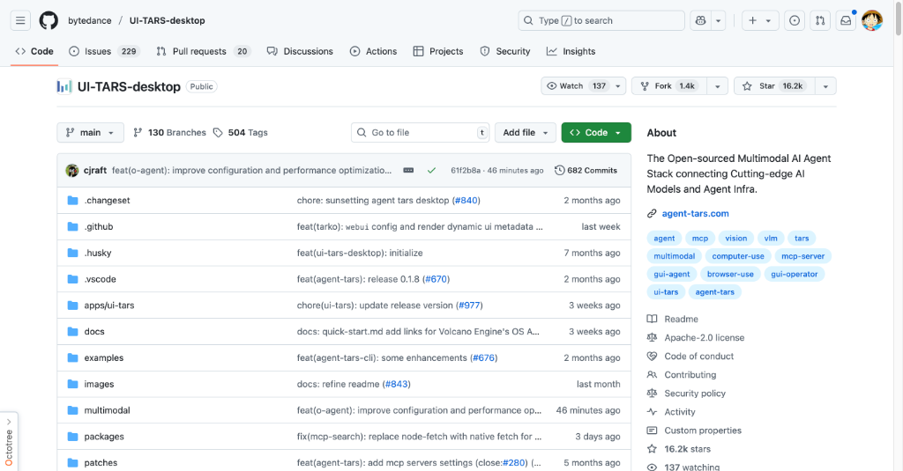

UI-TARS-desktop 是字节跳动开源的多模态 AI 代理栈，它将前沿的 AI 模型与代理基础设施连接起来。这个项目包括 Agent TARS 和 UI-TARS-desktop 两个主要部分。Agent TARS 是一个通用的多模态 AI 代理，可以通过 CLI 和 Web UI 将 GUI 代理和视觉能力引入终端、计算机、浏览器和产品中。UI-TARS-desktop 是一个桌面应用程序，基于 UI-TARS 模型提供本地 GUI 代理，支持本地和远程计算机以及浏览器操作员。

这个项目特别适合需要自动化复杂 GUI 交互的开发者，它提供了自然语言控制、精确的鼠标键盘控制、跨平台支持和实时反馈。通过 MCP 集成，它还能连接到真实世界的工具。

> 🔗 **项目链接**
> 
> https://github.com/bytedance/UI-TARS-desktop

---

### Go 语言的官方 Redis 客户端：go-redis
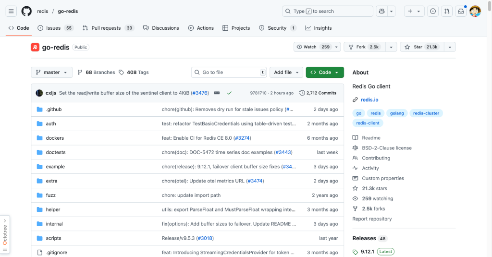

go-redis 是 Go 语言的官方 Redis 客户端库，提供了与 Redis 服务器交互的简单接口。它支持最新的 Redis 版本（7.2-8.2）和 Go 版本（1.23-1.24），并提供了丰富的功能，包括自动连接池、发布/订阅、管道和事务、脚本、Redis Sentinel、Redis Cluster、Redis Ring、性能监控和概率数据结构等。该库还支持自定义读写缓冲区大小和多种认证方法，包括实验性的基于令牌的 StreamingCredentialsProvider。

对于使用 Go 语言进行 Redis 开发的开发者来说，这是一个不可或缺的工具。它不仅支持最新的 Redis 功能，还提供了 OpenTelemetry 集成，方便进行性能监控和追踪。

> 🔗 **项目链接**
> 
> https://github.com/redis/go-redis

---

### 3D 重建利器：COLMAP
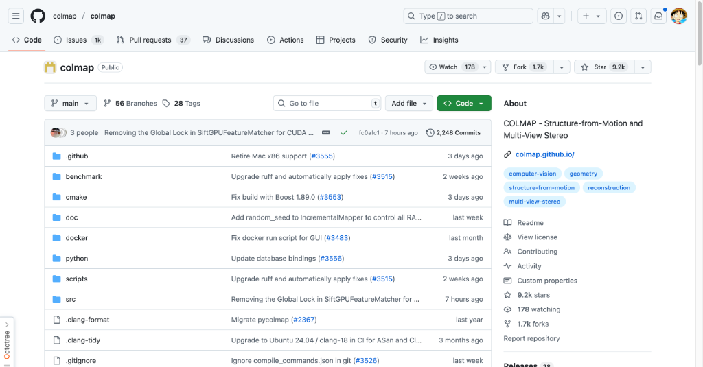

COLMAP 是一个通用的 Structure-from-Motion (SfM) 和 Multi-View Stereo (MVS) 管道，提供了图形和命令行界面。它支持有序和无序图像集合的重建，并提供了 Windows、Linux/Unix/BSD 的二进制文件、Docker 镜像和 Python 绑定。COLMAP 基于现有的工作构建，用户在使用特定算法时应引用原始作者。

这个项目非常适合计算机视觉领域的研究者和开发者，它能够从 2D 图像中重建 3D 模型，广泛应用于摄影测量、机器人视觉和增强现实等领域。

> 🔗 **项目链接**
> 
> https://github.com/colmap/colmap

---

### 基础设施即代码的王者：Terraform
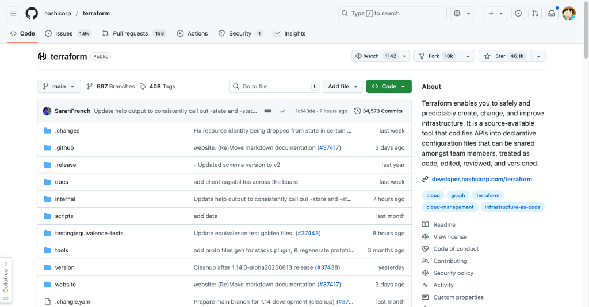

Terraform 是一个用于安全高效地构建、更改和版本化基础设施的工具。它允许使用高级配置语法描述基础设施，从而实现版本控制和重用。主要功能包括基础设施即代码、执行计划、资源图和变更自动化。Terraform 支持现有的和流行的服务提供商以及自定义的内部解决方案。

对于 DevOps 工程师和云架构师来说，Terraform 是管理云基础设施的必备工具。它通过声明式配置文件实现了基础设施的安全和可预测管理，减少了人为错误。

> 🔗 **项目链接**
> 
> https://github.com/hashicorp/terraform

---

### Angular 官方组件库：Angular Components
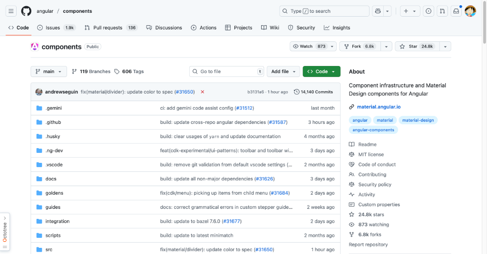

Angular Components 是 Angular 团队构建和维护的 UI 组件库，包括 @angular/cdk（用于构建自定义 UI 组件）、@angular/material（Material Design 组件）、@angular/google-maps（Google Maps 集成）和 @angular/youtube-player（YouTube 播放器组件）。该项目支持最新的浏览器和屏幕阅读器，旨在提供高质量、可访问和可定制的组件。

对于使用 Angular 进行前端开发的团队来说，这是一个非常有价值的资源。它提供了丰富的组件和工具，帮助开发者快速构建现代化的 Web 应用。

> 🔗 **项目链接**
> 
> https://github.com/angular/components

---

### 扩散模型训练套件：AI Toolkit
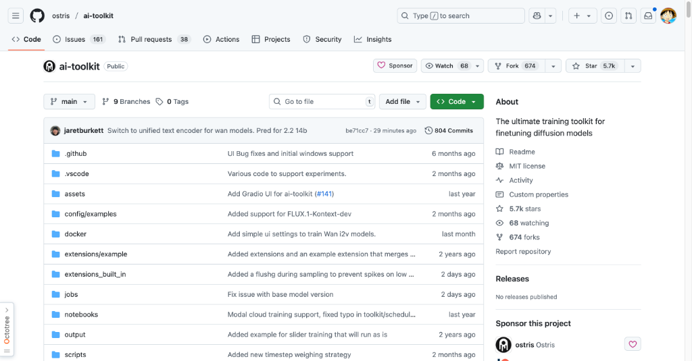

AI Toolkit 是一个用于扩散模型训练的一体化套件，支持在消费级硬件上训练最新的图像和视频模型。它提供了 GUI 和 CLI 界面，设计上注重易用性，同时包含丰富的功能。该工具包支持训练 FLUX.1 模型，并提供了详细的说明文档。它还具有基于 Web 的用户界面来管理训练任务，并支持通过认证令牌进行安全访问。

对于想要在本地训练扩散模型的开发者和研究人员来说，这是一个非常实用的工具。它简化了模型训练的过程，使得更多人能够参与到 AI 模型的开发中。

> 🔗 **项目链接**
> 
> https://github.com/ostris/ai-toolkit

---

### Kubernetes 外部密钥管理：External Secrets Operator
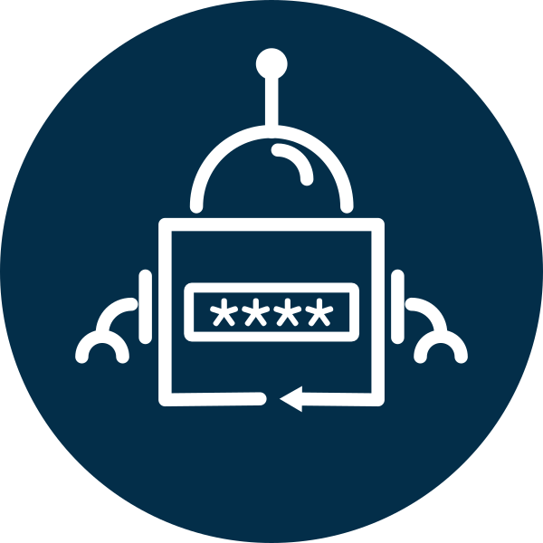

External Secrets Operator (ESO) 是一个 Kubernetes 操作符，用于集成外部密钥管理系统，如 AWS Secrets Manager、HashiCorp Vault、Google Secrets Manager、Azure Key Vault 等。该操作符从外部 API 读取信息，并自动将值注入到 Kubernetes Secrets 中。它为 Kubernetes 环境中的密钥管理提供了一个统一的接口。

对于在 Kubernetes 环境中管理密钥的团队来说，这是一个非常有用的工具。它简化了密钥管理的复杂性，提高了安全性，并支持 GitOps 工作流。

> 🔗 **项目链接**
> 
> https://github.com/external-secrets/external-secrets

---

## 🛠️ 产品观察

### AI 应用测试模拟器：Snowglobe
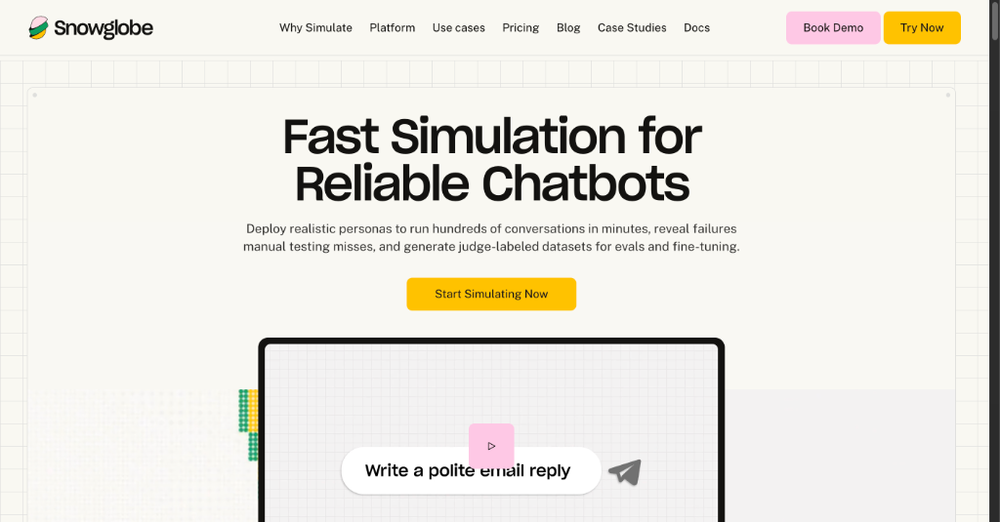

Snowglobe 是一个为 LLM 团队设计的模拟环境，用于在上线前测试 AI 应用的真实用户行为。它允许用户使用多样化和真实的角色模拟数千次与 AI 代理的对话，帮助及早发现潜在问题。通过高保真模拟，Snowglobe 使团队能够超越简单的测试数据集，评估 AI 如何处理常见和边缘案例场景。

对于需要确保 AI 应用质量的团队来说，这是一个非常有价值的工具。它可以帮助团队在上线前发现并修复问题，提高 AI 应用的可靠性。

> 🔗 **产品链接**
> 
> https://www.producthunt.com/products/snowglobe

---

### 无代码应用构建平台：Anything

Anything 是一个由 AI 驱动的平台，使用户无需编码即可构建移动应用和 Web 应用。它具有一个编码代理，可以从简单的提示中设计、开发和部署生产级应用。该平台集成了应用开发所需的一切，包括数据库、身份验证、支付和 AI 功能，无需额外工具或设置。

对于想要快速构建应用的非技术人员来说，这是一个非常有用的工具。它可以帮助他们快速实现想法，而无需学习复杂的编程知识。

> 🔗 **产品链接**
> 
> https://www.producthunt.com/products/anything-2

---

### 客户服务 AI 平台：CoSupport AI
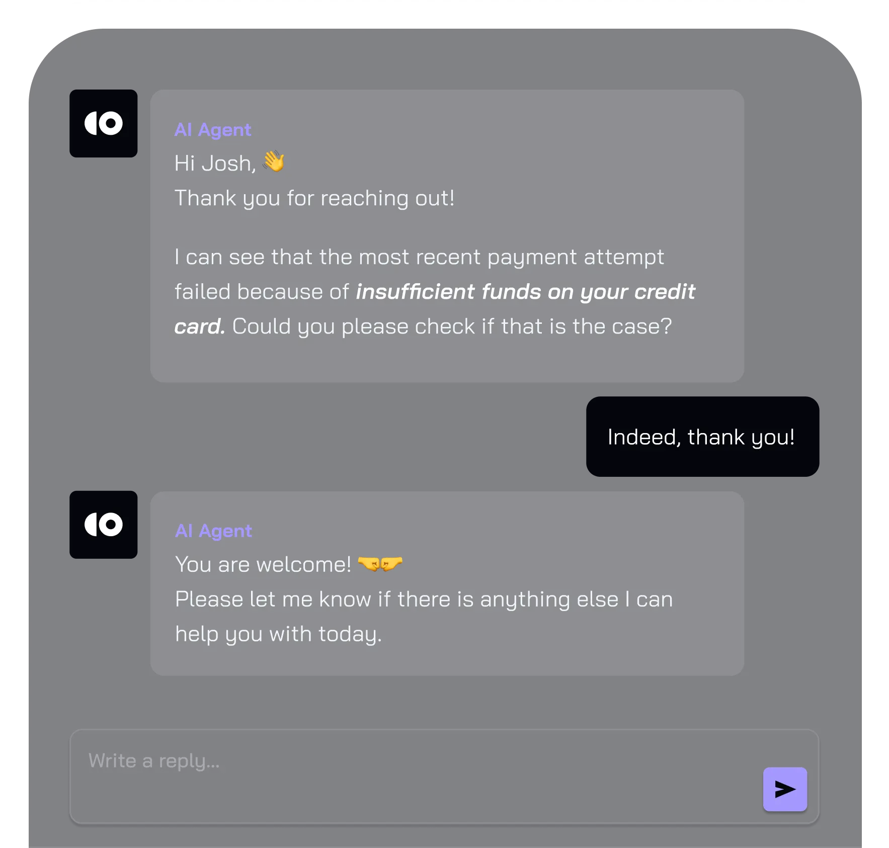

CoSupport AI 是一个完全可定制的 AI 客户服务平台，承诺以 99% 的准确率处理高达 90% 的重复工单。它允许用户在自己的内容上训练 AI 模型，并连接到 Zendesk、Intercom 和 Freshdesk 等流行的客服软件。主要功能包括自主 AI 代理、零幻觉、企业级安全性和不到 10 分钟的设置过程。

对于需要提高客户服务质量的团队来说，这是一个非常有价值的工具。它可以帮助团队自动化处理重复性问题，提高效率并降低成本。

> 🔗 **产品链接**
> 
> https://cosupport.ai/?ref=producthunt

---

### AI 驱动的新一代浏览器：Comet by Perplexity
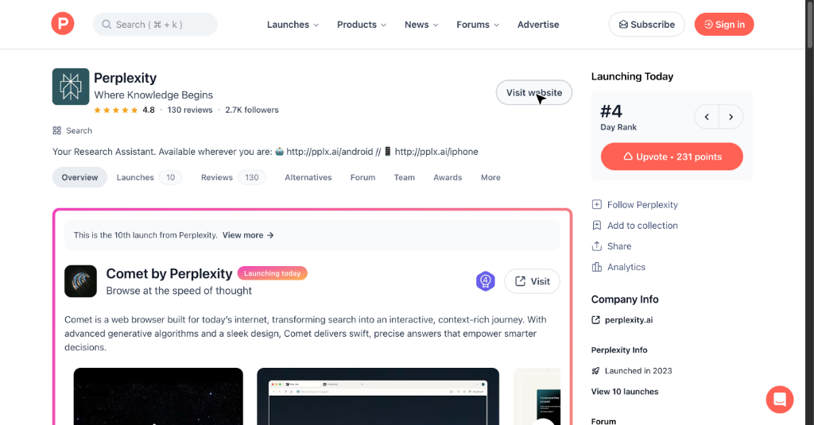

Comet by Perplexity 是一款新的 Web 浏览器，旨在改变用户在线搜索和交互信息的方式。它利用先进的生成算法和简洁的界面，提供快速、精确的答案，帮助用户做出更明智的决策。该浏览器适用于 Mac，还有 Android 和 iPhone 的移动版本。

对于需要高效搜索和信息处理的用户来说，这是一个非常有用的工具。它可以帮助用户更快地找到所需信息，提高工作效率。

> 🔗 **产品链接**
> 
> https://www.producthunt.com/products/perplexity-ai

---

### 语言学习阅读器：LangRead
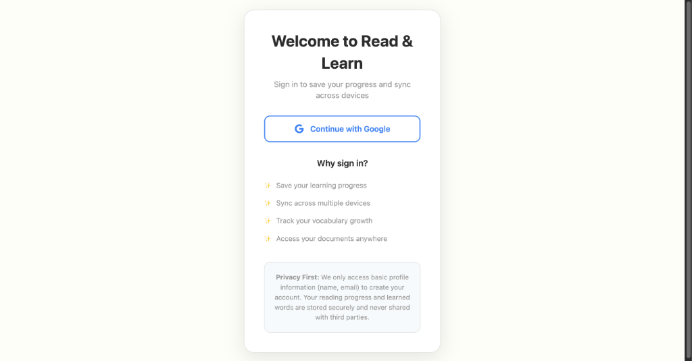

LangRead 是一个帮助用户通过阅读书籍学习语言的 Web 应用。它会逐渐将文本中的单词替换为目标语言的单词，让用户在语境中学习词汇。该应用支持 PDF、EPUB 和 Kindle 格式，用户可以查看翻译、听到发音、选择要学习的单词并跟踪进度。

对于想要通过阅读学习语言的用户来说，这是一个非常有用的工具。它提供了一种自然的语言学习方式，帮助用户在语境中掌握词汇。

> 🔗 **产品链接**
> 
> https://www.producthunt.com/products/langread

---

### 生活方式 AI 助手：Macaron AI
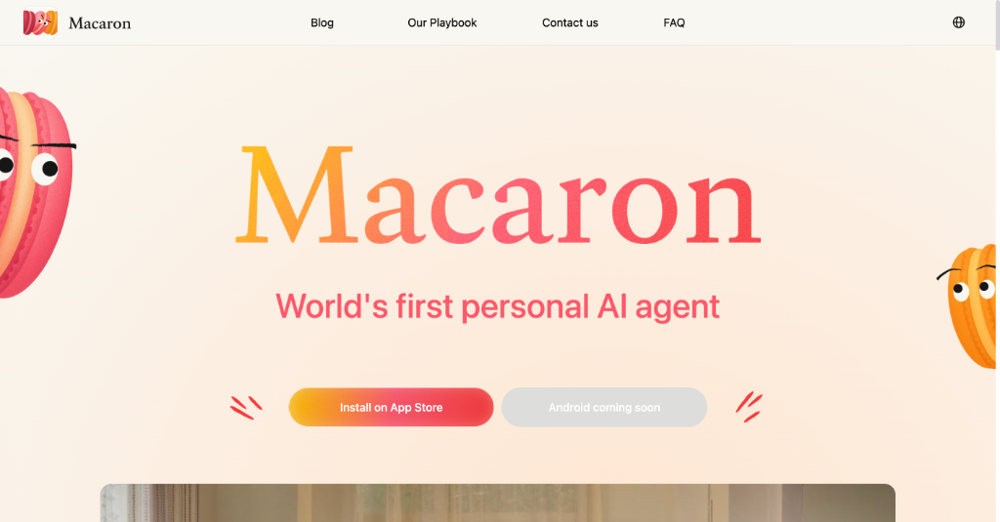

Macaron AI 是一个个人 AI 助手，从第一次聊天开始就与用户建立连接，记住他们的偏好和经历，并创建个性化的迷你应用来增强日常生活。与专注于生产力的 AI 工具不同，Macaron 旨在成为一个生活方式伴侣，理解用户的愿望并提供量身定制的解决方案，如健身追踪器、旅行计划或阅读伴侣。

对于希望 AI 成为生活伴侣的用户来说，这是一个非常有趣的产品。它可以帮助用户更好地管理日常生活，提高生活质量。

> 🔗 **产品链接**
> 
> https://www.producthunt.com/products/macaron-ai

---

## 📰 行业动态

### AI 视频创作平台：DeepReel

DeepReel 是一个由 AI 驱动的视频创作平台，充当个人视频制作团队。它使用户能够在几分钟内将博客、文档或想法转化为精美的、有主持人的视频。AI 负责剧本写作、视觉素材获取、配音、音乐和字幕，让用户专注于完善和发布内容。

对于需要快速制作视频内容的营销人员、创始人和内容密集型企业来说，这是一个非常有价值的工具。它可以帮助他们扩大视频营销规模，而无需增加工作量。

> 🔗 **相关链接**
> 
> https://www.producthunt.com/products/deepreel

---

### 从模板到月入 $12k 的创业故事

Jonathan Wilke 是一名 Web 开发者和 Supastarter 的创始人，他将重复的客户工作转化为成功的产品。面对不断为客户重建相同模板代码的问题，他创建了一个可重用的解决方案。从一个 49 美元的实验开始，这个产品演变成了一个每月 349 美元的产品，拥有超过 800 名客户，每月收入 12,000 美元。

这个故事告诉我们，解决自己的问题可以带来可扩展的业务。通过公开建设、合理定价和根据反馈迭代，可以实现业务的快速增长。

> 🔗 **相关链接**
> 
> https://www.indiehackers.com/post/tech/hitting-12k-mo-with-a-boilerplate-j2n9ECQvdJBw9Gvf4TKA

---

### 为 LLMs 提供持久内存的系统：YAMS
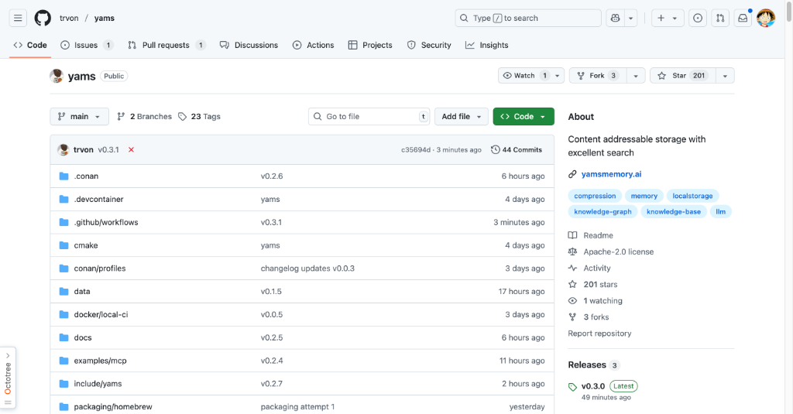

YAMS (Yet Another Memory System) 是一个为 LLMs 和应用程序设计的内容可寻址存储解决方案，提供持久内存，具有去重、语义搜索和全文索引等功能。它支持高性能，吞吐量超过 100MB/s，并通过预写日志提供崩溃恢复。该系统特别适用于在 LLM 会话中保持上下文，并通过模型上下文协议 (MCP) 与 Claude Desktop 等工具集成。

对于需要在 LLM 会话中保持上下文的开发者来说，这是一个非常有用的工具。它可以帮助提高 LLM 应用的性能和可靠性。

> 🔗 **相关链接**
> 
> https://github.com/trvon/yams

---

## 💡 经验讨论

### 从周末实验到月入 $20k 的创业故事
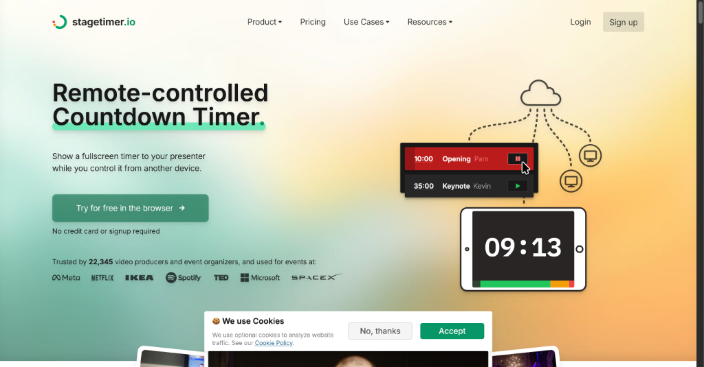

Lukas Hermann 通过创建 Stagetimer，将一个简单的周末项目变成了每月 20,000 美元的业务。Stagetimer 是一个用于现场活动和视频制作的基于 Web 的计时器。从解决个人不便的实验开始，通过专注于简单性、快速 MVP 开发和有效的产品主导增长策略，最终成为成功的产品。

这个故事强调了选择简单想法、快速构建 MVP、根据真实客户需求迭代的重要性。通过早期用户反馈、智能定价模型和免费增值模式，可以实现业务的快速增长。

> 🔗 **参考资料**
> 
> https://www.indiehackers.com/post/tech/from-weekend-experiment-to-20k-mo-business-aP4YP2DouOUuicCtcnCB

---

## 📸 每日一图

### 现代 SaaS 联盟营销平台：Dub Partners
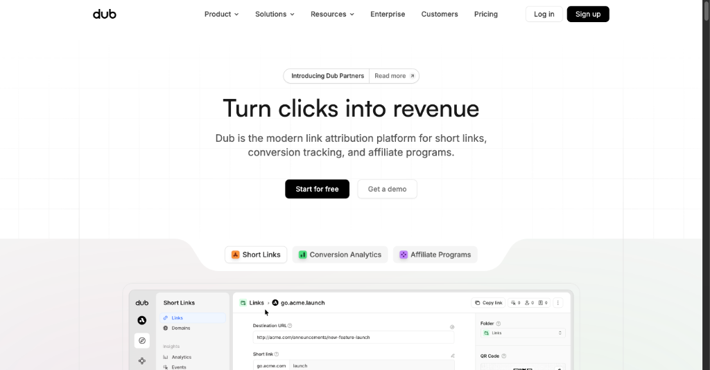

Dub Partners 是一个为 SaaS 公司设计的现代联盟营销平台和网络。它使企业能够构建可扩展的推荐和联盟计划，具有 1 次点击全球支付和白标功能。该平台受到 Framer、Superhuman 和 Perplexity 等知名公司的信任。它还提供从 Rewardful、Tolt 和 PartnerStack 等竞争平台的 1 次点击迁移助手。

对于需要建立联盟营销计划的 SaaS 公司来说，这是一个非常有价值的工具。它可以帮助企业快速建立和管理联盟计划，提高收入。

> 🔗 **图片来源**
> 
> https://www.producthunt.com/products/dub

---

## 📝 结语

明天见。Bye 👋

---

💌 **互动时间**：
- 你对哪个项目最感兴趣？
- 有什么想了解的技术话题？
- 欢迎在评论区分享你的想法！

🔗 **关注 HelloDev.io**：每日精选最有价值的内容，5 分钟了解行业最新进展

📱 **多平台发布**：微信公众号 | 掘金 | 知乎 | GitHub