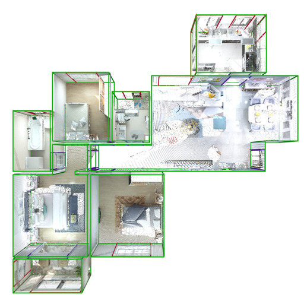
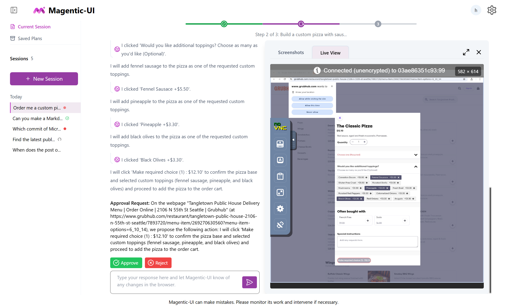
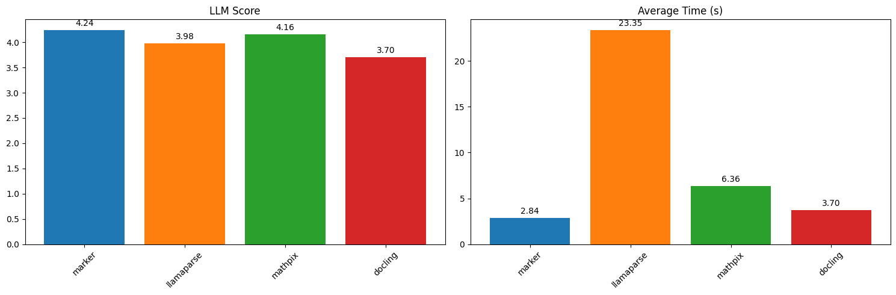
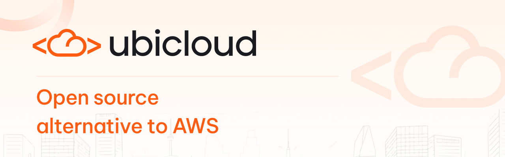
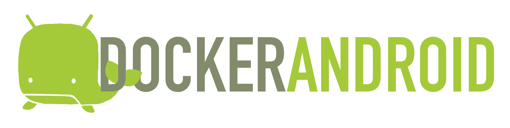
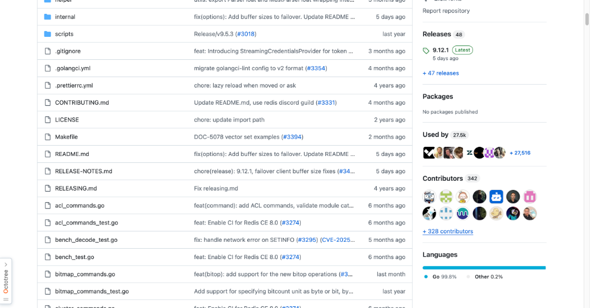
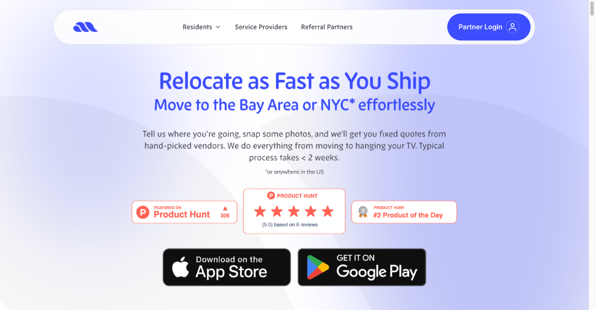
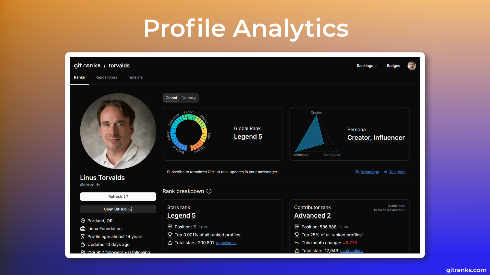

# HelloDev.io 开发者日报 - 第 10 期 (2025 年 08 月 16 日)

👋 Hi，这里是 HelloDev.io 开发者日报，今天是第 10 期，即将为你介绍今天的精彩发现：

📊 **今日统计**：
- 🚀 开源趋势：8 条
- 🛠️ 产品观察：6 条  
- 📰 行业动态：3 条
- 💡 经验讨论：1 条
- 📸 每日一图：1 条

---

## 🚀 开源趋势

### 🧠 3D 大语言模型新星：SpatialLM

SpatialLM 是一个专为处理 3D 点云数据而设计的多模态大语言模型。它能够将来自单目视频、RGBD 图像或 LiDAR 等不同来源的点云数据，转化为结构化的 3D 场景理解输出，例如墙壁、门窗等建筑元素以及带语义类别的定向物体包围盒。这有效弥合了非结构化 3D 几何数据与结构化 3D 表示之间的鸿沟，显著提升了在具身机器人、自动驾驶导航等场景中的空间推理能力。SpatialLM1.1 版本通过更强大的编码器，将点云分辨率翻倍，已在布局估计和 3D 物体检测基准测试中达到新的 SOTA。

推荐给需要处理 3D 场景理解或进行机器人相关开发的朋友。

> 🔗 **项目链接**
> 
> https://github.com/manycore-research/SpatialLM

---

### 🤖 微软开源的人机协作 Web 自动化界面：Magentic-UI

Magentic-UI 是微软推出的一个研究原型，它提供了一个以用户为中心的多智能体系统界面，用于自动化 Web 任务，同时将用户置于控制的核心。它支持网页浏览、代码生成与执行、文件分析等功能，并通过共同规划、共同执行、操作守卫和计划学习等特性，强调透明度和用户的参与感。该系统基于微软的 AutoGen 框架构建，支持与 MCP 服务器集成扩展功能，非常适合需要复杂 Web 交互但又不想完全放手给 AI 的场景。

对于希望探索人机协同 Web 自动化的开发者来说，这是一个值得关注的项目。

> 🔗 **项目链接**
> 
> https://github.com/microsoft/magentic-ui

---

### ⚡ 高效文档转换利器：Marker

Marker 是一款高效的文档转换工具，能够快速准确地将 PDF、图像、PPTX、DOCX 等多种格式文件转换为 Markdown、JSON、HTML 和 Chunks 格式。它支持多语言，并能很好地处理表格、公式、链接等复杂元素，还能提取和保存图像。通过可选的 LLM 集成，Marker 可以进一步提升转换准确性，尤其在处理复杂表格和数学公式时表现突出。支持 GPU 加速，处理速度快，还提供了结构化提取功能（beta），非常适合需要批量处理文档的场景。

对于经常需要将 PDF 或其他文档转换为结构化数据的开发者，Marker 是一个极佳的选择。

> 🔗 **项目链接**
> 
> https://github.com/datalab-to/marker

---

### 🌐 降本 3 倍的开源云平台：Ubicloud

Ubicloud 是一个开源的云平台，旨在成为 AWS 等专有云提供商的替代品，可以在任何地方运行。它提供了弹性计算、块存储、防火墙、负载均衡、托管 Postgres、Kubernetes、AI 推理和 IAM 等核心 IaaS 功能。用户可以通过托管服务使用，也可以在 Hetzner 和 AWS 等裸金属提供商上自部署。Ubicloud 强调降低成本、提高可移植性和控制力，允许用户在不被厂商锁定的情况下利用底层提供商的优势。该项目采用 Ruby 编写，利用了 Cloud Hypervisor、IPsec、SPDK 和 nftables 等成熟技术。

对于希望降低云成本或寻求更灵活云解决方案的团队，Ubicloud 值得深入研究。

> 🔗 **项目链接**
> 
> https://github.com/ubicloud/ubicloud

---

### 🔌 FastAPI 端点变身 MCP 工具：FastAPI-MCP

FastAPI-MCP 是一个将 FastAPI 端点暴露为模型上下文协议 (MCP) 工具的库，支持认证功能。它并非简单的 OpenAPI 到 MCP 转换器，而是原生利用 FastAPI 的依赖注入系统，保留了请求和响应模型的模式以及端点的文档。该项目支持灵活部署，可以将 MCP 服务器挂载到同一应用或单独部署，并使用 ASGI 传输实现高效通信。这对于希望将现有 FastAPI 服务快速集成到 MCP 生态（如 Cursor、Claude 等）中的开发者来说，是一个非常方便的工具。

如果你正在使用 FastAPI 并希望接入 MCP 生态，FastAPI-MCP 可以帮你省去大量重复工作。

> 🔗 **项目链接**
> 
> https://github.com/tadata-org/fastapi_mcp

---

### 🤖 在 Docker 中运行 Android：Docker-Android

Docker-Android 是一个专为 Android 应用开发和测试设计的 Docker 镜像。它在 Docker 容器内提供 Android 模拟器，支持多种设备配置和皮肤。其核心特性包括 noVNC 支持（用于可视化访问）、通过 Web UI 共享日志、与 Genymotion 等云解决方案集成。它支持构建 Android 项目，并能使用 Appium 和 Espresso 等框架运行 UI 测试。该项目为不同 Android 版本提供了多种 Docker 镜像，并包含了针对 Ubuntu、OSX 和 Windows (WSL2) 用户的快速入门指南。

对于需要在 CI/CD 流水线中进行 Android 测试或希望简化本地 Android 开发环境的团队，Docker-Android 是一个非常实用的方案。

> 🔗 **项目链接**
> 
> https://github.com/budtmo/docker-android

---

### 🔥 官方推荐的 Go Redis 客户端：go-redis

go-redis 是 Go 语言官方推荐的 Redis 客户端库，提供了简洁直观的接口来与 Redis 服务器交互。它支持 Redis 7.2 到 8.2 版本，并具备自动连接池、认证（包括实验性的基于令牌的 StreamingCredentialsProvider）、Pub/Sub、管道与事务、脚本、Redis Sentinel、Redis Cluster、Redis Ring、性能监控以及概率数据结构等全面的功能。库还支持自定义读写缓冲区大小以优化性能，并允许配置 RESP2/RESP3 协议。高级特性包括客户端识别、OpenTelemetry 集成和对 RediSearch 命令的支持。

对于使用 Go 语言进行 Redis 开发的开发者来说，go-redis 是无可争议的首选。

> 🔗 **项目链接**
> 
> https://github.com/redis/go-redis

---

### 🧹 用 Rust 编写的高效文件清理工具：Czkawka

Czkawka 是一个用 Rust 编写的多功能、快速且免费的磁盘清理工具。它能够查找重复文件、空文件夹、大文件、临时文件、相似图像、相似视频、相同音乐、无效符号链接和损坏文件等。该工具提供了 CLI 和 GUI 两种界面，支持 Linux、Windows、macOS、FreeBSD 等多平台，并且完全离线工作，不收集任何用户信息。它还支持缓存功能，使得后续扫描比首次扫描更快。其姊妹项目 Krokiet 使用 Slint 前端，提供了另一种 GUI 选择。

对于希望清理磁盘空间、整理文件或进行重复文件查找的用户，Czkawka 是一个安全、高效且功能丰富的选择。

> 🔗 **项目链接**
> 
> https://github.com/qarmin/czkawka

---

## 🛠️ 产品观察

### 🧠 集 ChatGPT、Notion、白板于一体的 AI 生产力工具：Kuse

Kuse 是一款 AI 驱动的生产力工具，它将 ChatGPT、Notion 和白板的功能整合到一个平台中。用户可以在可视化的画布上将杂乱的输入转化为结构化的产出，上下文可编辑且可复用。平台支持多种文件格式，并能根据上传的信息生成文档、图像、网页等特定输出。Kuse 旨在为人类和 AI 提供一个统一的协作空间，高效地处理信息并创造所需成果。它已经吸引了超过 400 个团队和 20 万用户，包括教育工作者、产品经理和创意工作者。

对于需要整合信息处理、知识管理和 AI 协作的知识工作者，Kuse 提供了一个非常有吸引力的一站式解决方案。

> 🔗 **产品链接**
> 
> https://www.producthunt.com/products/kuse

---

### 🎨 在浏览器中直接修改前端代码：stagewise

stagewise 是一个开源的前端编码代理，它直接在你的浏览器 localhost 上运行。开发者可以通过点击 UI 元素、输入提示，直观地修改 Web 应用，并将更改直接反映到本地代码库中。它旨在弥合像 v0 这样的原型工具与现有代码库之间的鸿沟。该工具支持任何前端框架，只需运行 `npx stagewise@latest` 命令即可轻松试用。

对于希望快速迭代前端 UI 而无需在工具间切换的开发者，stagewise 是一个非常有趣的尝试。

> 🔗 **产品链接**
> 
> https://www.producthunt.com/products/stagewise-2

---

### 🚚 你的个人 AI 搬家管家：Move AI

Move AI 是一款 AI 驱动的搬家管家服务，旨在简化长途搬家的流程。它能协调从寻找经过验证的搬家公司、安排清洁服务到宠物运输和家具安装等方方面面。用户只需提供基本信息和照片，Move AI 就会处理库存创建、报价比较、预订、文书工作和搬家当天的协调。该服务通过确保来自可信供应商的透明、货比三家的报价，来节省时间、减少压力并防止多付费。

对于即将搬家的用户，尤其是忙碌的专业人士和创始人，Move AI 可以极大地简化整个过程。

> 🔗 **产品链接**
> 
> https://www.producthunt.com/products/move-ai-your-ai-moving-assistant

---

### 🔍 了解 GPT-5 对你品牌的看法：GPT-5 SEO Brand Visiblity

GPT-5 SEO Brand Visiblity 是一款帮助用户发现 GPT-5 如何看待其品牌和竞争对手的工具。只需输入网站域名，即可快速获得一份报告，其中包括识别度得分、社交存在感与情绪、推荐可能性、竞争格局和分析置信度等指标。这对于希望了解 AI 模型如何感知其品牌，并在 AI 搜索时代优化 SEO 策略的 SEO 专业人士和营销人员来说非常有价值。

对于关注 AI 搜索趋势并希望优化品牌在 AI 搜索中可见度的营销人员，这是一个值得关注的工具。

> 🔗 **产品链接**
> 
> https://www.producthunt.com/products/gpt-5-seo-brand-visiblity

---

### 📱 将个人照片变成爆款内容：PersonaRoll

PersonaRoll 是一款 AI 驱动的工具，帮助用户通过将个人照片转化为病毒式传播的社交媒体内容。用户上传相机胶卷后，可以利用 AI 将图像与热门话题匹配，并以所选角色的声音生成真实的内容。该平台专为独立创作者、创始人和小团队设计，帮助他们保持一致且符合品牌调性的社交媒体形象，同时避免内容倦怠。主要功能包括角色构建、趋势感知的创意构思、一键生成草稿，以及可选的自动发布到 X（原 Twitter）等功能。前 1000 名用户可免费使用。

对于希望提高社交媒体内容创作效率并保持真实性的创作者，PersonaRoll 提供了一个新颖的解决方案。

> 🔗 **产品链接**
> 
> https://www.producthunt.com/products/personaroll

---

### 🏆 追踪你在 GitHub 上的排名：GitRanks

GitRanks 是一个 GitHub 个人资料分析和排名平台，允许开发者根据星标、贡献和关注者来跟踪自己的排名。它提供动态的全球和国家/地区特定的排行榜，让用户可以看到自己在全球或本国同行中的排名。平台从公共 GitHub 仓库中提取数据，并每日更新排名。用户还可以生成和展示动态徽章来展示他们的 GitHub 成就，并通过 WhatsApp 或 Telegram 等消息应用接收排名更新。

对于希望了解自己在开源社区中地位的开发者，GitRanks 提供了一个有趣且直观的视角。

> 🔗 **产品链接**
> 
> https://www.producthunt.com/products/gitranks

---

## 📰 行业动态

### 📚 更好地管理 Reddit 收藏：Readdit Later

Readdit Later 是一款 Chrome 扩展，旨在帮助用户轻松保存、搜索和整理 Reddit 帖子。它会自动同步保存的帖子，并提供一个干净、可搜索的仪表板，用户可以在其中过滤、排序和批量管理他们的发现。该扩展解决了保存的 Reddit 帖子杂乱且难以查找的常见问题，为管理内容提供了更有条理的方法。用户可以按 subreddit、帖子类型或时间进行过滤，甚至可以在需要整理时批量取消保存帖子。

对于经常在 Reddit 上保存大量帖子的活跃用户，Readdit Later 是一个能显著提升管理效率的工具。

> 🔗 **相关链接**
> 
> https://www.producthunt.com/products/readdit-later

---

### 🖼️ 在 Claude Code 中直接粘贴图片：Claude Utils

Claude Utils 是一款专为使用 Claude Code 的开发者设计的生产力工具，解决了分享截图的不便。用户现在可以直接将图片粘贴到 Claude Code 中，而无需保存和拖拽图像文件。这个简单但有效的解决方案在发布 48 小时内就吸引了超过 180 名开发者。该工具定位为增强 Claude Code 体验的实用程序中心，并承诺未来会推出更多功能。

对于使用 Claude Code 并经常需要分享代码截图的开发者，Claude Utils 是一个非常贴心的小工具。

> 🔗 **相关链接**
> 
> https://www.producthunt.com/products/claude-utils

---

### 🎨 从视频生成模型中脱颖而出的图像生成器：Wan2.2

Wan2.2 是一个最初为视频生成而设计的先进 AI 模型，但其图像生成能力也备受关注。用户可以通过 Textideo 的在线平台体验其功能，而无需本地安装。该模型以生成高分辨率图像（高达 1920 x 1536）而著称，具有独特的“视频截图”美学、自然的肤色和令人印象深刻的动漫和水彩等艺术风格细节。其主要优势包括通过基于云的处理实现易用性，消除了硬件障碍，并能快速提供多样化的创意风格。

对于寻求高质量、多样化视觉内容且不想投资本地硬件的创作者和营销人员，Wan2.2 是一个非常有吸引力的选择。

> 🔗 **相关链接**
> 
> https://www.indiehackers.com/post/wan2-2-text-to-image-generation-e766df96fe

---

## 💡 经验讨论

### 💰 从失败到年收入百万：8 个月的创业复盘

这篇来自 Indie Hackers 的文章详细介绍了 Rosie 的创始人 Jordan Gal 如何从一家失败的风险投资公司转向构建一款 AI 语音产品，并在短短八个月内实现了 100 万美元的年经常性收入 (ARR)。文章涵盖了这次转型的关键方面，包括发现 AI 语音机会、组建精简团队、利用冷邮件和广告进行增长、克服谷歌广告活动失败等挑战，以及通过低价策略吸引中小企业。Gal 强调了速度、专注力和从错误中学习的重要性。

这篇文章的核心启示是：从失败中 pivoting，如果能识别出真正的市场需求，可以带来巨大的成功。速度和专注在早期阶段至关重要，多样化的增长策略（冷启动 -> 广告 -> SEO）有助于快速扩张。即使是非技术创始人，也必须深入理解 AI 产品的技术栈。外部顾问可以提供宝贵的专业知识，帮助团队保持专注。

> 🔗 **参考资料**
> 
> https://www.indiehackers.com/post/tech/from-failure-to-1m-arr-in-8-months-oA0AqL4jY25lxrQ4uGBl

---

## 📸 每日一图

### 🌲 数字森林：代码与数据的生命之林

今日为您呈现一幅数字艺术风格的数字森林。一片由代码和数据构成的森林，树木是光纤和电路板，叶片是闪烁的二进制代码，阳光透过科技感的树冠洒下柔和的蓝光，传达清新、未来感、激励的情感氛围。愿这份美好为您的开发工作带来灵感和愉悦。

这幅图以一种极具想象力的方式，将我们日常工作的抽象概念——代码和数据——具象化为一片生机勃勃的森林。它提醒我们，即使在看似冰冷的数字世界中，也能孕育出无限的创造力和生命力。希望这份未来感和激励感能为你的开发工作注入新的活力。

> 🔗 **图片来源**
> 
> https://hellodev.io/daily-image

---

## 📝 结语

明天见。Bye 👋

---

💌 **互动时间**：
- 你对哪个项目最感兴趣？
- 有什么想了解的技术话题？
- 欢迎在评论区分享你的想法！

🔗 **关注 HelloDev.io**：每日精选最有价值的内容，5 分钟了解行业最新进展

📱 **多平台发布**：微信公众号 | 掘金 | 知乎 | GitHub