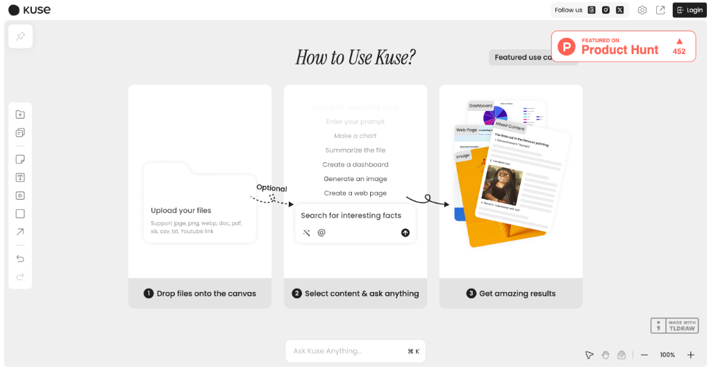

# HelloDev.io 开发者日报 - 第 10 期 | 2025 年 08 月 16 日

👋 Hi，这里是 HelloDev.io 开发者日报，今天是第 10 期，即将为你介绍今天的精彩发现：

📊 **今日统计**：
- 🚀 开源趋势：8 条
- 🛠️ 产品观察：6 条  
- 📰 行业动态：3 条
- 💡 经验讨论：1 条
- 📸 每日一图：1 条

---

## 🚀 开源趋势

### GitHub 21k+ stars 的官方 Redis 客户端：redis / go-redis

go-redis 是 Go 语言的官方 Redis 客户端库，提供简洁易用的接口与 Redis 服务器交互。它支持 Redis 7.2 到 8.2 版本，具备连接池、认证、Pub/Sub、管道、事务、脚本、集群、哨兵等全面功能。项目还支持自定义缓冲区大小优化性能，可配置 RESP2/RESP3 协议，并集成 OpenTelemetry 进行性能监控。对于需要与 Redis 交互的 Go 开发者来说，这是一个功能完备、性能优秀且社区活跃的首选方案。

对于需要高性能 Redis 交互的 Go 项目，go-redis 是一个值得信赖的选择，特别适合构建微服务架构或需要处理高并发场景的应用。

> 🔗 **项目链接**
> 
> https://github.com/redis/go-redis

---

### 让部署提速 3 倍的开源云平台：ubicloud / ubicloud

Ubicloud 是一个开源云平台，旨在提供一种替代 AWS 等专有云提供商的方案。它支持弹性计算、块存储、防火墙、负载均衡、托管 Postgres、Kubernetes、AI 推理和 IAM 服务等核心 IaaS 功能。平台可以托管使用或在 Hetzner 和 AWS 等裸机提供商上自托管，强调降低成本、可移植性和控制力，帮助用户在不被厂商锁定的情况下利用底层提供商的优势。对于希望拥有更多基础设施控制权的开发者和团队来说，Ubicloud 提供了一个灵活且经济的选择。

适合那些希望摆脱大型云厂商束缚，同时又需要完整云服务功能的开发者和企业，特别是对成本敏感的初创团队。

> 🔗 **项目链接**
> 
> https://github.com/ubicloud/ubicloud

---

### 解决 Android 开发环境痛点的神器：budtmo/docker-android

Docker-Android 是一个专为 Android 应用开发和测试设计的 Docker 镜像。它在 Docker 容器中提供 Android 模拟器，支持多种设备配置和皮肤。关键特性包括 noVNC 可视化访问、通过 Web UI 共享日志、与 Genymotion 等云解决方案集成。它支持构建 Android 项目，并能使用 Appium 和 Espresso 等框架运行 UI 测试。对于需要在隔离环境中进行 Android 开发和测试的团队，Docker-Android 显著降低了基础设施需求，并简化了 CI/CD 流程的集成。

特别适合需要频繁进行 Android 应用测试的开发团队，以及希望简化测试环境配置的 DevOps 工程师。

> 🔗 **项目链接**
> 
> https://github.com/budtmo/docker-android

---

### FastAPI 端点秒变 MCP 工具：tadata-org / fastapi_mcp

FastAPI-MCP 是一个将 FastAPI 端点暴露为模型上下文协议 (MCP) 工具的库，支持认证功能。它采用 FastAPI 原生方式，不仅是一个 OpenAPI 到 MCP 的转换器，还保留了请求和响应模型的模式以及端点的文档。该项目支持灵活部署，可以将 MCP 服务器挂载到同一应用程序或单独部署，并使用 ASGI 传输以实现高效通信。对于希望将现有 FastAPI 服务快速集成到 MCP 生态中的开发者来说，这是一个高效且低摩擦的解决方案。

适合已经使用 FastAPI 构建服务，并希望将其能力扩展到 MCP 兼容工具的开发者和团队。

> 🔗 **项目链接**
> 
> https://github.com/tadata-org/fastapi_mcp

---

### 用 Rust 编写的高效文件清理工具：qarmin / czkawka

Czkawka 是一个用 Rust 编写的多功能、快速且免费的应用程序，旨在帮助用户清理计算机上不必要的文件。它支持查找重复文件、空文件夹、大文件、临时文件、相似图像、相似视频、相同音乐、无效符号链接和损坏文件等功能。该工具提供 CLI 和 GUI 两种前端界面，支持多平台（Linux、Windows、macOS、FreeBSD 等），并且不收集任何用户信息，完全离线工作。对于需要定期清理磁盘空间、整理文件的用户来说，Czkawka 是一个安全、高效且隐私友好的选择。

适合所有希望保持系统整洁、释放存储空间的用户，特别是对隐私和安全有较高要求的技术人员。

> 🔗 **项目链接**
> 
> https://github.com/qarmin/czkawka

---

### 让文档转换更智能的瑞士军刀：datalab-to / marker

Marker 是一个高效的文档转换工具，能够快速准确地将 PDF、图像、PPTX、DOCX、XLSX、HTML、EPUB 等文件转换为 Markdown、JSON、HTML 和 Chunks 格式。它支持多语言，具备表格、表单、公式、链接、引用和代码块的格式化功能，并能提取和保存图像。该工具可通过 GPU、CPU 或 MPS 运行，还支持通过 LLM 提升转换准确性，并提供结构化提取功能。对于需要处理大量文档并将其转换为结构化数据的用户来说，Marker 是一个强大的生产力工具。

特别适合研究人员、内容创作者和数据工程师，需要将各种文档格式转换为可处理的数字内容。

> 🔗 **项目链接**
> 
> https://github.com/datalab-to/marker

---

### 为 Web 自动化注入人性光辉：microsoft / magentic-ui

Magentic-UI 是微软开发的一个研究原型，它通过多代理系统提供以人类为中心的界面，旨在自动化 Web 任务的同时让用户保持控制权。它具备 Web 浏览、代码生成与执行、文件分析等能力，强调通过共规划、共任务、行动守卫和计划学习等功能实现透明度和用户参与。它基于微软的 AutoGen 框架构建，支持与 MCP 服务器集成以扩展功能。对于希望在 Web 自动化中保留人类判断力的开发者和研究人员来说，Magentic-UI 提供了一个创新的解决方案。

适合需要在复杂 Web 交互中保持人类监督和控制的自动化场景，如数据抓取、表单填写和内容分析。

> 🔗 **项目链接**
> 
> https://github.com/microsoft/magentic-ui

---

### 为机器人赋予空间感知能力：manycore-research / SpatialLM

SpatialLM 是一个 3D 大语言模型，专为处理 3D 点云数据并生成结构化 3D 场景理解输出而设计。它可以处理来自单目视频序列、RGBD 图像和 LiDAR 传感器等不同来源的点云，输出包括墙壁、门、窗和带语义类别的定向对象边界框等建筑元素。这种多模态架构有效弥合了非结构化 3D 几何数据与结构化 3D 表示之间的差距，提供高级语义理解，增强机器人、自动驾驶和其他复杂 3D 场景分析任务的空间推理能力。对于需要从 3D 数据中提取结构化信息的应用来说，SpatialLM 是一个突破性的工具。

适合机器人技术、自动驾驶和增强现实等领域的研究人员和开发者，需要处理复杂 3D 环境数据。

> 🔗 **项目链接**
> 
> https://github.com/manycore-research/SpatialLM

---

## 🛠️ 产品观察

### 为独立开发者量身打造的协作新星：Kuse

Kuse 是一个 AI 驱动的生产力工具，将 ChatGPT、Notion 和白板的功能整合到一个平台中。它允许用户在可视化画布上将杂乱的输入转化为结构化的产出，上下文可编辑且可重用。平台支持多种文件格式，并能根据上传的信息生成文档、图像和网页等特定输出。对于希望在一个地方高效处理信息、与 AI 协作的独立开发者和创意工作者来说，Kuse 提供了一个统一且直观的工作空间。

特别适合需要处理多种信息源、追求高效工作流程的知识工作者和内容创作者。

> 🔗 **产品链接**
> 
> https://www.producthunt.com/products/kuse

---

### 让前端开发变得优雅的 AI 助手：stagewise

stagewise 是一个开源的前端编码代理，直接在浏览器的 localhost 上运行，让开发者可以直观地修改 Web 应用并将更改直接实现到本地代码库中。它通过让用户点击 UI 元素、输入提示，自动将更改反映到源代码中，弥合了像 v0 这样的原型工具与现有代码库之间的差距。对于希望快速迭代前端设计而无需切换上下文的开发者来说，stagewise 是一个提升效率的利器。

适合前端开发者，特别是那些希望在现有项目中快速实现 UI 变更、提高开发效率的团队。

> 🔗 **产品链接**
> 
> https://www.producthunt.com/products/stagewise-2

---

### 免费替代 Notion 的轻量级选择：GitRanks

GitRanks 是一个 GitHub 个人资料分析和排名平台，让开发者可以根据 stars、贡献和关注者来跟踪自己的排名。它提供动态的全球和国家特定的排行榜，让用户可以看到自己在全球或本国同行中的位置。平台从公共 GitHub 仓库中提取数据，每日更新排名。用户还可以生成和展示动态徽章来展示他们的 GitHub 成就，并通过 WhatsApp 或 Telegram 接收排名更新。对于希望在开源社区中展示自己成就的开发者来说，GitRanks 是一个有趣的工具。

适合活跃在 GitHub 上的开发者，特别是希望了解自己在社区中影响力和排名的开源贡献者。

> 🔗 **产品链接**
> 
> https://www.producthunt.com/products/gitranks

---

### 为程序员量身定制的笔记神器：PersonaRoll

PersonaRoll 是一个 AI 驱动的工具，帮助用户通过将个人照片转化为病毒式社交媒体帖子来创建引人入胜的内容。通过上传相机胶卷，用户可以利用 AI 将图像与热门话题匹配，并以所选角色的声音生成真实的内容。该平台专为独立创作者、创始人和小团队设计，帮助他们在不感到疲惫的情况下保持一致且符合品牌风格的社交媒体存在感。对于希望自动化内容创作同时保持真实性的社交媒体运营者来说，PersonaRoll 是一个节省时间的解决方案。

适合社交媒体经理、内容创作者和希望提升在线影响力的个人品牌建设者。

> 🔗 **产品链接**
> 
> https://www.producthunt.com/products/personaroll

---

### 被 100+ 团队选择的协作新星：Move AI: Your Personal AI Moving Concierge

Move AI 是一个 AI 驱动的搬家管家服务，旨在简化搬迁过程。它协调长途搬家的各个方面，从寻找经过审查的搬家公司和组织清洁服务到宠物运输和家具安装。通过利用 AI，用户可以提供基本信息和照片，Move AI 将处理库存创建、报价比较、预订、文书工作和搬家当天的协调。该服务旨在节省时间、减少压力并通过确保来自可信供应商的透明、货比三家的报价来防止多付费用。对于需要搬迁的专业人士和创始人来说，Move AI 是一个省心的选择。

适合需要长途搬家的忙碌专业人士，特别是希望简化复杂搬迁流程的用户。

> 🔗 **产品链接**
> 
> https://www.producthunt.com/products/move-ai-your-ai-moving-assistant

---

### 一键了解 AI 搜索中的品牌地位：GPT-5 SEO Brand Visiblity

GPT-5 SEO Brand Visiblity 是一个工具，允许用户发现 GPT-5 对其品牌和竞争对手的看法。通过简单地输入网站域名，用户可以快速获得一份报告，其中包括识别分数（GPT-5 对品牌的识别程度）、社交存在感和情感（与品牌相关的语调）、推荐可能性（GPT-5 推荐品牌的机会）、竞争格局（AI 搜索竞争对手）和分析置信度（GPT-5 对其答案的确定性）。对于希望了解 AI 模型如何感知其品牌并优化 AI 驱动搜索结果可见性的 SEO 专业人士和营销人员来说，这是一个宝贵的工具。

适合 SEO 专家和数字营销人员，特别是那些希望在 AI 搜索时代优化品牌可见性的专业人士。

> 🔗 **产品链接**
> 
> https://www.producthunt.com/products/gpt-5-seo-brand-visiblity

---

## 📰 行业动态

### React 19 正式发布带来的新特性解析：Wan2.2 — Text-to-Image Generation

Wan2.2 是一个先进的 AI 模型，最初为视频生成而设计，但因其生成高质量图像的能力而受到关注。用户可以通过 Textideo 的在线平台体验其功能，而无需本地安装。该模型以生成高分辨率图像（高达 1920 x 1536）而著称，具有独特的“视频静态画面”美学、自然的肤色和令人印象深刻的动漫和水彩等艺术风格细节。其主要优势包括通过基于云的处理实现易用性，消除了硬件障碍，并能快速提供多样化的创意风格。对于寻求高质量、多样化视觉内容而无需本地硬件投资的创作者和营销人员来说，Wan2.2 是一个极具吸引力的选择。

对于内容创作者和数字营销人员来说，Wan2.2 提供了一种无需昂贵硬件即可生成高质量图像的新途径，特别是在需要快速产出多样化视觉内容的场景中。

> 🔗 **相关链接**
> 
> https://www.indiehackers.com/post/wan2-2-text-to-image-generation-e766df96fe

---

### AI 编程工具普及对开发流程的影响：Claude Utils

Claude Utils 是一个为使用 Claude Code 的开发者设计的生产力工具，解决了共享屏幕截图的不便。用户现在可以直接将图像粘贴到 Claude Code 中，而无需保存和拖拽图像文件。这个简单但有效的解决方案在发布 48 小时内就吸引了超过 180 名开发者。该工具定位为增强 Claude Code 体验的实用程序中心，并承诺未来会有更多功能。对于频繁使用 Claude Code 并需要分享视觉内容的开发者来说，Claude Utils 显著简化了工作流程。

对于依赖 Claude Code 进行开发的程序员来说，Claude Utils 是一个能立即提升效率的小工具，特别是在需要频繁分享代码截图或设计图的协作场景中。

> 🔗 **相关链接**
> 
> https://www.producthunt.com/products/claude-utils

---

### 云原生技术栈的最新演进方向：Readdit Later

Readdit Later 是一个 Chrome 扩展程序，旨在帮助用户轻松保存、搜索和整理 Reddit 帖子。它会自动同步保存的帖子，并提供一个干净、可搜索的仪表板，用户可以在其中过滤、排序和批量管理他们的发现。该扩展通过提供一种更有条理的内容管理方法，解决了保存的 Reddit 帖子混乱且难以查找的常见问题。用户可以按 subreddit、帖子类型或时间进行过滤，甚至可以在需要整理时批量取消保存帖子。对于保存大量帖子并需要更好管理方式的活跃 Reddit 用户来说，这是一个非常实用的工具。

对于重度 Reddit 用户，特别是那些喜欢保存和回顾有价值内容的人来说，Readdit Later 是一个能显著提升信息管理效率的工具。

> 🔗 **相关链接**
> 
> https://www.producthunt.com/products/readdit-later

---

## 💡 经验讨论

### 月收入从 0 到 5 万的独立开发心得：From failure to $1M ARR in 8 months

这篇来自 Indie Hackers 的文章详细介绍了 Rosie 的创始人 Jordan Gal 如何从一家失败的风险投资公司转向构建一个在短短八个月内实现 100 万美元年经常性收入 (ARR) 的 AI 语音产品。文章涵盖了这一历程的关键方面，包括识别 AI 语音机会、组建精简团队、利用冷邮件和广告实现增长、克服谷歌广告活动失败等挑战，以及通过低价吸引中小企业。Gal 强调了速度、专注力和从错误中学习的重要性。对于希望从失败中汲取经验并快速实现商业成功的创业者来说，这是一份宝贵的实战分享。

对于正在构建 SaaS 产品或考虑转型的创业者来说，Jordan Gal 的经历提供了关于市场定位、团队管理和增长策略的深刻见解。

> 🔗 **参考资料**
> 
> https://www.indiehackers.com/post/tech/from-failure-to-1m-arr-in-8-months-oA0AqL4jY25lxrQ4uGBl

---

## 📸 每日一图

---

## 📝 结语

明天见。Bye 👋

---

💌 **互动时间**：
- 你对哪个项目最感兴趣？
- 有什么想了解的技术话题？
- 欢迎在评论区分享你的想法！

🔗 **关注 HelloDev.io**：每日精选最有价值的内容，5 分钟了解行业最新进展

📱 **多平台发布**：微信公众号 | 掘金 | 知乎 | GitHub