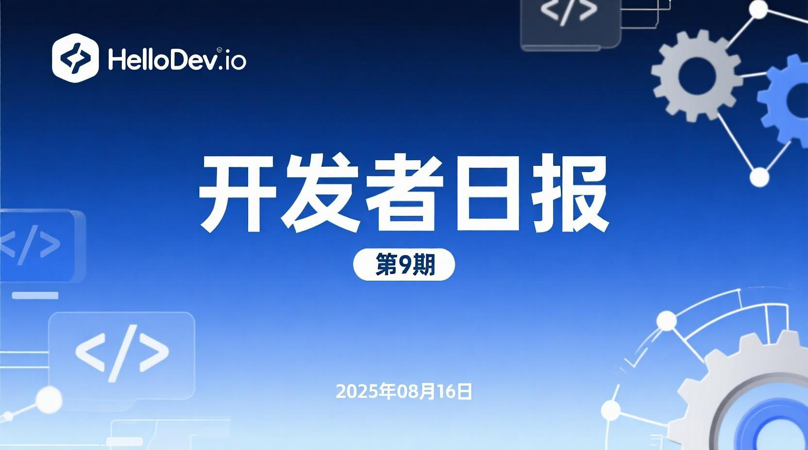
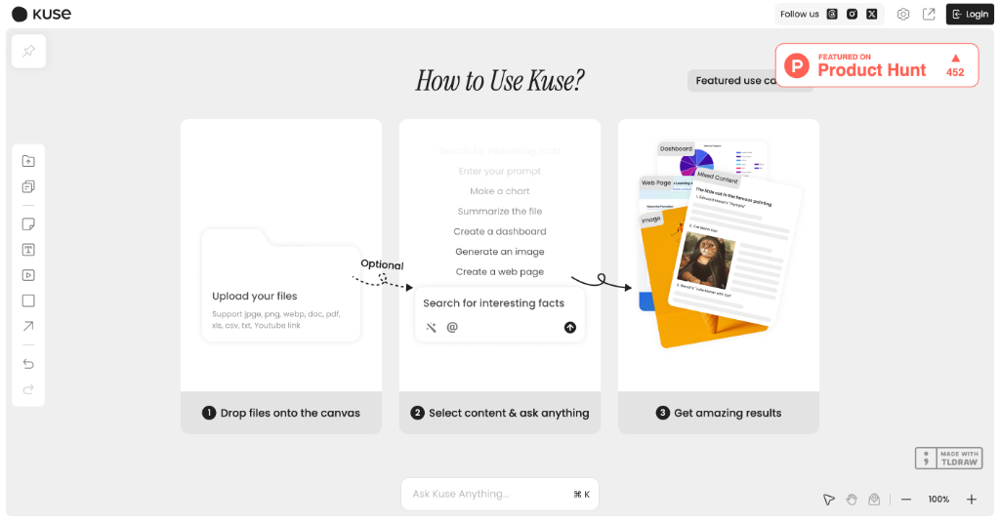
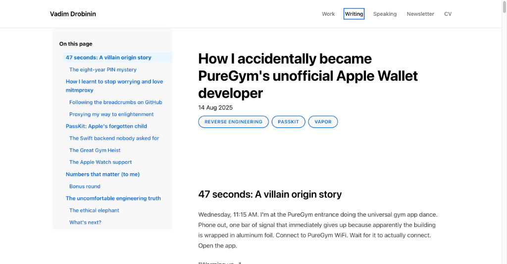

# HelloDev.io 开发者日报 - 第 9 期 (2025 年 08 月 16 日)

👋 Hi，这里是 HelloDev.io 开发者日报，今天是第 9 期，即将为你介绍今天的精彩发现：

📊 **今日统计**：
- 🚀 开源趋势：8 条
- 🛠️ 产品观察：6 条  
- 📰 行业动态：3 条
- 💡 经验讨论：1 条
- 📸 每日一图：1 条

---

## 🚀 开源趋势

### 让 3D 空间感知更智能：SpatialLM 1.1

SpatialLM 是一个专为 3D 点云数据设计的大语言模型，能够生成结构化的 3D 场景理解输出，包括墙壁、门窗等建筑元素以及带语义标签的物体边界框。它的一大亮点是支持从单目视频、RGBD 图像和 LiDAR 等多种来源处理点云数据，无需昂贵的专业设备。SpatialLM 1.1 版本通过更强大的编码器（Sonata）将点云分辨率翻倍，并在布局估计和 3D 物体检测基准测试中达到了 SOTA 性能，特别适用于机器人、自动驾驶等需要复杂 3D 场景分析的应用。

推荐给需要处理 3D 点云数据并进行空间理解的开发者，尤其是那些希望在不依赖高成本设备的情况下实现高精度场景分析的团队。

> 🔗 **项目链接**
> 
> https://github.com/manycore-research/SpatialLM

---

### 微软开源的人机协作 Web 自动化界面：Magentic-UI

Magentic-UI 是微软开发的一个研究原型，旨在通过多代理系统提供以用户为中心的 Web 自动化界面。它不仅能自动执行网页浏览、代码生成和文件分析等任务，还通过共规划、共任务、操作守卫等特性，让用户在自动化过程中保持控制权。该项目基于 AutoGen 框架构建，支持与 MCP 服务器集成，允许并行任务执行和实时交互。在 GAIA、AssistantBench 等基准测试中表现出色，适合需要复杂 Web 交互的自动化任务。

推荐给希望提升 Web 自动化效率同时又不想失去控制权的开发者，特别是那些需要处理网页导航、表单填写和数据分析等任务的团队。

> 🔗 **项目链接**
> 
> https://github.com/microsoft/magentic-ui

---

### GitHub 21k+ stars 的 Redis 官方 Go 客户端：go-redis

go-redis 是 Redis 官方为 Go 语言提供的客户端库，支持 Redis 7.2 到 8.2 版本，具备自动连接池、Pub/Sub、流水线、事务、脚本、集群、哨兵等全面功能。它还支持最新的 RESP3 协议、OpenTelemetry 监控和 RediSearch 命令，性能优化出色，拥有活跃的社区支持。对于需要在 Go 项目中高效操作 Redis 的开发者来说，这是一个值得信赖的选择。

推荐给所有使用 Go 语言开发并需要与 Redis 交互的开发者，无论是简单的键值操作还是复杂的集群部署都能轻松应对。

> 🔗 **项目链接**
> 
> https://github.com/redis/go-redis

---

### 支持多格式文档转换的利器：Marker

Marker 是一个高效的文档转换工具，能够将 PDF、图像、PPTX、DOCX 等多种格式的文件快速准确地转换为 Markdown、JSON、HTML 和 Chunks 格式。它支持多语言，具备表格、公式、图像等元素的识别与格式化功能，并可通过 GPU 加速提升处理速度。Marker 还支持通过 LLM 提升转换准确性，提供结构化提取功能，非常适合需要批量处理文档的场景。

推荐给需要频繁处理文档转换的开发者，特别是那些对转换质量和速度有较高要求的用户。

> 🔗 **项目链接**
> 
> https://github.com/datalab-to/marker

---

### 开源替代 AWS 的云平台：Ubicloud

Ubicloud 是一个开源云平台，旨在成为 AWS 等专有云提供商的替代方案，提供弹性计算、块存储、防火墙、负载均衡、托管 Postgres、Kubernetes、AI 推理和 IAM 等 IaaS 功能。它支持在 Hetzner 和 AWS 等裸金属提供商上自托管，强调降低成本、提高可移植性和控制力。Ubicloud 采用 Ruby 编写，利用 Cloud Hypervisor、IPsec、SPDK 和 nftables 等技术，目标是实现 10% 的 AWS 服务覆盖 80% 的使用场景。

推荐给希望减少云服务成本、避免厂商锁定并需要灵活部署的开发者和企业。

> 🔗 **项目链接**
> 
> https://github.com/ubicloud/ubicloud

---

### 将 FastAPI 端点转化为 MCP 工具：FastAPI-MCP

FastAPI-MCP 是一个将 FastAPI 端点暴露为模型上下文协议 (MCP) 工具的库，支持认证功能。它不仅是一个 OpenAPI 到 MCP 的转换器，还保留了请求和响应模型的模式以及端点文档。该项目支持灵活部署，可以将 MCP 服务器挂载到同一应用程序或单独部署，并使用 ASGI 传输以实现高效通信。对于希望为现有 FastAPI 服务添加 MCP 功能的开发者来说，这是一个非常实用的工具。

推荐给正在使用 FastAPI 并希望将其功能扩展到 MCP 生态的开发者。

> 🔗 **项目链接**
> 
> https://github.com/tadata-org/fastapi_mcp

---

### 在 Docker 中运行 Android：docker-android

Docker-Android 是一个专为 Android 应用开发和测试设计的 Docker 镜像，能够在容器中运行 Android 模拟器，支持多种设备配置和皮肤。它提供了 noVNC 支持以实现可视化访问，并能与 Genymotion 等云解决方案集成。该项目支持构建 Android 项目和运行 UI 测试，非常适合需要在 CI/CD 流水线中进行移动应用测试的团队。

推荐给需要在隔离环境中进行 Android 开发和测试的开发者，特别是那些希望简化基础设施配置的团队。

> 🔗 **项目链接**
> 
> https://github.com/budtmo/docker-android

---

### 用 Rust 编写的高效文件清理工具：Czkawka

Czkawka 是一个用 Rust 编写的多功能、快速且免费的文件清理工具，支持查找重复文件、空文件夹、大文件、临时文件、相似图像、相似视频、相同音乐、无效符号链接和损坏文件等功能。它提供 CLI 和 GUI 两种界面，支持多平台（Linux、Windows、macOS、FreeBSD 等），完全离线工作且不收集任何用户信息。其缓存功能使得后续扫描比首次扫描更快，非常适合需要定期清理磁盘空间的用户。

推荐给所有希望高效管理文件系统、释放磁盘空间的用户，特别是注重隐私和安全的开发者。

> 🔗 **项目链接**
> 
> https://github.com/qarmin/czkawka

---

## 🛠️ 产品观察

### AI 驱动的知识管理新体验：Kuse

Kuse 是一个 AI 驱动的生产力工具，将 ChatGPT、Notion 和白板的功能融合在一个平台上。它允许用户在一个可视化的画布上将杂乱的输入转化为结构化的输出，支持多种文件格式，并能根据上传的信息生成文档、图像和网页等特定输出。Kuse 旨在为人类和 AI 提供一个统一的协作空间，高效地处理信息并创造所需成果。

推荐给需要整合多种信息源、进行知识管理和创意输出的知识工作者和团队。

> 🔗 **产品链接**
> 
> https://www.producthunt.com/products/kuse

---

### 前端开发者的视觉编码助手：stagewise

stagewise 是一个开源的前端编码代理，直接在浏览器中运行，让开发者能够直观地修改 Web 应用并将更改直接反映到本地代码库中。它通过点击 UI 元素并输入提示来实现代码变更，支持任何前端框架，只需一条命令 `npx stagewise@latest` 即可快速启动。对于希望在现有项目中快速迭代 UI 的开发者来说，这是一个非常实用的工具。

推荐给希望提升前端开发效率、减少上下文切换的开发者，特别是那些喜欢可视化操作的用户。

> 🔗 **产品链接**
> 
> https://www.producthunt.com/products/stagewise-2

---

### AI 驱动的搬家助手：Move AI

Move AI 是一个 AI 驱动的搬家管家服务，旨在简化长途搬家的整个过程。用户只需提供基本信息和照片，Move AI 就会处理库存创建、报价比较、预订、文件处理和当天协调等工作。它通过透明的固定价格报价和经过验证的供应商网络，帮助用户节省时间、减少压力并避免多付费。

推荐给即将搬家的用户，特别是那些希望省心省力、获得透明报价的忙碌专业人士和创业者。

> 🔗 **产品链接**
> 
> https://www.producthunt.com/products/move-ai-your-ai-moving-assistant

---

### 了解 AI 对品牌认知的影响：GPT-5 SEO Brand Visiblity

GPT-5 SEO Brand Visiblity 是一个帮助用户了解 GPT-5 如何看待其品牌和竞争对手的工具。通过输入网站域名，用户可以快速获得包括认知分数、社交存在感和情绪、推荐可能性、竞争格局和分析置信度在内的报告。对于 SEO 专业人士和营销人员来说，这是一个了解 AI 模型对品牌感知的重要工具。

推荐给希望优化 AI 搜索可见性、跟踪品牌认知变化的 SEO 专家和营销人员。

> 🔗 **产品链接**
> 
> https://www.producthunt.com/products/gpt-5-seo-brand-visiblity

---

### AI 驱动的社交媒体内容生成器：PersonaRoll

PersonaRoll 是一个 AI 驱动的工具，帮助用户将个人照片转化为病毒式社交媒体帖子。通过上传相机胶卷，用户可以利用 AI 将图像与热门话题匹配，并以所选角色的声音生成真实的内容。该平台专为独立创作者、创始人和小团队设计，帮助他们保持一致的品牌社交媒体形象，而不会感到疲惫。

推荐给希望提高社交媒体内容创作效率、保持品牌一致性的创作者和小团队。

> 🔗 **产品链接**
> 
> https://www.producthunt.com/products/personaroll

---

### GitHub 开发者排名与分析平台：GitRanks

GitRanks 是一个 GitHub 个人资料分析和排名平台，允许开发者根据星标、贡献和关注者来跟踪自己的排名。它提供动态的全球和国家特定排行榜，让用户可以看到自己在全球或本国同行中的排名。平台每天更新数据，并支持生成动态徽章和通过 WhatsApp 或 Telegram 接收排名更新。

推荐给希望展示 GitHub 成就、与同行比较的开发者，特别是那些活跃于开源社区的用户。

> 🔗 **产品链接**
> 
> https://www.producthunt.com/products/gitranks

---

## 📰 行业动态

### 逆向工程解锁无缝体验：我如何意外成为 PureGym 的非官方 Apple Wallet 开发者

一位开发者分享了他如何意外地为健身房连锁品牌 PureGym 维护了一个非官方的 Apple Wallet 集成。由于官方应用进入健身房需要 47 秒，他通过逆向工程 API 创建了一个使用 Apple Wallet 通行证的解决方案，将进入时间缩短到仅 3 秒。这个项目涉及理解 PureGym 的 API、处理动态二维码，并利用 Apple 的 PassKit 框架。文章还探讨了用户体验、外部创新和伦理问题。

这个案例揭示了外部开发者有时能比组织本身更快地解决用户体验问题，并强调了通过逆向工程暴露应用安全不一致性的重要性。

> 🔗 **相关链接**
> 
> https://drobinin.com/posts/how-i-accidentally-became-puregyms-unofficial-apple-wallet-developer/

---

### 从失败到 100 万美元 ARR 的 8 个月：Rosie 创始人的创业复盘

Jordan Gal 分享了他如何从一个失败的 VC 资助公司（Rally）转向创建 AI 语音产品 Rosie，并在短短 8 个月内实现 100 万美元的年经常性收入（ARR）。文章涵盖了识别 AI 语音机会、组建精简团队、利用冷邮件和广告增长、克服 Google 广告活动失败等挑战，以及保持低价以吸引中小企业。Gal 强调了速度、专注和从错误中学习的重要性。

这个案例表明，从失败中 pivoting 可以带来巨大成功，只要能识别真正的市场需求。同时，多元化增长策略（冷邮件 -> 广告 -> SEO）对于快速扩展至关重要。

> 🔗 **相关链接**
> 
> https://www.indiehackers.com/post/tech/from-failure-to-1m-arr-in-8-months-oA0AqL4jY25lxrQ4uGBl

---

### Wan2.2：从视频生成到图像生成的 AI 模型

Wan2.2 是一个最初为视频生成设计的先进 AI 模型，但因其生成高质量图像的能力而受到关注。用户可以通过 Textideo 的在线平台体验其功能，无需本地安装。该模型以生成高分辨率图像（高达 1920 x 1536）著称，具有独特的“视频截图”美学、自然肤色和令人印象深刻的艺术风格细节（如动漫和水彩）。其主要优势包括通过基于云的处理实现易用性，消除了硬件障碍，并能快速交付多样化的创意风格。

对于寻求多样化、高质量视觉内容而无需本地硬件投资的创作者和营销人员来说，Wan2.2 是一个极具吸引力的选择。

> 🔗 **相关链接**
> 
> https://www.indiehackers.com/post/wan2-2-text-to-image-generation-e766df96fe

---

## 📸 每日一图

### 提升 Claude Code 体验的生产力工具：Claude Utils

Claude Utils 是一个专为使用 Claude Code 的开发者设计的生产力工具，解决了分享截图的不便。用户现在可以直接将图像粘贴到 Claude Code 中，而无需保存和拖拽图像文件。这个简单但有效的解决方案在发布 48 小时内就吸引了超过 180 名开发者。该工具定位为增强 Claude Code 体验的实用程序中心，未来还将推出更多功能。

这张图展示了开发者如何通过简单的工具创新来解决日常工作流中的痛点，体现了开发者社区的创造力和对效率的追求。

> 🔗 **图片来源**
> 
> https://www.producthunt.com/products/claude-utils

---

## 📝 结语

明天见。Bye 👋

---

💌 **互动时间**：
- 你对哪个项目最感兴趣？
- 有什么想了解的技术话题？
- 欢迎在评论区分享你的想法！

🔗 **关注 HelloDev.io**：每日精选最有价值的内容，5 分钟了解行业最新进展

📱 **多平台发布**：微信公众号 | 掘金 | 知乎 | GitHub