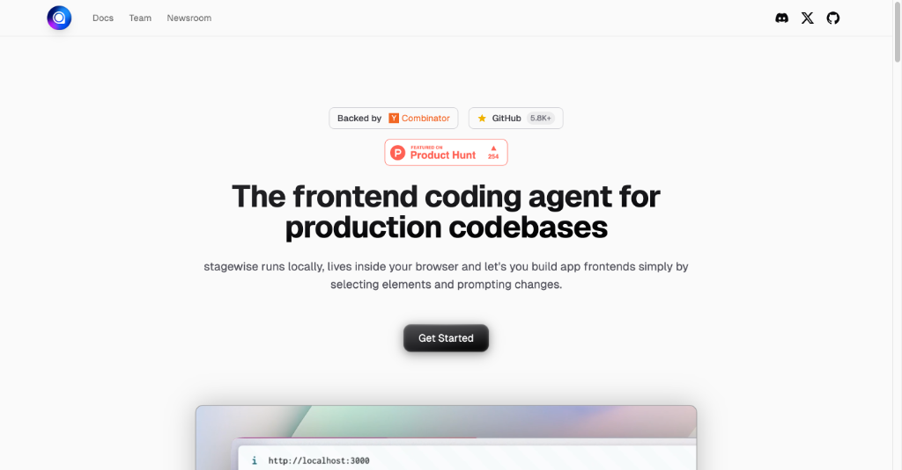
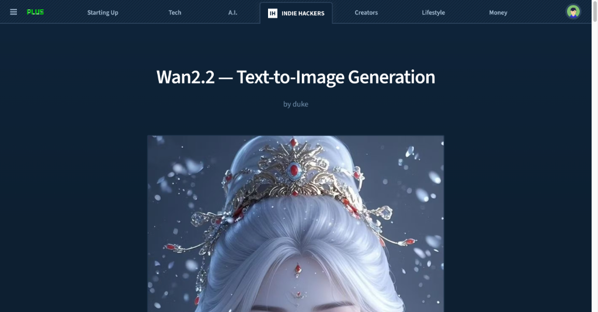
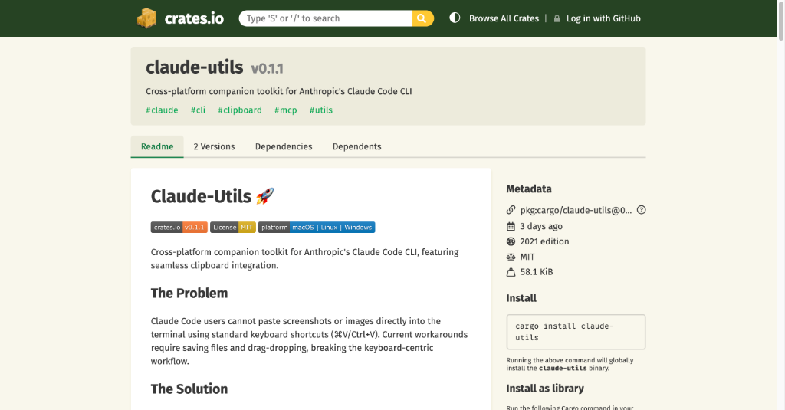

# HelloDev.io 开发者日报 - 第 10 期 (2025 年 08 月 16 日)

👋 Hi，这里是 HelloDev.io 开发者日报，今天是第 10 期，即将为你介绍今天的精彩发现：

📊 **今日统计**：
- 🚀 开源趋势：8 条
- 🛠️ 产品观察：6 条  
- 📰 行业动态：3 条
- 💡 经验讨论：1 条
- 📸 每日一图：1 条

---

## 🚀 开源趋势

### 让 3D 场景理解变得轻而易举：SpatialLM

SpatialLM 是一个用于处理 3D 点云数据的多模态大语言模型。它能够从单目视频、RGBD 图像或 LiDAR 等不同来源的点云中生成结构化的 3D 场景理解输出，如墙壁、门窗等建筑元素，以及带语义类别的定向对象边界框。SpatialLM 的亮点在于它有效弥合了非结构化 3D 几何数据与结构化 3D 表示之间的鸿沟，提供高级语义理解，从而增强在具身机器人、自主导航等复杂 3D 场景分析任务中的空间推理能力。SpatialLM1.1 版本通过更强大的编码器（Sonata）将点云分辨率提高了一倍，性能表现也达到了布局估计和 3D 对象检测基准测试的最先进水平。

对于需要处理 3D 数据的开发者，特别是机器人和空间计算领域的研究者和工程师，SpatialLM 提供了一个强大的工具来理解和操作现实世界的 3D 结构。

> 🔗 **项目链接**
> 
> https://github.com/manycore-research/SpatialLM

---

### 微软开源的多智能体 UI 框架：Magentic-UI

Magentic-UI 是微软开发的一个研究原型，它提供了一个以用户为中心的界面，由多智能体系统驱动。该系统旨在自动化 Web 任务的同时，让用户保持控制权。它支持网页浏览、代码生成与执行、文件分析等功能，并通过协同规划、协同任务、操作守卫和计划学习等特性，强调透明度和用户的参与感。Magentic-UI 基于微软的 AutoGen 框架构建，支持与 MCP 服务器集成以扩展功能。它在 GAIA、AssistantBench、WebVoyager 和 WebGames 等基准测试中展现了强大的自主能力，非常适合需要网页导航、表单填写、数据分析和搜索引擎无法索引的自定义交互等任务。

如果你正在寻找一个能与用户协作、透明可控的 Web 自动化工具，Magentic-UI 是一个值得探索的选择。

> 🔗 **项目链接**
> 
> https://github.com/microsoft/magentic-ui

---

### 文档转换效率之王：Marker

Marker 是一个高效的文档转换工具，能将 PDF、图像、PPTX、DOCX、XLSX、HTML、EPUB 等多种文件快速准确地转换为 Markdown、JSON、HTML 和 Chunks 格式。它支持多语言，能处理表格、表单、公式、链接、引用和代码块，并能提取和保存图像。Marker 可通过 GPU、CPU 或 MPS 运行，还支持通过 LLM 提升转换准确性，并提供结构化提取功能。相比其他开源和云服务，Marker 在处理 PDF 转换时表现出色，具有更高的准确性和更快的速度。它还提供托管 API 服务，具有高吞吐量和高可用性（99.99%）。

对于需要频繁处理文档转换的开发者和数据分析师，Marker 是一个不可多得的利器。

> 🔗 **项目链接**
> 
> https://github.com/datalab-to/marker

---

### 开源云平台新选择：Ubicloud

Ubicloud 是一个开源云平台，旨在任何地方运行，作为 AWS 等专有云提供商的替代方案。它提供弹性计算、块存储、防火墙、负载均衡、托管 Postgres、Kubernetes、AI 推理和 IAM 服务等基本 IaaS 功能。该平台可以通过托管服务使用，也可以在 Hetzner 和 AWS 等裸机提供商上自托管。Ubicloud 强调降低成本、可移植性和控制力，让用户能够利用底层提供商的好处而无需担心供应商锁定。它支持通过 Docker 快速设置，并提供详细的开发者文档。

如果你对云平台的成本和可移植性有较高要求，Ubicloud 是一个值得关注的开源替代方案。

> 🔗 **项目链接**
> 
> https://github.com/ubicloud/ubicloud

---

### FastAPI 端点轻松暴露为 MCP 工具：FastAPI-MCP

FastAPI-MCP 是一个将 FastAPI 端点暴露为模型上下文协议 (MCP) 工具的库，支持认证功能。它采用 FastAPI 原生方式，不仅是一个 OpenAPI 到 MCP 的转换器，还保留了请求和响应模型的模式以及端点的文档。该项目支持灵活部署，可以将 MCP 服务器挂载到同一应用程序或单独部署，并使用 ASGI 传输以实现高效通信。

对于使用 FastAPI 构建服务并希望将其功能暴露给 MCP 兼容客户端的开发者，FastAPI-MCP 提供了一个无缝且安全的解决方案。

> 🔗 **项目链接**
> 
> https://github.com/tadata-org/fastapi_mcp

---

### 容器化 Android 开发环境：Docker-Android

Docker-Android 是一个 Docker 镜像，专为 Android 应用程序开发和测试而设计。它在 Docker 容器内提供 Android 模拟器，支持各种设备配置文件和皮肤。其关键特性包括 noVNC 支持以进行可视化访问、通过 Web UI 共享日志，以及与 Genymotion 等云解决方案集成。它支持构建 Android 项目，并使用 Appium 和 Espresso 等框架运行 UI 测试。

如果你需要在隔离环境中进行 Android 开发和测试，Docker-Android 是一个便捷的解决方案。

> 🔗 **项目链接**
> 
> https://github.com/budtmo/docker-android

---

### Go 语言官方 Redis 客户端：go-redis

go-redis 是 Go 语言的官方 Redis 客户端库，提供了一个直接的接口来与 Redis 服务器交互。它支持 Redis 7.2 到 8.2 版本，并需要 Go 1.18 或更高版本。其功能全面，包括自动连接池、认证机制（包括实验性的基于令牌的身份验证）、Pub/Sub、管道和事务、脚本、Redis Sentinel、Redis Cluster、Redis Ring、Redis 性能监控和概率数据结构等。它还支持自定义读写缓冲区大小以优化性能，并允许配置 RESP2/RESP3 协议。

对于使用 Go 语言进行 Redis 开发的开发者，go-redis 是一个功能强大且经过验证的选择。

> 🔗 **项目链接**
> 
> https://github.com/redis/go-redis

---

### Rust 编写的多功能文件清理工具：Czkawka

Czkawka 是一个用 Rust 编写的多功能、快速且免费的应用程序，旨在帮助用户清理计算机上不必要的文件。它支持查找重复文件、空文件夹、大文件、临时文件、相似图像、相似视频、相同音乐、无效符号链接和损坏文件等功能。该工具提供 CLI 和 GUI 两种前端界面，支持多平台（Linux、Windows、macOS、FreeBSD 等），并且不收集任何用户信息，完全离线工作。它还支持缓存功能，使得后续扫描比首次扫描更快。

对于希望清理磁盘空间、优化系统性能的用户，Czkawka 是一个高效且安全的选择。

> 🔗 **项目链接**
> 
> https://github.com/qarmin/czkawka

---

## 🛠️ 产品观察

### AI 驱动的统一生产力平台：Kuse

Kuse 是一个 AI 驱动的生产力工具，它将 ChatGPT、Notion 和白板的功能结合到一个平台中。它允许用户在可视化画布上将杂乱的输入转化为结构化的交付成果，上下文可编辑且可重用。该平台支持各种文件格式，并能根据用户上传的信息生成特定的输出，如文档、图像和网页。Kuse 旨在为人类和 AI 提供一个统一的工作空间，以高效地协作、处理信息并创造所需的结果。

对于需要整合多种工具、提高信息处理效率的知识工作者，Kuse 是一个值得关注的平台。

> 🔗 **产品链接**
> 
> https://www.producthunt.com/products/kuse

---

### 前端编码的可视化助手：stagewise

stagewise 是一个开源的前端编码代理，直接在你的浏览器 localhost 上运行，使开发者能够可视化地修改他们的 Web 应用程序，并将更改直接实现到本地代码库中。它旨在弥合像 v0 这样的原型工具与现有代码库之间的差距，允许用户点击 UI 元素、输入提示，并让更改自动反映在源代码中。该工具支持任何前端框架，并且可以通过一个简单的命令 `npx stagewise@latest` 轻松试用。

对于希望快速迭代前端开发的开发者，stagewise 提供了一种直观且高效的解决方案。

> 🔗 **产品链接**
> 
> https://www.producthunt.com/products/stagewise-2

---

### 你的个人 AI 搬家助手：Move AI

Move AI 是一个 AI 驱动的搬家管家服务，旨在简化搬迁过程。它协调长距离搬家的各个方面，从寻找经过验证的搬家公司和组织清洁服务到宠物运输和家具安装。通过利用 AI，用户可以提供基本信息和照片，Move AI 将处理库存创建、报价比较、预订、文书工作和当天协调。该服务旨在节省时间、减少压力并防止多付费用，确保来自可信供应商的透明、货比三家的报价。

对于即将搬家的用户，特别是忙碌的专业人士和创始人，Move AI 是一个省心省力的选择。

> 🔗 **产品链接**
> 
> https://www.producthunt.com/products/move-ai-your-ai-moving-assistant

---

### GPT-5 时代的 SEO 品牌可见性分析工具：GPT-5 SEO Brand Visiblity

GPT-5 SEO Brand Visiblity 是一个工具，允许用户发现 GPT-5 对其品牌和竞争对手的看法。只需输入网站域名，用户就可以快速获得一份报告，其中包括识别分数（GPT-5 对品牌的识别程度）、社交存在感和情绪（与品牌相关的语气）、推荐可能性（GPT-5 建议该品牌的机会）、竞争格局（AI 搜索竞争对手）和分析信心（GPT-5 对其答案的确定性）。该工具对于希望了解 AI 模型如何在 AI 搜索不断发展的格局中感知其品牌的 SEO 专业人士和营销人员特别有用。

对于 SEO 专业人士和营销人员，这是一个洞察 AI 模型对品牌认知度的有力工具。

> 🔗 **产品链接**
> 
> https://www.producthunt.com/products/gpt-5-seo-brand-visiblity

---

### AI 驱动的社交媒体内容创作工具：PersonaRoll

PersonaRoll 是一个 AI 驱动的工具，帮助用户通过将他们的个人照片转化为病毒式传播的帖子来创建引人入胜的社交媒体内容。通过上传他们的相机胶卷，用户可以利用 AI 将他们的图像与热门话题相匹配，并以他们选择的人格声音生成真实的内容。该平台专为希望在不感到疲惫的情况下保持一致、符合品牌形象的社交媒体形象的独立创作者、创始人和小团队而设计。关键功能包括人格构建、趋势感知的构思、一键草稿和可选的自动发布到 X（前身为 Twitter）等平台。前 1000 名用户可以免费访问该服务。

对于需要持续产出高质量社交媒体内容的创作者，PersonaRoll 是一个高效的自动化解决方案。

> 🔗 **产品链接**
> 
> https://www.producthunt.com/products/personaroll

---

### GitHub 开发者排名与分析平台：GitRanks

GitRanks 是一个 GitHub 个人资料分析和排名平台，允许开发者根据星标、贡献和关注者来跟踪他们的排名。它提供动态的全球和国家特定的排行榜，使用户能够看到他们在全球或自己国家的同行中的排名。该平台从公共 GitHub 存储库中提取数据，并每天更新排名。用户还可以生成和展示动态徽章来展示他们的 GitHub 成就，并通过 WhatsApp 或 Telegram 等消息应用程序接收排名更新。

对于希望展示自己开源贡献和在开发者社区中建立声誉的开发者，GitRanks 是一个有趣且实用的工具。

> 🔗 **产品链接**
> 
> https://www.producthunt.com/products/gitranks

---

## 📰 行业动态

### 让 Reddit 收藏管理更轻松：Readdit Later

Readdit Later 是一个 Chrome 扩展程序，旨在帮助用户轻松保存、搜索和整理 Reddit 帖子。它会自动同步已保存的帖子，并提供一个干净、可搜索的仪表板，用户可以在其中过滤、排序和批量管理他们的发现。该扩展解决了已保存的 Reddit 帖子杂乱且难以查找的常见问题，提供了一种更有条理的内容管理方法。用户可以按 subreddit、帖子类型或时间进行过滤，甚至可以在需要整理时批量取消保存帖子。

对于经常使用 Reddit 并保存大量帖子的用户，Readdit Later 是一个提高效率的实用工具。

> 🔗 **相关链接**
> 
> https://www.producthunt.com/products/readdit-later

---

### 视频生成模型 Wan2.2 的图像生成能力

Wan2.2 是一个最初为视频生成而设计的先进 AI 模型，但其生成高质量图像的能力也引起了广泛关注。用户可以通过 Textideo 的在线平台体验其功能，而无需本地安装。该模型以其独特的“视频截图”美学、自然的肤色和令人印象深刻的动漫和水彩等艺术风格细节而著称，能够生成高达 1920 x 1536 分辨率的图像。其关键优势包括通过基于云的处理轻松使用，消除了硬件障碍，并能快速提供多样化的创意风格。

对于寻求多样化、高质量视觉内容而无需本地硬件投资的创作者和营销人员，Wan2.2 是一个极具吸引力的选择。

> 🔗 **相关链接**
> 
> https://www.indiehackers.com/post/wan2-2-text-to-image-generation-e766df96fe

---

### 我如何意外成为 PureGym 的非官方 Apple Wallet 开发者

一位开发者分享了他们如何无意中成为健身房连锁店 PureGym 的非官方 Apple Wallet 集成维护者。由于对使用官方应用程序进入健身房的 47 秒过程感到沮丧，该开发者对 API 进行了逆向工程，使用 Apple Wallet 通行证创建了解决方案。这将进入时间缩短至仅 3 秒。该项目涉及理解 PureGym 的 API、处理动态二维码，并利用 Apple 的 PassKit 框架。该开发者还讨论了伦理影响以及从组织外部进行创新的更广泛经验教训。

这个案例揭示了外部创新有时能比组织本身更快地解决用户体验问题，并强调了关注用户痛点的重要性。

> 🔗 **相关链接**
> 
> https://drobinin.com/posts/how-i-accidentally-became-puregyms-unofficial-apple-wallet-developer/

---

## 💡 经验讨论

### 从失败到年收入百万美元：8 个月的创业复盘

这篇 Indie Hackers 文章详细介绍了 Rosie 的创始人 Jordan Gal 如何从一家失败的风险投资公司转向构建一个在短短八个月内实现 100 万美元年经常性收入 (ARR) 的 AI 语音产品。文章涵盖了这次旅程的关键方面，包括识别 AI 语音机会、组建精简团队、利用冷邮件和广告进行增长、克服谷歌广告活动失败等挑战，以及保持低价以吸引中小型企业。Gal 强调了速度、专注力和从错误中学习的重要性。

对于正在创业或考虑转型的开发者，这篇文章提供了宝贵的经验和实用的建议。

> 🔗 **参考资料**
> 
> https://www.indiehackers.com/post/tech/from-failure-to-1m-arr-in-8-months-oA0AqL4jY25lxrQ4uGBl

---

## 📸 每日一图

### Claude Utils：提升 Claude Code 体验的工具集

Claude Utils 是一个为使用 Claude Code 的开发者设计的生产力工具，解决了分享截图的不便。用户现在可以直接将图像粘贴到 Claude Code 中，而无需保存和拖拽图像文件。这个简单但有效的解决方案在发布 48 小时内就吸引了超过 180 名开发者。该工具定位为增强 Claude Code 体验的实用程序中心，并承诺未来将推出更多功能。

这张图展示了工具界面的简洁性和易用性，体现了开发者工具设计中“少即是多”的理念。

> 🔗 **图片来源**
> 
> https://www.producthunt.com/products/claude-utils

---

## 📝 结语

明天见。Bye 👋

---

💌 **互动时间**：
- 你对哪个项目最感兴趣？
- 有什么想了解的技术话题？
- 欢迎在评论区分享你的想法！

🔗 **关注 HelloDev.io**：每日精选最有价值的内容，5 分钟了解行业最新进展

📱 **多平台发布**：微信公众号 | 掘金 | 知乎 | GitHub