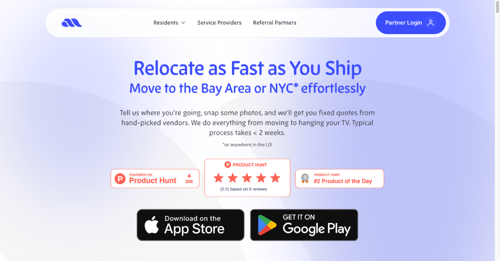
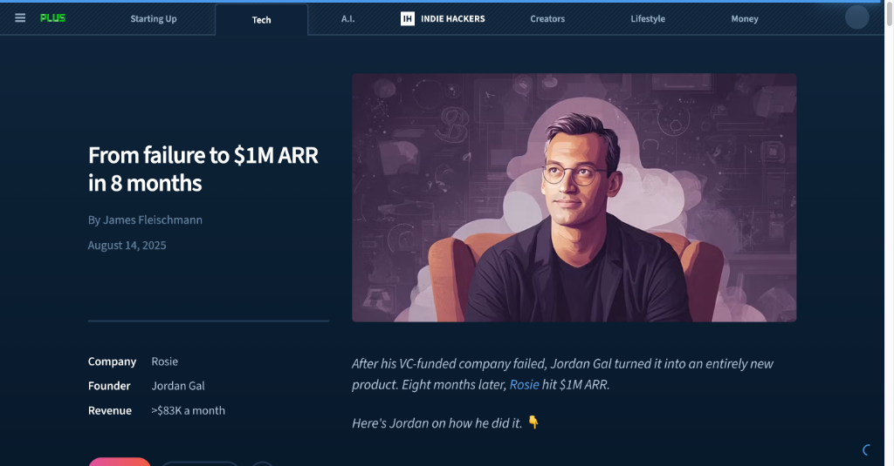

# HelloDev.io 开发者日报 - 第 10 期 | 2025 年 08 月 16 日

👋 Hi，这里是 HelloDev.io 开发者日报，今天是第 10 期，即将为你介绍今天的精彩发现：

📊 **今日统计**：
- 🚀 开源趋势：8 条
- 🛠️ 产品观察：6 条  
- 📰 行业动态：3 条
- 💡 经验讨论：1 条
- 📸 每日一图：1 条

---

## 🚀 开源趋势

### 🧠 空间智能的突破：SpatialLM 3D 大语言模型

SpatialLM 是一个专为处理 3D 点云数据而设计的多模态大语言模型，它能够生成结构化的 3D 场景理解输出，包括墙壁、门窗等建筑元素以及带语义类别的定向对象边界框。与传统方法不同，SpatialLM 能够处理来自单目视频、RGBD 图像和 LiDAR 传感器等多种来源的点云数据，有效弥合了非结构化 3D 几何数据与结构化 3D 表示之间的差距。它在具身机器人、自主导航等复杂 3D 场景分析任务中展现出强大的空间推理能力。对于需要处理真实世界 3D 数据的应用场景，SpatialLM 提供了更高效和准确的解决方案。

> 🔗 **项目链接**
> 
> https://github.com/manycore-research/SpatialLM

---

### 👨‍💻 微软推出人机协作新范式：Magentic-UI 自动化界面

Magentic-UI 是微软推出的一个研究原型，它基于多代理系统，为用户提供了一个以人类为中心的界面，用于自动化网页任务。该系统支持网页浏览、代码生成与执行、文件分析等功能，同时通过共规划、共任务、操作守卫和计划学习等特性，确保用户在自动化过程中始终掌握控制权。它利用微软的 AutoGen 框架构建，可以集成 MCP 服务器以扩展功能。对于需要在浏览器中进行复杂任务自动化，同时希望保持透明度和控制力的开发者来说，Magentic-UI 是一个值得尝试的工具。

> 🔗 **项目链接**
> 
> https://github.com/microsoft/magentic-ui

---

### 📄 文档转换效率之王：Marker 多格式转换利器

Marker 是一个高效的文档转换工具，能够快速准确地将 PDF、图像、PPTX、DOCX 等多种文件格式转换为 Markdown、JSON、HTML 和 Chunks 格式。它支持多语言，具备表格、公式、链接等元素的格式化功能，并能提取和保存图像。Marker 支持 GPU/CPU/MPS 运行，还可通过 LLM 提升转换准确性，提供结构化提取功能。对于需要频繁处理文档转换的开发者和研究人员来说，Marker 可以显著提高工作效率，特别是在处理复杂表格和数学公式时表现尤为出色。

> 🔗 **项目链接**
> 
> https://github.com/datalab-to/marker

---

### ☁️ 摆脱云厂商锁定：Ubicloud 开源云平台

Ubicloud 是一个开源云平台，旨在提供一个可运行在任何地方的替代方案，以取代 AWS 等专有云提供商。它提供了弹性计算、块存储、防火墙、负载均衡、托管 Postgres、Kubernetes、AI 推理和 IAM 服务等核心 IaaS 功能。用户可以通过托管服务或在 Hetzner 和 AWS 等裸机提供商上自托管。Ubicloud 强调降低成本、可移植性和控制力，允许用户在不被厂商锁定的情况下利用底层提供商的优势。对于希望拥有更多控制权和降低成本的开发者来说，Ubicloud 是一个极具吸引力的选择。

> 🔗 **项目链接**
> 
> https://github.com/ubicloud/ubicloud

---

### 🔌 FastAPI 与 MCP 的完美融合：FastAPI-MCP 库

FastAPI-MCP 是一个将 FastAPI 端点暴露为模型上下文协议 (MCP) 工具的库，支持认证功能。它采用 FastAPI 原生方式，不仅是一个 OpenAPI 到 MCP 的转换器，还保留了请求和响应模型的模式以及端点的文档。该项目支持灵活部署，可以将 MCP 服务器挂载到同一应用程序或单独部署，并使用 ASGI 传输以实现高效通信。对于希望将现有 FastAPI 服务快速扩展为 MCP 工具的开发者来说，FastAPI-MCP 提供了最小摩擦的解决方案。

> 🔗 **项目链接**
> 
> https://github.com/tadata-org/fastapi_mcp

---

### 🤖 Android 开发新利器：Docker-Android 容器化方案

Docker-Android 是一个专为 Android 应用开发和测试设计的 Docker 镜像。它在 Docker 容器内提供 Android 模拟器，支持各种设备配置和皮肤。其关键特性包括 noVNC 支持以实现可视化访问、通过 Web UI 共享日志，以及与 Genymotion 等云解决方案集成。它支持构建 Android 项目，并使用 Appium 和 Espresso 等框架运行 UI 测试。对于需要在隔离环境中进行 Android 开发和测试的团队，Docker-Android 可以显著减少基础设施需求并简化 CI/CD 流程。

> 🔗 **项目链接**
> 
> https://github.com/budtmo/docker-android

---

### 🔴 Go 语言 Redis 官方客户端：go-redis 库

go-redis 是 Go 语言的官方 Redis 客户端库，提供了与 Redis 服务器交互的简洁接口。它支持 Redis 7.2 到 8.2 版本，并提供自动连接池、认证机制、Pub/Sub、管道和事务、脚本、Redis Sentinel、Redis Cluster、Redis Ring、性能监控和概率数据结构等全面功能。该库还支持自定义读写缓冲区大小以优化性能，并允许配置 RESP2/RESP3 协议。对于使用 Go 语言进行 Redis 开发的开发者来说，go-redis 是一个功能强大且维护良好的选择。

> 🔗 **项目链接**
> 
> https://github.com/redis/go-redis

---

### 🧹 Rust 编写的高效文件清理工具：Czkawka

Czkawka 是一个用 Rust 编写的多功能、快速且免费的应用程序，旨在帮助用户清理计算机上不必要的文件。它支持查找重复文件、空文件夹、大文件、临时文件、相似图像、相似视频、相同音乐、无效符号链接和损坏文件等功能。该工具提供 CLI 和 GUI 两种前端界面，支持多平台（Linux、Windows、macOS、FreeBSD 等），并且不收集任何用户信息，完全离线工作。对于需要定期清理和整理计算机文件的用户来说，Czkawka 是一个安全、高效且隐私友好的选择。

> 🔗 **项目链接**
> 
> https://github.com/qarmin/czkawka

---

## 🛠️ 产品观察

### 🧠 一站式知识处理平台：Kuse AI 生产力工具

Kuse 是一个 AI 驱动的生产力工具，它将 ChatGPT、Notion 和白板的功能整合到一个平台上。用户可以在可视化画布上将杂乱的输入转化为结构化的输出，上下文可编辑且可重用。该平台支持多种文件格式，并能根据上传的信息生成文档、图像和网页等特定输出。Kuse 旨在为人类和 AI 提供一个统一的协作空间，以高效地处理信息并创造所需的结果。对于需要整合多种工具进行知识管理和内容创作的用户来说，Kuse 提供了一个更流畅的工作流程。

> 🔗 **产品链接**
> 
> https://www.producthunt.com/products/kuse

---

### 🧑‍💻 前端开发新体验：stagewise 浏览器内编码代理

stagewise 是一个开源的前端编码代理，它直接在浏览器的 localhost 上运行，使开发者能够直观地修改 Web 应用并将更改直接反映到本地代码库中。它旨在弥合 v0 等原型工具与现有代码库之间的差距，用户只需点击 UI 元素、输入提示，更改就会自动应用到源代码中。该工具支持任何前端框架，可通过 `npx stagewise@latest` 命令轻松试用。对于希望在现有项目中快速迭代 UI 的前端开发者来说，stagewise 提供了极大的便利。

> 🔗 **产品链接**
> 
> https://www.producthunt.com/products/stagewise-2

---

### 🚚 AI 驱动的搬家助手：Move AI 个人搬家管家

Move AI 是一个 AI 驱动的搬家管家服务，旨在简化长途搬家过程。它协调搬家的各个方面，从寻找经过验证的搬家公司和组织清洁服务到宠物运输和家具安装。通过 AI，用户只需提供基本信息和照片，Move AI 就会处理库存创建、报价比较、预订、文书工作和搬家当天的协调。该服务旨在节省时间、减少压力并防止多付费，确保从可信赖的供应商那里获得透明、货比三家的报价。对于需要长途搬家的用户来说，Move AI 提供了一站式的解决方案。

> 🔗 **产品链接**
> 
> https://www.producthunt.com/products/move-ai-your-ai-moving-assistant

---

### 🔍 AI 搜索时代的品牌洞察：GPT-5 SEO Brand Visiblity

GPT-5 SEO Brand Visiblity 是一个工具，允许用户发现 GPT-5 对其品牌和竞争对手的看法。只需输入网站域名，用户就可以快速获得一份报告，其中包括识别分数（GPT-5 对品牌的识别程度）、社交存在感和情绪（与品牌相关的语调）、推荐可能性（GPT-5 推荐该品牌的机会）、竞争格局（AI 搜索竞争对手）和分析置信度（GPT-5 对其答案的确定性）。对于希望了解 AI 模型如何感知其品牌的 SEO 专业人士和营销人员来说，这是一个非常有价值的工具。

> 🔗 **产品链接**
> 
> https://www.producthunt.com/products/gpt-5-seo-brand-visiblity

---

### 📱 社交媒体内容创作神器：PersonaRoll AI 工具

PersonaRoll 是一个 AI 驱动的工具，帮助用户通过将个人照片转化为病毒式传播的帖子来创建引人入胜的社交媒体内容。通过上传相机胶卷，用户可以利用 AI 将他们的图像与热门话题相匹配，并以他们选择的角色的声音生成真实的内容。该平台专为独立创作者、创始人和小型团队设计，帮助他们在不产生倦怠感的情况下保持一致的、符合品牌风格的社交媒体形象。对于需要持续产出高质量社交媒体内容的创作者来说，PersonaRoll 是一个高效的解决方案。

> 🔗 **产品链接**
> 
> https://www.producthunt.com/products/personaroll

---

### 🏆 GitHub 开发者排名平台：GitRanks

GitRanks 是一个 GitHub 个人资料分析和排名平台，允许开发者根据星标、贡献和关注者来跟踪自己的排名。它提供动态的全球和国家特定的排行榜，使用户能够看到他们在全球或自己国家的同行中的排名。该平台从公共 GitHub 仓库中提取数据，并每天更新排名。用户还可以生成和展示动态徽章来展示他们的 GitHub 成就，并通过 WhatsApp 或 Telegram 等消息应用程序接收排名更新。对于希望展示自己开源贡献的开发者来说，GitRanks 提供了一个有趣且可视化的平台。

> 🔗 **产品链接**
> 
> https://www.producthunt.com/products/gitranks

---

## 📰 行业动态

### 📚 Reddit 收藏管理新方案：Readdit Later Chrome 扩展
Readdit Later 是一款 Chrome 扩展，旨在帮助用户轻松保存、搜索和整理 Reddit 帖子。它会自动同步保存的帖子，并提供一个干净、可搜索的仪表板，用户可以在其中过滤、排序和批量管理他们的发现。该扩展解决了保存的 Reddit 帖子混乱且难以查找的常见问题，提供了一种更有条理的内容管理方法。用户可以按 subreddit、帖子类型或时间进行过滤，甚至可以在需要整理时批量取消保存帖子。对于经常保存大量 Reddit 帖子的活跃用户来说，这是一个非常实用的工具。

> 🔗 **相关链接**
> 
> https://www.producthunt.com/products/readdit-later

---

### 📎 Claude Code 效率提升工具：Claude Utils
Claude Utils 是一款专为使用 Claude Code 的开发者设计的生产力工具，解决了共享屏幕截图的不便。用户现在可以直接将图像粘贴到 Claude Code 中，而无需保存和拖拽图像文件。这个简单但有效的解决方案在发布 48 小时内就吸引了超过 180 名开发者。该工具定位为增强 Claude Code 体验的实用程序中心，并承诺未来会提供更多功能。对于经常使用 Claude Code 进行开发的用户来说，这可以显著提高工作效率。

> 🔗 **相关链接**
> 
> https://www.producthunt.com/products/claude-utils

---

### 🎨 视频生成模型的图像潜力：Wan2.2 文生图新选择
Wan2.2 是一个最初为视频生成而设计的先进 AI 模型，但其生成高质量图像的能力也备受关注。用户可以通过 Textideo 的在线平台体验其功能，而无需本地安装。该模型以生成高分辨率图像（高达 1920 x 1536）而著称，具有独特的“视频定格”美学、自然的肤色和令人印象深刻的动漫和水彩等艺术风格细节。其主要优势包括通过基于云的处理实现易用性，消除了硬件障碍，并能快速提供多样化的创意风格。对于寻求多样化、高质量视觉效果而无需本地硬件投资的创作者和营销人员来说，Wan2.2 是一个极具吸引力的选择。

> 🔗 **相关链接**
> 
> https://www.indiehackers.com/post/wan2-2-text-to-image-generation-e766df96fe

---

## 💡 经验讨论

### 💰 从失败到百万美元 ARR：8 个月的创业逆袭之路

这篇 Indie Hackers 文章详细介绍了 Rosie 创始人 Jordan Gal 如何从一家失败的风险投资公司转向构建一个在短短八个月内实现 100 万美元年经常性收入 (ARR) 的 AI 语音产品。文章涵盖了这一历程的关键方面，包括识别 AI 语音机会、组建精简团队、利用冷邮件和广告进行增长、克服 Google 广告活动失败等挑战，以及保持低价以吸引中小企业。Gal 强调了速度、专注力和从错误中学习的重要性。对于正在经历创业挫折或希望了解如何快速扩展 SaaS 产品的创始人来说，这是一份宝贵的经验分享。

> 🔗 **参考资料**
> 
> https://www.indiehackers.com/post/tech/from-failure-to-1m-arr-in-8-months-oA0AqL4jY25lxrQ4uGBl

---

## 📸 每日一图

---

## 📝 结语

明天见。Bye 👋

---

💌 **互动时间**：
- 你对哪个项目最感兴趣？
- 有什么想了解的技术话题？
- 欢迎在评论区分享你的想法！

🔗 **关注 HelloDev.io**：每日精选最有价值的内容，5 分钟了解行业最新进展

📱 **多平台发布**：微信公众号 | 掘金 | 知乎 | GitHub
